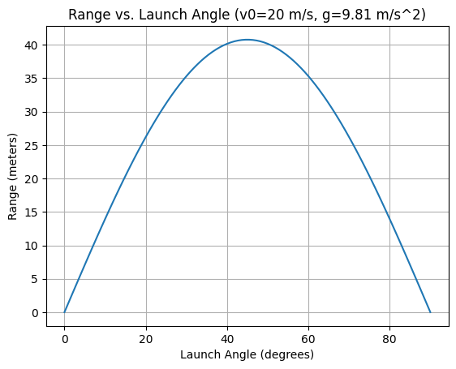

# Theoretical Foundation of Projectile Motion

## Introduction
Projectile motion is a fundamental concept in classical mechanics, governed by Newton’s laws under the influence of gravity. This section establishes the theoretical framework by deriving the equations of motion from first principles, decomposing initial conditions, and solving the resulting differential equations. We assume an idealized scenario with no air resistance and constant gravitational acceleration, providing a baseline for analyzing the range as a function of the angle of projection.

---

## Newton’s Second Law Applied to Projectile Motion
Newton’s second law, $\vec{F} = m\vec{a}$, describes the motion of a projectile under gravity. For a projectile of mass $m$, the only force acting is gravity, directed vertically downward. We define a Cartesian coordinate system where $x$ is horizontal (positive to the right) and $y$ is vertical (positive upward). The gravitational force is:

$$
\vec{F} = -mg\hat{j}
$$

where $g$ is the gravitational acceleration ($g \approx 9.81 \, \text{m/s}^2$) and $\hat{j}$ is the unit vector in the $y$-direction. Since no forces act horizontally (in the absence of air resistance), the net force components are:

$$
F_x = 0, \quad F_y = -mg
$$

Applying Newton’s second law in each direction:

$$
m \frac{d^2 x}{dt^2} = 0, \quad m \frac{d^2 y}{dt^2} = -mg
$$

Simplifying by dividing through by $m$ (assuming $m \neq 0$):

$$
\frac{d^2 x}{dt^2} = 0, \quad \frac{d^2 y}{dt^2} = -g
$$

These second-order differential equations govern the projectile’s motion in two dimensions.

---

## Decomposition of Initial Velocity
The projectile is launched with an initial speed $v_0$ at an angle $\theta$ to the horizontal. Using trigonometry, the initial velocity vector $\vec{v}_0$ is resolved into horizontal and vertical components:

$$
v_{0x} = v_0 \cos\theta, \quad v_{0y} = v_0 \sin\theta
$$

At $t = 0$, assuming the launch point is at the origin $(x_0, y_0) = (0, 0)$, the initial conditions are:

$$
x(0) = 0, \quad y(0) = 0, \quad \frac{dx}{dt}(0) = v_0 \cos\theta, \quad \frac{dy}{dt}(0) = v_0 \sin\theta
$$

These components dictate the projectile’s trajectory, with $v_{0x}$ driving horizontal motion and $v_{0y}$ opposing gravity in the vertical direction.

---

## Differential Equations of Motion
The equations $\frac{d^2 x}{dt^2} = 0$ and $\frac{d^2 y}{dt^2} = -g$ are solved independently due to the decoupling of horizontal and vertical motion.

### Horizontal Motion
For the $x$-direction:

$$
\frac{d^2 x}{dt^2} = 0
$$

Integrate with respect to time:

$$
\frac{dx}{dt} = \int 0 \, dt = C_1
$$

where $C_1$ is a constant. Using the initial condition $\frac{dx}{dt}(0) = v_0 \cos\theta$:

$$
\frac{dx}{dt} = v_0 \cos\theta
$$

Integrate again:

$$
x(t) = \int (v_0 \cos\theta) \, dt = v_0 \cos\theta \cdot t + C_2
$$

With $x(0) = 0$:

$$
x(0) = 0 = v_0 \cos\theta \cdot 0 + C_2 \implies C_2 = 0
$$

Thus:

$$
x(t) = v_0 \cos\theta \cdot t
$$

### Vertical Motion
For the $y$-direction:

$$
\frac{d^2 y}{dt^2} = -g
$$

Integrate:

$$
\frac{dy}{dt} = \int -g \, dt = -gt + C_3
$$

Using $\frac{dy}{dt}(0) = v_0 \sin\theta$:

$$
v_0 \sin\theta = -g \cdot 0 + C_3 \implies C_3 = v_0 \sin\theta
$$

So:

$$
\frac{dy}{dt} = v_0 \sin\theta - gt
$$

Integrate again:

$$
y(t) = \int (v_0 \sin\theta - gt) \, dt = v_0 \sin\theta \cdot t - \frac{1}{2} g t^2 + C_4
$$

With $y(0) = 0$:

$$
y(0) = 0 = v_0 \sin\theta \cdot 0 - \frac{1}{2} g \cdot 0^2 + C_4 \implies C_4 = 0
$$

Thus:

$$
y(t) = v_0 \sin\theta \cdot t - \frac{1}{2} g t^2
$$

### General Solution
The position of the projectile as a function of time is:

$$
x(t) = v_0 \cos\theta \cdot t, \quad y(t) = v_0 \sin\theta \cdot t - \frac{1}{2} g t^2
$$

This parametric form describes a parabolic trajectory, with $x(t)$ linear and $y(t)$ quadratic in time.

---

## Key Variables and Parametric Dependence
The equations depend on several parameters:
- **Initial velocity ($v_0$)**: Scales both $x(t)$ and $y(t)$ linearly, increasing the range and height.
- **Angle of projection ($\theta$)**: Modulates the balance between horizontal and vertical components via $\cos\theta$ and $\sin\theta$.
- **Gravitational acceleration ($g$)**: Affects only the vertical motion, steepening the parabola as $g$ increases.
- **Initial height ($h$)**: If $y(0) = h \neq 0$, the vertical equation becomes:

$$
y(t) = h + v_0 \sin\theta \cdot t - \frac{1}{2} g t^2
$$

### Sensitivity Analysis
- Increasing $v_0$ amplifies the range and maximum height proportionally to $v_0^2$ (as derived later for range).
- Varying $\theta$ shifts energy between horizontal and vertical motion, with $\theta = 45^\circ$ often maximizing range (to be verified).
- Larger $g$ reduces flight time and range, compressing the trajectory.
- Non-zero $h$ extends flight time and alters the range, requiring a modified time-of-flight calculation.

---

## Discussion
These equations form a family of solutions parameterized by $v_0$, $\theta$, $g$, and $h$. The horizontal range, defined as $x(t)$ when $y(t) = 0$, depends critically on $\theta$, setting the stage for further analysis. This idealized model assumes no air resistance, a simplification to be revisited when considering real-world applications.


# Analysis of the Range in Projectile Motion

## Introduction
The horizontal range of a projectile—the distance traveled along the ground before landing—is a key metric in understanding how launch parameters influence its trajectory. This section derives the range formula for a projectile launched from ground level, explores its dependence on the angle of projection, and examines the effects of varying initial velocity and gravitational acceleration. We aim to predict range behavior across a spectrum of angles and hypothesize the optimal angle for maximum range.

---

## Derivation of the Range Formula
For a projectile launched from ground level ($y_0 = 0$), the range $R$ is the horizontal distance $x(t)$ when the projectile returns to $y = 0$. From the theoretical foundation, the position equations are:

$$
x(t) = v_0 \cos\theta \cdot t, \quad y(t) = v_0 \sin\theta \cdot t - \frac{1}{2} g t^2
$$

where $v_0$ is the initial velocity, $\theta$ is the angle of projection, $g$ is gravitational acceleration, and $t$ is time.

### Time of Flight
The projectile lands when $y(t) = 0$. Set the vertical position to zero:

$$
v_0 \sin\theta \cdot t - \frac{1}{2} g t^2 = 0
$$

Factorize:

$$
t \left( v_0 \sin\theta - \frac{1}{2} g t \right) = 0
$$

This yields two solutions:
- $t = 0$ (launch time),
- $v_0 \sin\theta - \frac{1}{2} g t = 0$.

Solve the second:

$$
\frac{1}{2} g t = v_0 \sin\theta \implies t = \frac{2 v_0 \sin\theta}{g}
$$

This $t = \frac{2 v_0 \sin\theta}{g}$ is the time of flight, $T$, when the projectile returns to ground level.

### Horizontal Range
Substitute $T$ into the horizontal position equation:

$$
R = x(T) = v_0 \cos\theta \cdot T = v_0 \cos\theta \cdot \frac{2 v_0 \sin\theta}{g}
$$

Simplify using the trigonometric identity $2 \sin\theta \cos\theta = \sin 2\theta$:

$$
R = \frac{v_0^2 2 \sin\theta \cos\theta}{g} = \frac{v_0^2 \sin 2\theta}{g}
$$

Thus, the range formula is:

$$
R = \frac{v_0^2 \sin 2\theta}{g}
$$

This equation expresses $R$ as a function of $\theta$, $v_0$, and $g$, valid for a projectile launched and landing at the same height.

---

## Testing Projection Angles
To explore how $R$ varies with $\theta$, consider angles from $0^\circ$ to $90^\circ$:
- At $\theta = 0^\circ$: $\sin 2\theta = \sin 0^\circ = 0$, so $R = 0$ (no horizontal motion).
- At $\theta = 30^\circ$: $\sin 2\theta = \sin 60^\circ = \frac{\sqrt{3}}{2}$, so $R = \frac{v_0^2 \cdot \frac{\sqrt{3}}{2}}{g}$.
- At $\theta = 45^\circ$: $\sin 2\theta = \sin 90^\circ = 1$, so $R = \frac{v_0^2}{g}$ (potential maximum).
- At $\theta = 60^\circ$: $\sin 2\theta = \sin 120^\circ = \frac{\sqrt{3}}{2}$, so $R = \frac{v_0^2 \cdot \frac{\sqrt{3}}{2}}{g}$ (same as $30^\circ$).
- At $\theta = 90^\circ$: $\sin 2\theta = \sin 180^\circ = 0$, so $R = 0$ (straight up).

The symmetry around $45^\circ$ (e.g., $30^\circ$ and $60^\circ$ yield equal ranges) suggests a parabolic dependence of $R$ on $\theta$, peaking at $\sin 2\theta = 1$. A planned test of angles in increments (e.g., $0^\circ, 15^\circ, 30^\circ, 45^\circ, 60^\circ, 75^\circ, 90^\circ$) will confirm this trend.

---

## Influence of Other Parameters
The range depends on $v_0$ and $g$ alongside $\theta$. Analyze their effects:
- **Initial Velocity ($v_0$)**: $R \propto v_0^2$. Doubling $v_0$ quadruples $R$, as kinetic energy scales with $v_0^2$, extending both flight time and horizontal reach.
- **Gravitational Acceleration ($g$)**: $R \propto \frac{1}{g}$. Increasing $g$ reduces $R$ by shortening the flight time, $T = \frac{2 v_0 \sin\theta}{g}$, compressing the trajectory.

### Parametric Shifts
- Increasing $v_0$ stretches the range curve upward, maintaining the peak at $\theta = 45^\circ$.
- Increasing $g$ flattens the curve, reducing all ranges proportionally without altering the optimal angle.
- Combining changes (e.g., higher $v_0$, lower $g$) amplifies $R$ dramatically, useful for applications like artillery.

---

## Hypothesis for Maximum Range
The term $\sin 2\theta$ in $R = \frac{v_0^2 \sin 2\theta}{g}$ reaches its maximum of 1 when $2\theta = 90^\circ$, or $\theta = 45^\circ$. Thus, hypothesize that $\theta = 45^\circ$ maximizes $R$. Physically, this balances horizontal velocity ($v_0 \cos\theta$) and flight time (proportional to $v_0 \sin\theta$):
- At $\theta < 45^\circ$, higher $v_{0x}$ is offset by shorter $T$.
- At $\theta > 45^\circ$, longer $T$ is offset by lower $v_{0x}$.

To test, compute the derivative of $R$ with respect to $\theta$:

$$
\frac{dR}{d\theta} = \frac{d}{d\theta} \left( \frac{v_0^2 \sin 2\theta}{g} \right) = \frac{v_0^2}{g} \cdot 2 \cos 2\theta
$$

Set $\frac{dR}{d\theta} = 0$:

$$
2 \cos 2\theta = 0 \implies \cos 2\theta = 0 \implies 2\theta = 90^\circ \implies \theta = 45^\circ
$$

The second derivative, $\frac{d^2 R}{d\theta^2} = \frac{v_0^2}{g} \cdot (-4 \sin 2\theta)$, is negative at $\theta = 45^\circ$ ($\sin 90^\circ = 1$), confirming a maximum. This supports the hypothesis that $45^\circ$ optimizes range due to the interplay of horizontal and vertical motion components.

---

## Discussion
The range formula $R = \frac{v_0^2 \sin 2\theta}{g}$ encapsulates the projectile’s dependence on $\theta$, with a clear maximum at $45^\circ$ for ground-level launch and landing. Variations in $v_0$ and $g$ scale the range but preserve this optimum, highlighting the robustness of the result. Future analysis could explore non-zero launch heights, where symmetry breaks and the optimal angle shifts.

# Practical Applications of Projectile Motion

## Introduction
Projectile motion extends beyond theoretical models to describe a variety of real-world phenomena, from sports to military applications and space exploration. This section identifies practical examples, considers modifications to the idealized model for complex scenarios like uneven terrain and air resistance, and proposes analytical adaptations. The goal is to bridge the gap between the simplified equations and their application in diverse physical contexts.

---

## Real-World Examples
Projectile motion governs numerous scenarios:
- **Basketball Shot**: A player launches the ball with initial velocity $v_0$ at angle $\theta$ toward a hoop. The arc must clear defenders and reach the target height, typically 3.05 m above the ground.
- **Cannonball**: Historical artillery relies on maximizing range $R = \frac{v_0^2 \sin 2\theta}{g}$ by adjusting $\theta$, often near 45°, to strike distant targets.
- **Spacecraft Launch**: Initial ascent approximates projectile motion under gravity, though thrust and atmospheric effects dominate later phases.
- Additional examples include golf balls, javelin throws, and water jets from a hose, each with unique initial conditions and environmental factors.

These cases highlight the versatility of the model $x(t) = v_0 \cos\theta \cdot t$, $y(t) = v_0 \sin\theta \cdot t - \frac{1}{2} g t^2$, but real conditions necessitate adjustments.

---

## Adjustments for Uneven Terrain
In the idealized model, launch and landing occur at $y = 0$. Uneven terrain introduces a height difference $h$ between launch ($y_0 = 0$) and landing ($y = h$). The vertical position becomes:

$$
y(t) = v_0 \sin\theta \cdot t - \frac{1}{2} g t^2
$$

Landing occurs when $y(t) = h$:

$$
h = v_0 \sin\theta \cdot t - \frac{1}{2} g t^2
$$

Rearrange into a quadratic equation in $t$:

$$
\frac{1}{2} g t^2 - v_0 \sin\theta \cdot t + h = 0
$$

Solve using the quadratic formula $t = \frac{-b \pm \sqrt{b^2 - 4ac}}{2a}$, where $a = \frac{1}{2} g$, $b = -v_0 \sin\theta$, $c = h$:

$$
t = \frac{v_0 \sin\theta \pm \sqrt{(v_0 \sin\theta)^2 - 2gh}}{g}
$$

The positive root (assuming upward motion) gives the time of flight $T$. The range is then:

$$
R = v_0 \cos\theta \cdot T = v_0 \cos\theta \cdot \frac{v_0 \sin\theta + \sqrt{(v_0 \sin\theta)^2 - 2gh}}{g}
$$

### Implications
- For $h > 0$ (landing above launch), $T$ increases, potentially extending $R$ beyond the flat-ground case.
- For $h < 0$ (landing below), $R$ increases further due to prolonged flight time.
- The optimal angle shifts from 45°, requiring numerical or analytical optimization.

---

## Introducing Air Resistance
Air resistance introduces a drag force, typically modeled as $F_d = -k v$ (linear) or $F_d = -k v^2$ (quadratic), where $k$ is a drag coefficient and $v$ is velocity. For simplicity, consider the quadratic form, proportional to speed squared:

$$
\vec{F_d} = -k |\vec{v}| \vec{v}
$$

With components $v_x = \frac{dx}{dt}$, $v_y = \frac{dy}{dt}$, and $|\vec{v}| = \sqrt{v_x^2 + v_y^2}$, the equations of motion become:

$$
m \frac{d^2 x}{dt^2} = -k v_x \sqrt{v_x^2 + v_y^2}, \quad m \frac{d^2 y}{dt^2} = -mg - k v_y \sqrt{v_x^2 + v_y^2}
$$

Dividing by $m$:

$$
\frac{d^2 x}{dt^2} = -\frac{k}{m} v_x \sqrt{v_x^2 + v_y^2}, \quad \frac{d^2 y}{dt^2} = -g - \frac{k}{m} v_y \sqrt{v_x^2 + v_y^2}
$$

### Qualitative Effects
- **Range Reduction**: Drag opposes motion, reducing $v_x$ and $v_y$, shortening $T$ and $R$ compared to $R = \frac{v_0^2 \sin 2\theta}{g}$.
- **Trajectory Asymmetry**: The peak height decreases, and the descent steepens, unlike the symmetric parabola of the ideal case.
- **Angle Adjustment**: The optimal $\theta$ for maximum range decreases below 45°, as vertical motion is more penalized by drag.

These differential equations lack a simple analytical solution, suggesting numerical methods (e.g., Euler or Runge-Kutta) for simulation.

---

## Adaptation Strategies
To apply the model to real-world scenarios:
- **Basketball Shot**:
  - Adjust for hoop height: Set $y(t) = h_{\text{hoop}}$ and solve for $t$ and $x$.
  - Include light drag ($k$ small) and optimize $\theta$ for accuracy, not just range.
- **Cannonball**:
  - Account for uneven terrain using the modified $R$ equation.
  - Incorporate drag via numerical integration, adjusting $v_0$ and $\theta$ for target distance.
- **Spacecraft Launch**:
  - Model initial phase with $g$ decreasing with altitude ($g = \frac{GM}{(R+h)^2}$).
  - Add thrust as an external force, modifying $\frac{d^2 y}{dt^2} = -g + \frac{F_{\text{thrust}}}{m}$.

### General Ideas
- **Initial Conditions**: Vary $v_0$, $\theta$, or $h$ to match specific contexts (e.g., higher $v_0$ for cannonballs).
- **External Forces**: Add terms to the equations (e.g., $-k v^2$ for drag, wind forces $F_w$).
- **Numerical Tools**: Use Python to simulate complex cases, plotting adjusted trajectories and ranges.

---

## Discussion
Real-world projectile motion deviates from the ideal $R = \frac{v_0^2 \sin 2\theta}{g}$ due to terrain, air resistance, and additional forces. Adapting the model requires modifying equations or adopting numerical methods, preserving the core physics while addressing practical constraints. These adjustments enhance applicability across engineering, sports, and astrophysics.


## Codes and Plots


```python
import numpy as np
import matplotlib.pyplot as plt

# Constants
g = 9.81  # gravitational acceleration (m/s^2)
angles_deg = np.arange(0, 91, 5)  # angles from 0° to 90° in 5° increments
angles_rad = np.deg2rad(angles_deg)  # convert to radians
v0_values = [10, 20, 30]  # initial velocities (m/s)

# Calculate range for each v0
plt.figure(figsize=(10, 6))
for v0 in v0_values:
    R = (v0**2 * np.sin(2 * angles_rad)) / g
    plt.plot(angles_deg, R, label=f'$v_0 = {v0} \, \text{{m/s}}$')

# Plot settings
plt.xlabel('Angle of Projection ($^\circ$)')
plt.ylabel('Range (m)')
plt.title('Range vs. Angle for Different Initial Velocities ($g = 9.81 \, \text{m/s}^2$)')
plt.legend()
plt.grid(True)
plt.savefig('range_vs_angle_v0.png')  # Save for Markdown embedding
plt.show()
```


```python
import numpy as np
import matplotlib.pyplot as plt

def projectile_range(v0, theta_deg, g=9.81):
    """Calculates the range of a projectile."""
    theta_rad = np.radians(theta_deg)
    return (v0**2 * np.sin(2 * theta_rad)) / g

def projectile_trajectory(v0, theta_deg, g=9.81, time_steps=100):
    """Calculates the trajectory of a projectile."""
    theta_rad = np.radians(theta_deg)
    t_flight = (2 * v0 * np.sin(theta_rad)) / g
    t = np.linspace(0, t_flight, time_steps)
    x = v0 * np.cos(theta_rad) * t
    y = v0 * np.sin(theta_rad) * t - 0.5 * g * t**2
    return x, y

def plot_range_vs_angle(v0, g=9.81):
    """Plots the range vs. launch angle."""
    angles = np.linspace(0, 90, 100)
    ranges = [projectile_range(v0, angle, g) for angle in angles]
    plt.plot(angles, ranges)
    plt.xlabel('Launch Angle (degrees)')
    plt.ylabel('Range (meters)')
    plt.title(f'Range vs. Launch Angle (v0={v0} m/s, g={g} m/s^2)')
    plt.grid(True)
    plt.show()

def plot_trajectories(v0_list, theta_deg, g=9.81):
    """Plots trajectories for different initial velocities."""
    plt.figure()
    for v0 in v0_list:
        x, y = projectile_trajectory(v0, theta_deg, g)
        plt.plot(x, y, label=f'v0={v0} m/s')
    plt.xlabel('Horizontal Distance (meters)')
    plt.ylabel('Vertical Distance (meters)')
    plt.title(f'Trajectories at {theta_deg} degrees')
    plt.grid(True)
    plt.legend()
    plt.show()

# Example usage
plot_range_vs_angle(20)
plot_trajectories([10, 20, 30], 45)
def projectile_range(v0, theta_deg, g=9.81):
    """Calculates the range of a projectile."""
    theta_rad = np.radians(theta_deg)
    return (v0**2 * np.sin(2 * theta_rad)) / g

def projectile_trajectory(v0, theta_deg, g=9.81, time_steps=100):
    """Calculates the trajectory of a projectile."""
    theta_rad = np.radians(theta_deg)
    t_flight = (2 * v0 * np.sin(theta_rad)) / g
    t = np.linspace(0, t_flight, time_steps)
    x = v0 * np.cos(theta_rad) * t
    y = v0 * np.sin(theta_rad) * t - 0.5 * g * t**2
    return x, y

def plot_range_vs_angle(v0, g=9.81):
    """Plots the range vs. launch angle."""
    angles = np.linspace(0, 90, 100)
    ranges = [projectile_range(v0, angle, g) for angle in angles]
    plt.plot(angles, ranges)
    plt.xlabel('Launch Angle (degrees)')
    plt.ylabel('Range (meters)')
    plt.title(f'Range vs. Launch Angle (v0={v0} m/s, g={g} m/s^2)')
    plt.grid(True)
    plt.show()

def plot_trajectories(v0_list, theta_deg, g=9.81):
    """Plots trajectories for different initial velocities."""
    plt.figure()
    for v0 in v0_list:
        x, y = projectile_trajectory(v0, theta_deg, g)
        plt.plot(x, y, label=f'v0={v0} m/s')
    plt.xlabel('Horizontal Distance (meters)')
    plt.ylabel('Vertical Distance (meters)')
    plt.title(f'Trajectories at {theta_deg} degrees')
    plt.grid(True)
    plt.legend()
    plt.show()
    
# Example usage
plot_range_vs_angle(20)
plot_trajectories([10, 20, 30], 45


## Colab 

[Colab 1](https://colab.research.google.com/drive/1DPhWK40LB2ZhQ4Tf30tDa6CkUmWPynDH)
   