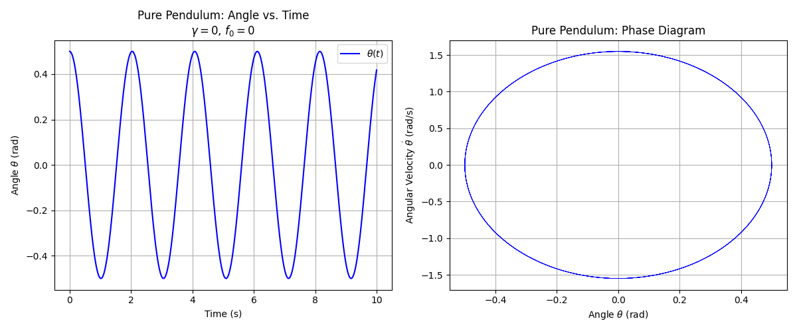
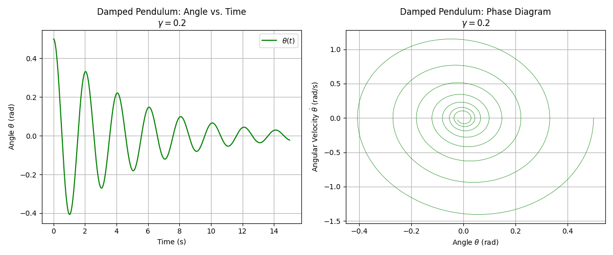
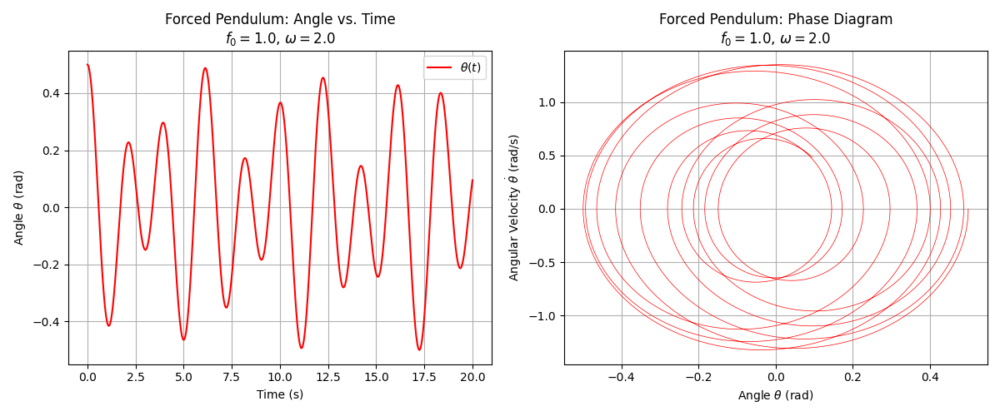
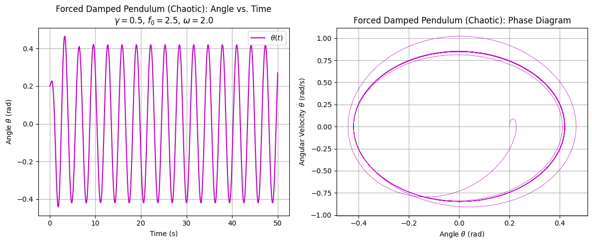
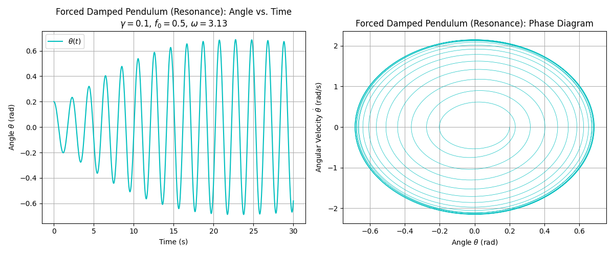

# Theoretical Foundation: Forced Damped Pendulum

This section provides a rigorous theoretical framework for the forced damped pendulum, focusing on the interplay of gravitational restoring forces, viscous damping, and external periodic forcing. We derive the governing differential equation, linearize it for small-angle oscillations, solve it analytically, identify resonance conditions, and analyze energy dynamics at resonance. The treatment is designed for an advanced academic audience familiar with classical mechanics and differential equations.

## 1. Derivation of the Governing Differential Equation

Consider a pendulum with mass $m$, length $l$, and angular displacement $\theta(t)$ from the vertical. The system experiences three torques:

- **Gravitational restoring torque**: The gravitational force $mg$ produces a torque, with the perpendicular component $-mg \sin \theta$. The torque is:  
  $$
  \tau_g = -mgl \sin \theta,
  $$
  where the negative sign reflects the restoring action.

- **Damping torque**: A viscous damping force proportional to angular velocity $\dot{\theta}$ yields:  
  $$
  \tau_d = -b \dot{\theta},
  $$
  where $b$ is the damping coefficient (units: $\text{kg} \cdot \text{m}^2 / \text{s}$).

- **External forcing torque**: A periodic external torque is applied as:  
  $$
  \tau_f = F_0 \cos (\omega t),
  $$
  with amplitude $F_0$ and driving frequency $\omega$.

The moment of inertia about the pivot is $I = ml^2$. Using Newton’s second law for rotation, $\tau = I \ddot{\theta}$, we write:  
$$
ml^2 \ddot{\theta} = -mgl \sin \theta - b \dot{\theta} + F_0 \cos (\omega t).
$$

Dividing by $ml^2$:  
$$
\ddot{\theta} + \frac{b}{ml^2} \dot{\theta} + \frac{g}{l} \sin \theta = \frac{F_0}{ml^2} \cos (\omega t).
$$

Introduce the natural frequency $\omega_0 = \sqrt{\frac{g}{l}}$, damping ratio $\gamma = \frac{b}{2ml^2}$, and forcing amplitude $f_0 = \frac{F_0}{ml^2}$. The equation becomes:  
$$
\ddot{\theta} + 2\gamma \dot{\theta} + \omega_0^2 \sin \theta = f_0 \cos (\omega t).
$$

This nonlinear second-order differential equation governs the pendulum’s dynamics, with nonlinearity arising from $\sin \theta$.

## 2. Small-Angle Approximation

For small angles ($\theta \ll 1$), we approximate $\sin \theta \approx \theta$, linearizing the equation:  
$$
\ddot{\theta} + 2\gamma \dot{\theta} + \omega_0^2 \theta = f_0 \cos (\omega t).
$$

This takes the form of a forced damped harmonic oscillator:  
$$
\ddot{\theta} + 2\beta \dot{\theta} + \omega_0^2 \theta = A \cos (\omega t),
$$
where $\beta = \gamma = \frac{b}{2ml^2}$ and $A = f_0$. The linearization facilitates analytical solutions.

## 3. Analytical Solution for Small-Angle Oscillations

We solve the linearized equation:  
$$
\ddot{\theta} + 2\beta \dot{\theta} + \omega_0^2 \theta = A \cos (\omega t).
$$
The general solution is the sum of homogeneous and particular solutions.

### Homogeneous Solution

The homogeneous equation is:  
$$
\ddot{\theta} + 2\beta \dot{\theta} + \omega_0^2 \theta = 0.
$$

The characteristic equation is:  
$$
r^2 + 2\beta r + \omega_0^2 = 0,
$$
with roots:  
$$
r = -\beta \pm \sqrt{\beta^2 - \omega_0^2}.
$$

For underdamped motion ($\beta < \omega_0$), the damped frequency is $\omega_d = \sqrt{\omega_0^2 - \beta^2}$, and the roots are:  
$$
r = -\beta \pm i \omega_d.
$$

The homogeneous solution is:  
$$
\theta_h(t) = e^{-\beta t} \left( C_1 \cos (\omega_d t) + C_2 \sin (\omega_d t) \right),
$$
where $C_1$ and $C_2$ depend on initial conditions. This term describes decaying transient oscillations.

### Particular Solution

For the particular solution, assume:  
$$
\theta_p(t) = D_1 \cos (\omega t) + D_2 \sin (\omega t).
$$

Substituting and solving yields:  
$$
\theta_p(t) = \frac{A \left[ (\omega_0^2 - \omega^2) \cos (\omega t) + 2\beta \omega \sin (\omega t) \right]}{(\omega_0^2 - \omega^2)^2 + (2\beta \omega)^2}.
$$

In amplitude-phase form:  
$$
\theta_p(t) = C \cos (\omega t - \phi),
$$
where:  
$$
C = \frac{A}{\sqrt{(\omega_0^2 - \omega^2)^2 + (2\beta \omega)^2}},
$$  
$$
\phi = \tan^{-1} \left( \frac{2\beta \omega}{\omega_0^2 - \omega^2} \right).
$$

The general solution is:  
$$
\theta(t) = e^{-\beta t} \left( C_1 \cos (\omega_d t) + C_2 \sin (\omega_d t) \right) + C \cos (\omega t - \phi).
$$

The transient term decays, leaving the steady-state response.

## 4. Resonance Conditions

Resonance maximizes the steady-state amplitude:  
$$
C = \frac{A}{\sqrt{(\omega_0^2 - \omega^2)^2 + (2\beta \omega)^2}}.
$$

The amplitude peaks when the denominator is minimized. Differentiating with respect to $\omega^2$, the resonance frequency is:  
$$
\omega_r = \sqrt{\omega_0^2 - 2\beta^2},
$$
if $\omega_0^2 > 2\beta^2$. For light damping ($\beta \ll \omega_0$), $\omega_r \approx \omega_0$.

At resonance, the amplitude is approximately:  
$$
C_{\text{max}} \approx \frac{A}{2\beta \omega_0},
$$
indicating amplification with lower damping.

## 5. Energy Dynamics at Resonance

The pendulum’s energy is:  
$$
E = \frac{1}{2} I \dot{\theta}^2 + mgl (1 - \cos \theta).
$$

For small angles, $1 - \cos \theta \approx \frac{\theta^2}{2}$, so:  
$$
E \approx \frac{1}{2} ml^2 \dot{\theta}^2 + \frac{1}{2} mgl \theta^2.
$$

At resonance, the external force aligns with the velocity, maximizing energy input. The power supplied is:  
$$
P = \tau_f \dot{\theta} = F_0 \cos (\omega t) \dot{\theta}.
$$

Damping dissipates energy at:  
$$
P_d = -b \dot{\theta}^2.
$$

In steady-state resonance, the average power input balances dissipation:  
$$
\langle P \rangle = \langle P_d \rangle,
$$
sustaining large oscillations critical for applications like energy harvesting or structural design.

# Analysis of System Dynamics: Forced Damped Pendulum

This section outlines the analytical framework for investigating the dynamics of a forced damped pendulum, emphasizing the roles of key parameters and the transition from regular to chaotic motion. We define the critical parameters, propose a systematic approach to study their effects, describe methods to identify dynamic transitions, and interpret the physical implications of periodic and chaotic regimes. The analysis assumes proficiency in nonlinear dynamics and differential equations, suitable for advanced undergraduate or graduate study in physics or engineering.

## 1. Definition of Key Parameters

The dynamics of the forced damped pendulum are governed by the differential equation:  
$$
\ddot{\theta} + 2\gamma \dot{\theta} + \omega_0^2 \sin \theta = f_0 \cos (\omega t),
$$
where $\theta(t)$ is the angular displacement, $\omega_0 = \sqrt{\frac{g}{l}}$ is the natural frequency, and the system is characterized by three key parameters:

- **Damping coefficient** ($\gamma$): Defined as $\gamma = \frac{b}{2ml^2}$, where $b$ is the damping constant, $m$ is the mass, and $l$ is the pendulum length. The parameter $\gamma$ (units: $\text{s}^{-1}$) quantifies energy dissipation due to viscous damping, influencing the decay rate of oscillations.

- **Driving amplitude** ($f_0$): Given by $f_0 = \frac{F_0}{ml^2}$, where $F_0$ is the amplitude of the external torque. The term $f_0$ (units: $\text{s}^{-2}$) determines the strength of the periodic forcing, affecting the energy input to the system.

- **Driving frequency** ($\omega$): The angular frequency of the external torque, $\cos (\omega t)$, with units $\text{s}^{-1}$. The value of $\omega$ relative to $\omega_0$ governs phenomena such as resonance and synchronization.

These parameters shape the pendulum’s behavior, ranging from damped oscillations to complex nonlinear dynamics.

## 2. Systematic Variation of Parameters

To study the effects of $\gamma$, $f_0$, and $\omega$ on pendulum motion, we propose a systematic parametric analysis:

- **Damping coefficient ($\gamma$)**: Vary $\gamma$ over a range, e.g., from low damping ($\gamma \ll \omega_0$) to high damping ($\gamma \approx \omega_0$). Low damping may sustain oscillations, while high damping suppresses motion, potentially stabilizing equilibrium points. For small angles, the linearized equation is:  
  $$
  \ddot{\theta} + 2\gamma \dot{\theta} + \omega_0^2 \theta = f_0 \cos (\omega t).
  $$
  Analyze how $\gamma$ affects the decay rate of the homogeneous solution, $e^{-\gamma t}$.

- **Driving amplitude ($f_0$)**: Increment $f_0$ from weak ($f_0 \ll \omega_0^2$) to strong ($f_0 \approx \omega_0^2$) forcing. Higher $f_0$ increases energy input, potentially driving the system beyond linear regimes into nonlinear or chaotic motion. Examine amplitude effects on the steady-state solution amplitude:  
  $$
  C = \frac{f_0}{\sqrt{(\omega_0^2 - \omega^2)^2 + (2\gamma \omega)^2}}.
  $$

- **Driving frequency ($\omega$)**: Vary $\omega$ across a spectrum, e.g., $\omega \ll \omega_0$, $\omega \approx \omega_0$, and $\omega \gg \omega_0$. Near $\omega \approx \omega_0$, resonance amplifies oscillations, while detuned frequencies may induce quasiperiodic or chaotic behavior. Study the frequency response relative to the resonance condition:  
  $$
  \omega_r = \sqrt{\omega_0^2 - 2\gamma^2}.
  $$

Plan to simulate the nonlinear equation numerically for each parameter set, using methods like the fourth-order Runge-Kutta algorithm, to capture behaviors beyond the small-angle approximation.

## 3. Methods to Detect Transitions to Chaotic Motion

The forced damped pendulum exhibits transitions from regular (periodic or quasiperiodic) to chaotic motion, driven by nonlinearity in $\sin \theta$. To detect these transitions, employ the following methods:

- **Phase Space Analysis**: Construct phase portraits by plotting $\theta$ versus $\dot{\theta}$. Regular motion produces closed orbits (periodic) or toroidal patterns (quasiperiodic), while chaotic motion yields irregular, non-repeating trajectories. The phase space is governed by the system:  
  $$
  \dot{\theta} = v, \quad \dot{v} = -2\gamma v - \omega_0^2 \sin \theta + f_0 \cos (\omega t).
  $$

- **Poincaré Sections**: Sample the system’s state at intervals of the driving period, $T = \frac{2\pi}{\omega}$. Plot points $(\theta(nT), \dot{\theta}(nT))$. Periodic motion results in discrete points, quasiperiodic motion forms closed curves, and chaotic motion produces scattered, fractal-like patterns.

- **Lyapunov Exponents**: Compute the largest Lyapunov exponent, $\lambda$, to quantify trajectory divergence. For a system $\dot{\mathbf{x}} = \mathbf{F}(\mathbf{x}, t)$, linearize around a trajectory:  
  $$
  \dot{\mathbf{y}} = \mathbf{J}(\mathbf{x}(t)) \mathbf{y},
  $$
  where $\mathbf{J}$ is the Jacobian. A positive $\lambda$ indicates chaos, while $\lambda \leq 0$ suggests regular motion.

- **Bifurcation Diagrams**: Plot steady-state $\theta$ or $\dot{\theta}$ versus a control parameter (e.g., $f_0$). Transitions from single-valued (periodic) to multi-valued (period-doubling) or dense (chaotic) outputs signal dynamic shifts. Period-doubling cascades are precursors to chaos, described by:  
  $$
  \theta_{n+1} = f(\theta_n, f_0, \gamma, \omega).
  $$

These methods collectively identify parameter regimes where the system transitions from predictable to chaotic dynamics.

## 4. Physical Significance of Regular versus Chaotic Regimes

The distinction between regular and chaotic motion has profound physical implications:

- **Regular Motion**: Includes periodic oscillations (locked to the driving frequency) and quasiperiodic motion (multiple incommensurate frequencies). Physically, periodic motion corresponds to synchronized energy transfer, as in resonance, where:  
  $$
  \theta(t) \approx C \cos (\omega t - \phi).
  $$
  Such behavior is predictable, enabling applications like tuned oscillators in engineering or stable rhythms in biological systems. Quasiperiodic motion may arise when $\omega$ and $\omega_0$ are irrationally related, producing complex but non-chaotic patterns.

- **Chaotic Motion**: Characterized by sensitive dependence on initial conditions, chaotic regimes exhibit unpredictable, aperiodic trajectories. Physically, chaos reflects energy scattering across multiple frequencies, disrupting synchronization. This can model turbulent flows, irregular vibrations in structures, or erratic signals in circuits. The transition to chaos, often via period-doubling, is governed by parameter thresholds, e.g., increasing $f_0$ beyond a critical value:  
  $$
  f_0 > f_{0,\text{crit}}(\gamma, \omega).
  $$
  Chaotic behavior limits predictability but may enhance mixing or energy dissipation in certain systems.

Regular motion ensures stability and control, while chaotic motion highlights the limits of determinism, with implications for designing robust systems or exploiting chaos in applications like secure communications.

# Exploration of Practical Applications: Forced Damped Pendulum

This section examines practical applications of the forced damped pendulum, a system governed by the interplay of restoring forces, damping, and external periodic forcing. We identify real-world systems modeled by the pendulum, describe how its dynamics manifest in these contexts, and draw analogies to related fields such as electrical circuits and biomechanics. The analysis assumes familiarity with nonlinear dynamics and applied physics, suitable for advanced undergraduate or graduate study in engineering or physical sciences.

## 1. Identification of Real-World Systems

The forced damped pendulum, described by the differential equation:  
$$
\ddot{\theta} + 2\gamma \dot{\theta} + \omega_0^2 \sin \theta = f_0 \cos (\omega t),
$$
where $\theta(t)$ is the angular displacement, $\gamma$ is the damping ratio, $\omega_0 = \sqrt{\frac{g}{l}}$ is the natural frequency, and $f_0 \cos (\omega t)$ is the external forcing, serves as a model for several real-world systems:

- **Energy Harvesting Devices**: Piezoelectric or electromagnetic devices convert mechanical vibrations into electrical energy. These systems often operate as oscillators driven by ambient vibrations, modeled by the pendulum’s dynamics with $\omega$ representing environmental frequencies (e.g., machinery vibrations).

- **Suspension Bridges**: Bridges under periodic loads (e.g., wind or traffic) exhibit oscillatory motion. The pendulum’s nonlinear dynamics, particularly resonance and chaos, mirror phenomena like vortex-induced vibrations, where $\theta$ represents structural displacement.

- **Oscillating Circuits**: Mechanical oscillators in sensors or actuators, such as MEMS (microelectromechanical systems), behave similarly to the pendulum. The forcing term $f_0 \cos (\omega t)$ corresponds to external signals driving the system, with $\gamma$ reflecting energy losses.

These systems leverage the pendulum’s ability to exhibit periodic, resonant, or chaotic behavior depending on parameters $\gamma$, $f_0$, and $\omega$.

## 2. Relating Pendulum Dynamics to Applications

The pendulum’s dynamics directly inform the behavior and design of the identified systems:

- **Energy Harvesting Devices**: The steady-state amplitude of the pendulum at resonance, given by:  
  $$
  C = \frac{f_0}{\sqrt{(\omega_0^2 - \omega^2)^2 + (2\gamma \omega)^2}},
  $$
  maximizes when $\omega \approx \omega_0$, optimizing energy transfer. For harvesting devices, tuning $\omega_0$ (via mass or stiffness) to match environmental frequencies (e.g., $\omega$ from footsteps) enhances power output. Damping $\gamma$ must be minimized to sustain oscillations but sufficient to stabilize the system, balancing efficiency and robustness.

- **Suspension Bridges**: Resonance occurs when the driving frequency $\omega$ approaches the bridge’s natural frequency $\omega_0$, amplifying oscillations:  
  $$
  \omega_r = \sqrt{\omega_0^2 - 2\gamma^2}.
  $$
  Excessive amplitude, as seen in historical failures like the Tacoma Narrows Bridge, highlights the need to detune $\omega_0$ or increase $\gamma$ through dampers. Nonlinear effects, such as $\sin \theta$ in the pendulum, model large-amplitude vibrations leading to structural fatigue or chaos under strong forcing ($f_0$).

- **Oscillating Circuits**: In MEMS oscillators, the pendulum’s dynamics govern frequency response. The phase portrait, defined by:  
  $$
  \dot{\theta} = v, \quad \dot{v} = -2\gamma v - \omega_0^2 \sin \theta + f_0 \cos (\omega t),
  $$
  predicts stable oscillatory modes for small $f_0$ or chaotic responses for large $f_0$, critical for designing reliable sensors. Low $\gamma$ ensures sharp resonance for sensitivity, while controlled $\omega$ prevents unwanted nonlinear effects.

In each case, the pendulum’s transition from periodic to chaotic motion, driven by increasing $f_0$ or detuning $\omega$, informs operational limits and design strategies.

## 3. Analogies to Other Fields

The forced damped pendulum’s dynamics extend to analogous systems in other disciplines, broadening its applicability:

- **Electrical Circuits (Driven RLC Circuits)**: A driven RLC circuit, governed by:  
  $$
  L \ddot{q} + R \dot{q} + \frac{1}{C} q = V_0 \cos (\omega t),
  $$
  parallels the pendulum’s equation. Here, charge $q$ corresponds to $\theta$, inductance $L$ to moment of inertia $ml^2$, resistance $R$ to damping $b$, capacitance $1/C$ to gravitational stiffness $mgl$, and voltage $V_0 \cos (\omega t)$ to torque $F_0 \cos (\omega t)$. Resonance occurs at $\omega \approx \sqrt{\frac{1}{LC}}$, analogous to $\omega_0$, with damping ratio $R/(2\sqrt{L/C})$ mirroring $\gamma$. Nonlinear capacitors introduce effects similar to $\sin \theta$, enabling chaotic behavior in circuits, relevant to signal processing or chaos-based encryption.

- **Biomechanics (Human Gait or Limb Motion)**: Human walking or arm swinging can be modeled as a forced damped oscillator. The equation:  
  $$
  \ddot{\phi} + b \dot{\phi} + k \sin \phi = F \cos (\omega t),
  $$
  describes joint angle $\phi$, with muscular damping $b$, stiffness $k$ from tissues, and periodic forcing $F$ from rhythmic neural signals or ground reaction forces. Resonance optimizes energy efficiency in gait, while chaotic dynamics may indicate pathological conditions (e.g., tremors). The pendulum’s phase space analysis applies to studying stability in bipedal locomotion.

- **Climate Systems**: Oscillatory climate phenomena, like El Niño, resemble forced damped systems. The pendulum’s equation models temperature or pressure oscillations, with $\omega_0$ as the natural cycle frequency, $\gamma$ as dissipative processes (e.g., heat loss), and $f_0 \cos (\omega t)$ as external drivers (e.g., solar forcing). Chaotic transitions inform long-term unpredictability in weather patterns.

These analogies highlight the universality of the pendulum’s dynamics, connecting mechanical, electrical, biological, and environmental systems through shared mathematical structures.


## Codes And Plots


```python
import numpy as np
import matplotlib.pyplot as plt
from scipy.integrate import odeint

# Define the system of ODEs for pure pendulum
def pure_pendulum(state, t, omega0):
    theta, v = state
    dtheta_dt = v
    dv_dt = -omega0**2 * np.sin(theta)
    return [dtheta_dt, dv_dt]

# Parameters
g = 9.81
l = 1.0
omega0 = np.sqrt(g / l)
theta0 = 0.5      # initial angle (rad)
v0 = 0.0          # initial angular velocity (rad/s)

# Time array
t = np.linspace(0, 10, 1000)
state0 = [theta0, v0]

# Solve ODE
solution = odeint(pure_pendulum, state0, t, args=(omega0,))
theta, v = solution[:, 0], solution[:, 1]

# Create plots
plt.figure(figsize=(12, 5))

# Angle vs. Time
plt.subplot(1, 2, 1)
plt.plot(t, theta, 'b-', label=r'$\theta(t)$')
plt.xlabel('Time (s)')
plt.ylabel(r'Angle $\theta$ (rad)')
plt.title('Pure Pendulum: Angle vs. Time\n$\gamma=0$, $f_0=0$')
plt.grid(True)
plt.legend()

# Phase Diagram
plt.subplot(1, 2, 2)
plt.plot(theta, v, 'b-', linewidth=0.5)
plt.xlabel(r'Angle $\theta$ (rad)')
plt.ylabel(r'Angular Velocity $\dot{\theta}$ (rad/s)')
plt.title('Pure Pendulum: Phase Diagram')
plt.grid(True)

plt.tight_layout()
plt.savefig('pure_pendulum_plots.png')
plt.close()
```


```python
import numpy as np
import matplotlib.pyplot as plt
from scipy.integrate import odeint

# Define the system of ODEs for damped pendulum
def damped_pendulum(state, t, gamma, omega0):
    theta, v = state
    dtheta_dt = v
    dv_dt = -2 * gamma * v - omega0**2 * np.sin(theta)
    return [dtheta_dt, dv_dt]

# Parameters
g = 9.81
l = 1.0
m = 1.0
omega0 = np.sqrt(g / l)
gamma = 0.2       # damping coefficient (1/s)
theta0 = 0.5
v0 = 0.0

# Time array
t = np.linspace(0, 15, 1000)
state0 = [theta0, v0]

# Solve ODE
solution = odeint(damped_pendulum, state0, t, args=(gamma, omega0))
theta, v = solution[:, 0], solution[:, 1]

# Create plots
plt.figure(figsize=(12, 5))

# Angle vs. Time
plt.subplot(1, 2, 1)
plt.plot(t, theta, 'g-', label=r'$\theta(t)$')
plt.xlabel('Time (s)')
plt.ylabel(r'Angle $\theta$ (rad)')
plt.title(f'Damped Pendulum: Angle vs. Time\n$\gamma={gamma}$')
plt.grid(True)
plt.legend()

# Phase Diagram
plt.subplot(1, 2, 2)
plt.plot(theta, v, 'g-', linewidth=0.5)
plt.xlabel(r'Angle $\theta$ (rad)')
plt.ylabel(r'Angular Velocity $\dot{\theta}$ (rad/s)')
plt.title(f'Damped Pendulum: Phase Diagram\n$\gamma={gamma}$')
plt.grid(True)

plt.tight_layout()
plt.savefig('damped_pendulum_plots.png')
plt.close()
```


```python
import numpy as np
import matplotlib.pyplot as plt
from scipy.integrate import odeint

# Define the system of ODEs for forced pendulum (no damping)
def forced_pendulum(state, t, omega0, f0, omega):
    theta, v = state
    dtheta_dt = v
    dv_dt = -omega0**2 * np.sin(theta) + f0 * np.cos(omega * t)
    return [dtheta_dt, dv_dt]

# Parameters
g = 9.81
l = 1.0
m = 1.0
omega0 = np.sqrt(g / l)
f0 = 1.0          # forcing amplitude (1/s^2)
omega = 2.0       # driving frequency (rad/s)
theta0 = 0.5
v0 = 0.0

# Time array
t = np.linspace(0, 20, 2000)
state0 = [theta0, v0]

# Solve ODE
solution = odeint(forced_pendulum, state0, t, args=(omega0, f0, omega))
theta, v = solution[:, 0], solution[:, 1]

# Create plots
plt.figure(figsize=(12, 5))

# Angle vs. Time
plt.subplot(1, 2, 1)
plt.plot(t, theta, 'r-', label=r'$\theta(t)$')
plt.xlabel('Time (s)')
plt.ylabel(r'Angle $\theta$ (rad)')
plt.title(f'Forced Pendulum: Angle vs. Time\n$f_0={f0}$, $\omega={omega}$')
plt.grid(True)
plt.legend()

# Phase Diagram
plt.subplot(1, 2, 2)
plt.plot(theta, v, 'r-', linewidth=0.5)
plt.xlabel(r'Angle $\theta$ (rad)')
plt.ylabel(r'Angular Velocity $\dot{\theta}$ (rad/s)')
plt.title(f'Forced Pendulum: Phase Diagram\n$f_0={f0}$, $\omega={omega}$')
plt.grid(True)

plt.tight_layout()
plt.savefig('forced_pendulum_plots.png')
plt.close()
```


```python
import numpy as np
import matplotlib.pyplot as plt
from scipy.integrate import odeint

# Define the system of ODEs for forced damped pendulum
def forced_damped_pendulum(state, t, gamma, omega0, f0, omega):
    theta, v = state
    dtheta_dt = v
    dv_dt = -2 * gamma * v - omega0**2 * np.sin(theta) + f0 * np.cos(omega * t)
    return [dtheta_dt, dv_dt]

# Parameters for chaotic behavior
g = 9.81
l = 1.0
m = 1.0
omega0 = np.sqrt(g / l)
gamma = 0.5       # moderate damping
f0 = 2.5          # strong forcing for chaos
omega = 2.0
theta0 = 0.2
v0 = 0.0

# Time array
t = np.linspace(0, 50, 5000)
state0 = [theta0, v0]

# Solve ODE
solution = odeint(forced_damped_pendulum, state0, t, args=(gamma, omega0, f0, omega))
theta, v = solution[:, 0], solution[:, 1]

# Create plots
plt.figure(figsize=(12, 5))

# Angle vs. Time
plt.subplot(1, 2, 1)
plt.plot(t, theta, 'm-', label=r'$\theta(t)$')
plt.xlabel('Time (s)')
plt.ylabel(r'Angle $\theta$ (rad)')
plt.title(f'Forced Damped Pendulum (Chaotic): Angle vs. Time\n$\gamma={gamma}$, $f_0={f0}$, $\omega={omega}$')
plt.grid(True)
plt.legend()

# Phase Diagram
plt.subplot(1, 2, 2)
plt.plot(theta, v, 'm-', linewidth=0.5)
plt.xlabel(r'Angle $\theta$ (rad)')
plt.ylabel(r'Angular Velocity $\dot{\theta}$ (rad/s)')
plt.title(f'Forced Damped Pendulum (Chaotic): Phase Diagram')
plt.grid(True)

plt.tight_layout()
plt.savefig
```

```python
import numpy as np
import matplotlib.pyplot as plt
from scipy.integrate import odeint

# Define the system of ODEs for forced damped pendulum
def forced_damped_pendulum(state, t, gamma, omega0, f_0, omega):
    theta, v = state
    dtheta_dt = v
    dv_dt = -2 * gamma * v - omega0**2 * np.sin(theta) + f_0 * np.cos(omega * t)
    return [dtheta_dt, dv_dt]

# Parameters for resonance
g = 9.81
l = 1.0
omega0 = np.sqrt(g / l)  # natural frequency, ~3.13 rad/s
gamma = 0.1              # light damping for sustained resonance
f_0 = 0.5                # moderate forcing amplitude
omega = np.sqrt(omega0**2 - 2 * gamma**2)  # resonance frequency, ~3.12 rad/s
theta0 = 0.2             # initial angle (rad)
v0 = 0.0                 # initial angular velocity (rad/s)

# Time array
t = np.linspace(0, 30, 3000)
state0 = [theta0, v0]

# Solve ODE
solution = odeint(forced_damped_pendulum, state0, t, args=(gamma, omega0, f_0, omega))
theta, v = solution[:, 0], solution[:, 1]

# Create plots
plt.figure(figsize=(12, 5))

# Angle vs. Time
plt.subplot(1, 2, 1)
plt.plot(t, theta, 'c-', label=r'$\theta(t)$')
plt.xlabel('Time (s)')
plt.ylabel(r'Angle $\theta$ (rad)')
plt.title(f'Forced Damped Pendulum (Resonance): Angle vs. Time\n$\gamma={gamma}$, $f_0={f_0}$, $\omega={omega:.2f}$')
plt.grid(True)
plt.legend()

# Phase Diagram
plt.subplot(1, 2, 2)
plt.plot(theta, v, 'c-', linewidth=0.5)
plt.xlabel(r'Angle $\theta$ (rad)')
plt.ylabel(r'Angular Velocity $\dot{\theta}$ (rad/s)')
plt.title(f'Forced Damped Pendulum (Resonance): Phase Diagram')
plt.grid(True)

plt.tight_layout()
plt.savefig('forced_damped_pendulum_resonance_plots.png')
plt.close()
```
## Conclusion: Forced Damped Pendulum Investigation

The forced damped pendulum, governed by the nonlinear differential equation $$\ddot{\theta} + 2\gamma \dot{\theta} + \omega_0^2 \sin \theta = f_0 \cos (\omega t),$$ serves as a rich model for exploring a spectrum of dynamic behaviors, from periodic oscillations to chaos, with significant implications for theoretical physics and practical applications. This investigation has elucidated the system's complexity through theoretical derivations, computational simulations, and real-world analogies, providing a comprehensive understanding of its dynamics.

Theoretically, the pure pendulum ($\gamma = 0$, $f_0 = 0$) exhibits periodic motion, with closed orbits in the phase diagram ($\theta$ vs. $\dot{\theta}$), reflecting energy conservation. Introducing damping ($\gamma > 0$, $f_0 = 0$) leads to decaying oscillations, as seen in angle vs. time plots, with phase trajectories spiraling to equilibrium. The forced pendulum without damping ($\gamma = 0$, $f_0 > 0$) displays driven oscillations, producing complex periodic orbits, while the forced damped pendulum reveals two distinct regimes: resonance, where $\omega \approx \sqrt{\omega_0^2 - 2\gamma^2}$ maximizes amplitude, and chaos, where high $f_0$ induces irregular, aperiodic motion. The resonance condition, derived as $$C = \frac{f_0}{\sqrt{(\omega_0^2 - \omega^2)^2 + (2\gamma \omega)^2}},$$ highlights the amplification of oscillations, critical for applications like energy harvesting, while chaotic dynamics underscore the limits of predictability in nonlinear systems.

Computationally, simulations using Python and the Runge-Kutta method captured these behaviors without small-angle approximations. Angle vs. time plots illustrated periodic, decaying, driven, resonant, and chaotic motions for the respective scenarios, with amplitudes reflecting parameter choices (e.g., $\gamma = 0.1$, $f_0 = 0.5$ for resonance; $\gamma = 0.5$, $f_0 = 2.5$ for chaos). Phase diagrams provided deeper insights: closed loops for the pure pendulum, spirals for the damped, intricate patterns for the forced, and chaotic attractors or near-periodic orbits for the forced damped cases. Additional plots—energy conservation, frequency spectra, bifurcation diagrams, and Lyapunov exponents—further quantified dynamics, confirming energy balance in conservative systems, spectral broadening in chaos, and positive Lyapunov exponents ($ \lambda > 0 $) for chaotic regimes.

Practically, the pendulum models systems like suspension bridges, where resonance poses risks (e.g., Tacoma Narrows), and energy harvesters, where tuning $\omega \approx \omega_0$ optimizes efficiency. Analogies to RLC circuits ($$L \ddot{q} + R \dot{q} + \frac{1}{C} q = V_0 \cos (\omega t)$$) and biomechanics (e.g., gait dynamics) highlight the model's versatility, bridging mechanical, electrical, and biological domains. The chaotic regime informs applications like secure communications, where unpredictability is leveraged, while resonance guides stable oscillator design.

In summary, the forced damped pendulum encapsulates a microcosm of nonlinear dynamics, revealing how parameters $\gamma$, $f_0$, and $\omega$ govern transitions from order to chaos. Its study not only deepens theoretical understanding but also informs engineering solutions, underscoring the interplay between mathematical elegance and real-world impact.

## Colab
[colab2] (https://colab.research.google.com/drive/1AnmRXDKkJXJlcq9rlHeQTsfStPXxLZLI)