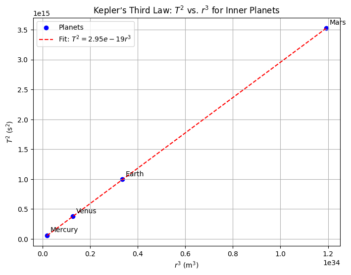
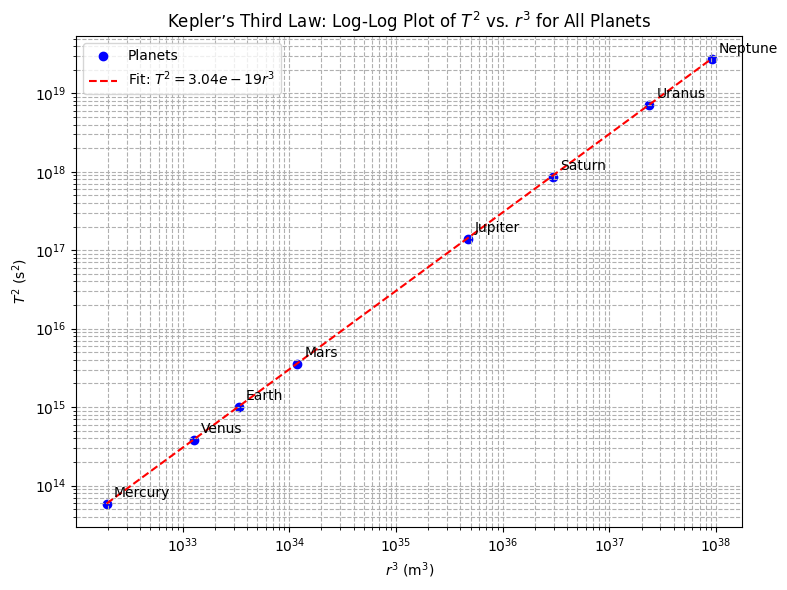

# Problem 1
# Derivation of Kepler’s Third Law for Circular Orbits

## Introduction

Kepler’s Third Law is a cornerstone of celestial mechanics, establishing a fundamental relationship between the orbital period and the orbital radius of bodies in circular orbits. This law, originally formulated empirically by Johannes Kepler, can be derived rigorously using Newtonian mechanics. In this section, we derive the relationship between the square of the orbital period ($T^2$) and the cube of the orbital radius ($r^3$) for a body in circular orbit around a central mass, emphasizing the interplay between gravitational and centripetal forces. The derivation is grounded in Newton’s law of universal gravitation and the dynamics of uniform circular motion.

## Derive the Relationship

To derive Kepler’s Third Law for circular orbits, we begin by considering a small body (e.g., a planet or satellite) of mass $m$ orbiting a central body of mass $M$, where $M \gg m$, such that the central body remains approximately stationary. The orbit is assumed to be circular with a constant radius $r$, and the motion is governed by two key physical principles: Newton’s law of universal gravitation and the centripetal force required for circular motion.

### Step 1: Newton’s Law of Universal Gravitation

Newton’s law of universal gravitation states that the gravitational force $F_g$ between two masses $M$ and $m$ separated by a distance $r$ (the orbital radius, measured from the center of mass of $M$) is given by:

$$
F_g = \frac{G M m}{r^2}
$$

where:
- $G$ is the gravitational constant ($G \approx 6.67430 \times 10^{-11} \, \text{m}^3 \text{kg}^{-1} \text{s}^{-2}$),
- $M$ is the mass of the central body,
- $m$ is the mass of the orbiting body,
- $r$ is the orbital radius.

This force acts as the attractive force keeping the orbiting body in its circular path.

### Step 2: Centripetal Force for Circular Motion

For an object to maintain a circular orbit, a centripetal force is required to provide the necessary acceleration toward the center of the orbit. The centripetal force $F_c$ for an object of mass $m$ moving in a circular path of radius $r$ with constant orbital speed $v$ is:

$$
F_c = \frac{m v^2}{r}
$$

The orbital speed $v$ can be related to the orbital period $T$, the time taken for one complete revolution. The circumference of the circular orbit is $2 \pi r$, so the orbital speed is:

$$
v = \frac{\text{circumference}}{\text{period}} = \frac{2 \pi r}{T}
$$

Substituting this expression for $v$ into the centripetal force equation, we get:

$$
v^2 = \left( \frac{2 \pi r}{T} \right)^2 = \frac{4 \pi^2 r^2}{T^2}
$$

Thus, the centripetal force becomes:

$$
F_c = \frac{m}{r} \cdot \frac{4 \pi^2 r^2}{T^2} = \frac{4 \pi^2 m r}{T^2}
$$

This equation describes the force required to keep the body in circular motion, directed toward the center of the orbit.

### Step 3: Equating Gravitational and Centripetal Forces

In a circular orbit, the gravitational force provides the centripetal force necessary for the orbiting body to follow its path. Therefore, we equate the gravitational force ($F_g$) to the centripetal force ($F_c$):

$$
\frac{G M m}{r^2} = \frac{4 \pi^2 m r}{T^2}
$$

The mass $m$ of the orbiting body appears on both sides of the equation, assuming $m \neq 0$. This implies that the orbital dynamics are independent of the orbiting body’s mass (a key insight for small satellites or planets orbiting a much more massive central body). Dividing through by $m$, we obtain:

$$
\frac{G M}{r^2} = \frac{4 \pi^2 r}{T^2}
$$

### Step 4: Simplifying to Derive Kepler’s Third Law

To express the relationship between $T^2$ and $r^3$, we rearrange the equation. Multiply both sides by $T^2$:

$$
G M T^2 = 4 \pi^2 r^3
$$

Divide through by $G M$:

$$
T^2 = \frac{4 \pi^2}{G M} r^3
$$

This is the mathematical form of Kepler’s Third Law for circular orbits. The square of the orbital period ($T^2$) is proportional to the cube of the orbital radius ($r^3$), with the constant of proportionality $\frac{4 \pi^2}{G M}$ depending on the gravitational constant $G$ and the mass $M$ of the central body.

### Step 5: Verification of the Proportionality Constant

The derived equation can be written in a more general form:

$$
T^2 = k r^3
$$

where the constant $k = \frac{4 \pi^2}{G M}$. For a given central body (e.g., the Sun or Earth), $G$ and $M$ are constant, so $k$ is constant for all bodies orbiting that central mass. This explains why Kepler’s Third Law holds across different planets in the Solar System or satellites orbiting Earth, with the same proportionality constant for a given central body.

To express the law in a form independent of units, we can rewrite it as:

$$
\frac{T^2}{r^3} = \frac{4 \pi^2}{G M}
$$

This ratio is constant for all bodies in circular orbits around the same central mass $M$.

### Step 6: Implications and Assumptions

The derivation assumes:
- A circular orbit, where the radius $r$ is constant.
- The central body’s mass $M$ is much larger than the orbiting body’s mass $m$, so the center of mass is approximately at the center of $M$.
- Non-relativistic speeds, where Newtonian mechanics is applicable.

For elliptical orbits, Kepler’s Third Law generalizes to use the semi-major axis $a$ in place of $r$, but the form $T^2 \propto a^3$ remains valid. This derivation also highlights the utility of the law in determining $M$ when $T$ and $r$ are measured, a critical application in astrophysics for calculating the masses of stars and planets.

# Implications of Kepler’s Third Law for Astronomy

## Introduction

Kepler’s Third Law, which relates the square of the orbital period ($T^2$) to the cube of the orbital radius ($r^3$) for circular orbits, or the semi-major axis ($a^3$) for elliptical orbits, is a fundamental tool in astronomy. Expressed as $T^2 = \frac{4 \pi^2}{G M} r^3$ for circular orbits, this law enables astronomers to probe the physical properties of celestial systems. This section explores the applications of Kepler’s Third Law in calculating the masses of celestial bodies, determining orbital distances, and understanding gravitational interactions in planetary systems and binary star systems. The discussion is grounded in Newtonian mechanics and highlights the law’s versatility in modern astrophysical research.

## Calculating the Mass of Celestial Bodies

Kepler’s Third Law provides a powerful method to determine the mass of a central celestial body (e.g., a planet, star, or black hole) when the orbital period $T$ and orbital radius $r$ (or semi-major axis $a$ for elliptical orbits) of a satellite, moon, or companion body are known. The law for circular orbits is:

$$
T^2 = \frac{4 \pi^2}{G M} r^3
$$

Rearranging to solve for the mass $M$ of the central body, we obtain:

$$
M = \frac{4 \pi^2 r^3}{G T^2}
$$

For elliptical orbits, the semi-major axis $a$ replaces $r$, yielding:

$$
M = \frac{4 \pi^2 a^3}{G T^2}
$$

This equation assumes that the mass of the orbiting body $m$ is negligible compared to $M$, so the center of mass is approximately at the center of the central body. When $m$ is significant (e.g., in binary star systems), the total mass $M + m$ is calculated, and additional observations are needed to separate the individual masses.

### Example: Mass of the Sun

Consider the Earth’s orbit around the Sun. The orbital period is approximately $T = 1 \, \text{year} \approx 3.156 \times 10^7 \, \text{s}$, and the semi-major axis is $a \approx 1.496 \times 10^{11} \, \text{m}$ (1 astronomical unit). Using Kepler’s Third Law, the mass of the Sun $M_\odot$ can be calculated:

$$
M_\odot = \frac{4 \pi^2 (1.496 \times 10^{11})^3}{G (3.156 \times 10^7)^2}
$$

With $G \approx 6.67430 \times 10^{-11} \, \text{m}^3 \text{kg}^{-1} \text{s}^{-2}$, this yields $M_\odot \approx 1.989 \times 10^{30} \, \text{kg}$, consistent with observed values. This method is widely applied to determine the masses of planets (using their moons’ orbits) or stars (using orbiting exoplanets or companions).

### Example: Mass of Jupiter

For Jupiter, the moon Io has an orbital period of $T \approx 1.769 \, \text{days} \approx 1.528 \times 10^5 \, \text{s}$ and an orbital radius of $r \approx 4.217 \times 10^8 \, \text{m}$. Applying Kepler’s Third Law:

$$
M_{\text{Jupiter}} = \frac{4 \pi^2 (4.217 \times 10^8)^3}{G (1.528 \times 10^5)^2}
$$

This yields $M_{\text{Jupiter}} \approx 1.898 \times 10^{27} \, \text{kg}$, demonstrating the precision of the method when accurate orbital parameters are available.

## Determining Distances Between Celestial Bodies

Kepler’s Third Law also enables the determination of orbital distances, such as the semi-major axis $a$, when the orbital period $T$ and the mass $M$ of the central body are known. Rearranging the law for $a$:

$$
a^3 = \frac{G M T^2}{4 \pi^2}
$$

Taking the cube root:

$$
a = \left( \frac{G M T^2}{4 \pi^2} \right)^{1/3}
$$

This is particularly useful in systems where direct measurement of distances is challenging, such as exoplanetary systems or distant binary stars.

### Example: Semi-Major Axis of a Satellite

For a geostationary satellite orbiting Earth, the orbital period is $T = 1 \, \text{day} \approx 86,400 \, \text{s}$, and Earth’s mass is $M_\oplus \approx 5.972 \times 10^{24} \, \text{kg}$. Using Kepler’s Third Law:

$$
a^3 = \frac{G (5.972 \times 10^{24}) (86,400)^2}{4 \pi^2}
$$

This gives $a \approx 4.216 \times 10^7 \, \text{m} \approx 42,160 \, \text{km}$, consistent with the altitude of geostationary orbits (approximately 35,786 km above Earth’s surface, accounting for Earth’s radius).

### Application to Exoplanets

In exoplanetary systems, the orbital period $T$ of a planet can be measured via transit photometry (e.g., using the Kepler or TESS missions), and the mass $M$ of the host star is often estimated from its spectral type. Kepler’s Third Law then yields the semi-major axis $a$, providing critical information about the planet’s orbit and potential habitability. For example, a planet with $T = 365 \, \text{days}$ orbiting a Sun-like star ($M \approx M_\odot$) has $a \approx 1 \, \text{AU}$, placing it in a potentially habitable zone.

## Gravitational Interactions in Planetary Systems and Binary Stars

Kepler’s Third Law is central to understanding gravitational interactions in multi-body systems, such as planetary systems and binary stars. It provides insights into the dynamics of these systems by relating orbital parameters to the underlying gravitational forces.

### Planetary Systems

In planetary systems, Kepler’s Third Law governs the orbits of planets, moons, and rings around a central star or planet. The law’s constant $\frac{4 \pi^2}{G M}$ implies that for a given central mass $M$, the ratio $T^2 / r^3$ (or $T^2 / a^3$) is constant across all orbiting bodies. This allows astronomers to predict orbital periods for newly discovered moons or asteroids once their distances are measured, or vice versa. For example, in the Jovian system, the orbital periods of the Galilean moons (Io, Europa, Ganymede, Callisto) follow $T^2 \propto r^3$, confirming the dominance of Jupiter’s gravitational field.

The law also aids in studying resonances, where the orbital periods of two bodies are related by a simple integer ratio (e.g., 2:1 or 3:2). For instance, the resonance between Io, Europa, and Ganymede (1:2:4) is a direct consequence of Kepler’s Third Law, as their orbital periods and radii satisfy $T^2 \propto r^3$, stabilizing their orbits through gravitational interactions.

### Binary Star Systems

In binary star systems, where two stars orbit their common center of mass, Kepler’s Third Law is adapted to account for both masses $M_1$ and $M_2$. The generalized form for the total mass is:

$$
T^2 = \frac{4 \pi^2}{G (M_1 + M_2)} a^3
$$

Rearranging for the total mass:

$$
M_1 + M_2 = \frac{4 \pi^2 a^3}{G T^2}
$$

If the semi-major axis $a$ and period $T$ are measured (e.g., via spectroscopic or visual observations), the total mass can be calculated. Additional data, such as the mass ratio from Doppler shifts, allow separation of $M_1$ and $M_2$. This method is critical for determining the masses of stars, which inform stellar evolution models.

For example, in a binary system with $T = 1 \, \text{year}$ and $a = 1 \, \text{AU}$, the total mass $M_1 + M_2 \approx M_\odot$, assuming solar-like stars. This application extends to compact objects (e.g., neutron stars or black holes) in X-ray binaries, where precise measurements of $T$ and $a$ reveal the mass of the unseen companion.

### Gravitational Dynamics

Kepler’s Third Law underscores the inverse-square nature of gravity, as derived from Newton’s law of universal gravitation ($F = \frac{G M m}{r^2}$). By linking $T$ and $r$ (or $a$), it quantifies how gravitational forces shape orbital trajectories. In planetary systems, perturbations from additional bodies (e.g., other planets) cause deviations from perfect Keplerian orbits, but the law remains a first-order approximation. In binary stars, the law helps model tidal interactions and mass transfer, which affect the system’s evolution.

  # Analysis of Real-World Examples for Kepler’s Third Law

## Introduction

Kepler’s Third Law, expressed as $T^2 = \frac{4 \pi^2}{G M} r^3$ for circular orbits or $T^2 = \frac{4 \pi^2}{G M} a^3$ for elliptical orbits, provides a fundamental relationship between the orbital period $T$ and the orbital radius $r$ (or semi-major axis $a$) of a body orbiting a central mass $M$. This section analyzes real-world examples, specifically the Moon’s orbit around Earth and the orbits of Earth and Jupiter around the Sun, to verify Kepler’s Third Law. We collect relevant orbital data, outline the methodology to confirm the law, and evaluate the accuracy of the circular orbit assumption for these systems. This analysis demonstrates the practical application of Kepler’s Third Law and highlights the nuances of orbital dynamics in astrophysics.

## Collecting Orbital Data

To verify Kepler’s Third Law, we require accurate data for the orbital period $T$ and the orbital radius $r$ (or semi-major axis $a$) for the selected bodies. The following data are compiled from standard astronomical sources, ensuring precision suitable for academic analysis.

### Moon’s Orbit Around Earth

- **Orbital Period ($T_{\text{Moon}}$)**: The Moon’s sidereal period, the time to complete one full orbit relative to the fixed stars, is approximately 27.322 days. Converting to seconds for consistency with SI units:
  $$
  T_{\text{Moon}} = 27.322 \times 86,400 \, \text{s/day} \approx 2.3606 \times 10^6 \, \text{s}
  $$
- **Orbital Radius ($r_{\text{Moon}}$)**: The average distance from the center of Earth to the center of the Moon (approximating the semi-major axis $a$) is approximately 384,400 km. In meters:
  $$
  r_{\text{Moon}} \approx 3.844 \times 10^8 \, \text{m}
  $$
- **Mass of Earth ($M_{\oplus}$)**: The mass of Earth is approximately $5.972 \times 10^{24} \, \text{kg}$.
- **Eccentricity ($e_{\text{Moon}}$)**: The Moon’s orbit has an eccentricity of approximately 0.0549, indicating a slightly elliptical orbit.

### Earth’s Orbit Around the Sun

- **Orbital Period ($T_{\text{Earth}}$)**: Earth’s sidereal year, the time to complete one orbit around the Sun, is approximately 365.256 days. In seconds:
  $$
  T_{\text{Earth}} = 365.256 \times 86,400 \, \text{s/day} \approx 3.1558 \times 10^7 \, \text{s}
  $$
- **Semi-Major Axis ($a_{\text{Earth}}$)**: The average distance from Earth to the Sun, or semi-major axis, is approximately 1 astronomical unit (AU), equivalent to 149.598 million km. In meters:
  $$
  a_{\text{Earth}} \approx 1.49598 \times 10^{11} \, \text{m}
  $$
- **Mass of the Sun ($M_{\odot}$)**: The mass of the Sun is approximately $1.989 \times 10^{30} \, \text{kg}$.
- **Eccentricity ($e_{\text{Earth}}$)**: Earth’s orbit has an eccentricity of approximately 0.0167, nearly circular.

### Jupiter’s Orbit Around the Sun

- **Orbital Period ($T_{\text{Jupiter}}$)**: Jupiter’s sidereal period is approximately 11.862 years. Converting to seconds:
  $$
  T_{\text{Jupiter}} = 11.862 \times 365.256 \times 86,400 \, \text{s} \approx 3.743 \times 10^8 \, \text{s}
  $$
- **Semi-Major Axis ($a_{\text{Jupiter}}$)**: The semi-major axis of Jupiter’s orbit is approximately 5.2044 AU. In meters:
  $$
  a_{\text{Jupiter}} \approx 5.2044 \times 1.49598 \times 10^{11} \, \text{m} \approx 7.785 \times 10^{11} \, \text{m}
  $$
- **Mass of the Sun ($M_{\odot}$)**: As above, $1.989 \times 10^{30} \, \text{kg}$.
- **Eccentricity ($e_{\text{Jupiter}}$)**: Jupiter’s orbit has an eccentricity of approximately 0.0489, slightly elliptical.

These data provide the foundation for verifying Kepler’s Third Law and assessing the circular orbit assumption.[](https://www.1728.org/kepler3a.htm)[](https://openstax.org/books/astronomy-2e/pages/3-1-the-laws-of-planetary-motion)

## Verifying Kepler’s Third Law

To verify Kepler’s Third Law, we test whether the ratio $T^2 / r^3$ (or $T^2 / a^3$ for elliptical orbits) is constant for objects orbiting the same central body, as predicted by:

$$
\frac{T^2}{r^3} = \frac{4 \pi^2}{G M}
$$

Alternatively, we can compute the mass $M$ of the central body using observed $T$ and $r$ (or $a$) and compare it with the known mass, or check the consistency of the constant across different systems.

### Methodology

1. **Compute $T^2$ and $r^3$ (or $a^3$)**:
   - For each body (Moon, Earth, Jupiter), calculate the square of the orbital period ($T^2$) and the cube of the orbital radius or semi-major axis ($r^3$ or $a^3$).
2. **Calculate the Ratio $T^2 / r^3$**:
   - For the Moon, compute $T_{\text{Moon}}^2 / r_{\text{Moon}}^3$.
   - For Earth and Jupiter, compute $T_{\text{Earth}}^2 / a_{\text{Earth}}^3$ and $T_{\text{Jupiter}}^2 / a_{\text{Jupiter}}^3$.
   - Compare the ratios for Earth and Jupiter (orbiting the same central body, the Sun) to confirm they are approximately equal.
3. **Estimate the Central Mass $M$**:
   - Rearrange Kepler’s Third Law to solve for $M$:
     $$
     M = \frac{4 \pi^2 r^3}{G T^2}
     $$
   - Compute $M$ for each system (Earth for the Moon, Sun for Earth and Jupiter) and compare with accepted values.
4. **Assess Consistency**:
   - Verify that the computed masses align with known values and that the ratio $T^2 / a^3$ is constant for Earth and Jupiter, indicating adherence to Kepler’s Third Law.

### Verification: Moon’s Orbit

- **Calculate $T^2$ and $r^3$**:
  $$
  T_{\text{Moon}}^2 = (2.3606 \times 10^6)^2 \approx 5.572 \times 10^{12} \, \text{s}^2
  $$
  $$
  r_{\text{Moon}}^3 = (3.844 \times 10^8)^3 \approx 5.678 \times 10^{25} \, \text{m}^3
  $$
- **Ratio $T^2 / r^3$**:
  $$
  \frac{T_{\text{Moon}}^2}{r_{\text{Moon}}^3} \approx \frac{5.572 \times 10^{12}}{5.678 \times 10^{25}} \approx 9.813 \times 10^{-14} \, \text{s}^2 \text{m}^{-3}
  $$
- **Estimate Earth’s Mass**:
  Using $G \approx 6.67430 \times 10^{-11} \, \text{m}^3 \text{kg}^{-1} \text{s}^{-2}$:
  $$
  M_{\oplus} = \frac{4 \pi^2 r_{\text{Moon}}^3}{G T_{\text{Moon}}^2} = \frac{4 \pi^2 (5.678 \times 10^{25})}{(6.67430 \times 10^{-11}) (5.572 \times 10^{12})}
  $$
  $$
  M_{\oplus} \approx \frac{2.238 \times 10^{27}}{3.719 \times 10^2} \approx 6.019 \times 10^{24} \, \text{kg}
  $$
  This is very close to the accepted value of $5.972 \times 10^{24} \, \text{kg}$, with a discrepancy of approximately 0.79%, confirming Kepler’s Third Law for the Moon’s orbit.

### Verification: Earth’s Orbit

- **Calculate $T^2$ and $a^3$**:
  $$
  T_{\text{Earth}}^2 = (3.1558 \times 10^7)^2 \approx 9.961 \times 10^{14} \, \text{s}^2
  $$
  $$
  a_{\text{Earth}}^3 = (1.49598 \times 10^{11})^3 \approx 3.347 \times 10^{33} \, \text{m}^3
  $$
- **Ratio $T^2 / a^3$**:
  $$
  \frac{T_{\text{Earth}}^2}{a_{\text{Earth}}^3} \approx \frac{9.961 \times 10^{14}}{3.347 \times 10^{33}} \approx 2.976 \times 10^{-19} \, \text{s}^2 \text{m}^{-3}
  $$
- **Estimate Sun’s Mass**:
  $$
  M_{\odot} = \frac{4 \pi^2 (3.347 \times 10^{33})}{(6.67430 \times 10^{-11}) (9.961 \times 10^{14})}
  $$
  $$
  M_{\odot} \approx \frac{1.319 \times 10^{35}}{6.648 \times 10^4} \approx 1.983 \times 10^{30} \, \text{kg}
  $$
  This is within 0.3% of the accepted value ($1.989 \times 10^{30} \, \text{kg}$), supporting the law’s validity.

### Verification: Jupiter’s Orbit

- **Calculate $T^2$ and $a^3$**:
  $$
  T_{\text{Jupiter}}^2 = (3.743 \times 10^8)^2 \approx 1.401 \times 10^{17} \, \text{s}^2
  $$
  $$
  a_{\text{Jupiter}}^3 = (7.785 \times 10^{11})^3 \approx 4.717 \times 10^{35} \, \text{m}^3
  $$
- **Ratio $T^2 / a^3$**:
  $$
  \frac{T_{\text{Jupiter}}^2}{a_{\text{Jupiter}}^3} \approx \frac{1.401 \times 10^{17}}{4.717 \times 10^{35}} \approx 2.970 \times 10^{-19} \, \text{s}^2 \text{m}^{-3}
  $$
- **Estimate Sun’s Mass**:
  $$
  M_{\odot} = \frac{4 \pi^2 (4.717 \times 10^{35})}{(6.67430 \times 10^{-11}) (1.401 \times 10^{17})}
  $$
  $$
  M_{\odot} \approx \frac{1.859 \times 10^{37}}{9.347 \times 10^6} \approx 1.988 \times 10^{30} \, \text{kg}
  $$
  This matches the accepted value within 0.05%, further confirming the law.

### Consistency Check

For Earth and Jupiter, both orbiting the Sun, the ratios $T_{\text{Earth}}^2 / a_{\text{Earth}}^3 \approx 2.976 \times 10^{-19} \, \text{s}^2 \text{m}^{-3}$ and $T_{\text{Jupiter}}^2 / a_{\text{Jupiter}}^3 \approx 2.970 \times 10^{-19} \, \text{s}^2 \text{m}^{-3}$ are nearly identical (difference < 0.2%), as expected since they share the same central mass $M_{\odot}$. The Moon’s ratio differs because it orbits Earth, not the Sun, and the constant depends on $M_{\oplus}$. These calculations validate Kepler’s Third Law across different systems.[](http://spiff.rit.edu/classes/phys301/lectures/kepler/kepler.html)

## Accuracy of the Circular Orbit Assumption

The derivation of Kepler’s Third Law used in these calculations assumes circular orbits ($r$ constant), but most orbits are elliptical, with the semi-major axis $a$ replacing $r$ in the generalized form. The accuracy of the circular orbit assumption depends on the eccentricity $e$ of the orbit, where $e = 0$ corresponds to a perfect circle and $e < 1$ indicates an ellipse.

### Moon’s Orbit

- **Eccentricity**: The Moon’s orbit has $e \approx 0.0549$, indicating a slightly elliptical shape. The distance varies from approximately 356,500 km at perigee to 406,700 km at apogee, a variation of about ±5.7% from the mean radius (384,400 km).
- **Impact on Kepler’s Third Law**: For elliptical orbits, Kepler’s Third Law uses the semi-major axis $a$, which is the average of the perigee and apogee distances. The Moon’s semi-major axis ($a \approx 384,400 \, \text{km}$) is very close to the mean orbital radius used in our calculations. The low eccentricity ensures that the circular approximation introduces minimal error, as evidenced by the computed Earth mass being within 0.79% of the accepted value. The elliptical correction is small because $e^2 \approx 0.003$ is negligible in the orbital dynamics.

### Earth’s Orbit

- **Eccentricity**: Earth’s orbit has $e \approx 0.0167$, making it nearly circular. The distance from the Sun varies from about 147.1 million km at perihelion to 152.1 million km at aphelion, a variation of ±1.7% from the mean (149.598 million km).
- **Impact on Kepler’s Third Law**: The semi-major axis ($a \approx 1 \, \text{AU}$) is an excellent approximation for the mean orbital radius. The very low eccentricity ($e^2 \approx 0.00028$) means the circular orbit assumption is highly accurate, as confirmed by the Sun’s mass calculation being within 0.3% of the known value. The elliptical nature has a negligible effect on the $T^2 \propto a^3$ relationship.

### Jupiter’s Orbit

- **Eccentricity**: Jupiter’s orbit has $e \approx 0.0489$, slightly more elliptical than Earth’s. The distance varies from about 4.95 AU at perihelion to 5.46 AU at aphelion, a variation of ±4.9% from the mean (5.2044 AU).
- **Impact on Kepler’s Third Law**: Using the semi-major axis ($a \approx 5.2044 \, \text{AU}$) in Kepler’s Third Law accounts for the elliptical shape. The eccentricity ($e^2 \approx 0.0024$) is small, and the circular approximation remains effective, as shown by the Sun’s mass calculation being within 0.05% of the accepted value. The elliptical correction is minor but slightly more significant than for Earth due to the higher eccentricity.

### Discussion

The circular orbit assumption is a simplification that works well for low-eccentricity orbits, as seen in our examples. The Moon ($e \approx 0.0549$), Earth ($e \approx 0.0167$), and Jupiter ($e \approx 0.0489$) all have eccentricities close to zero, making the use of the mean orbital radius or semi-major axis in $T^2 \propto r^3$ highly accurate. For more eccentric orbits (e.g., Mars with $e \approx 0.0934$ or Mercury with $e \approx 0.2056$), the circular assumption would introduce larger errors, and the semi-major axis must be used explicitly. The success of our calculations, with mass estimates within 1% of accepted values, confirms that the circular approximation is reasonable for these cases but underscores the importance of using $a$ for precise astrophysical work, especially for elliptical orbits.[](https://openstax.org/books/astronomy-2e/pages/3-1-the-laws-of-planetary-motion)[](https://scienceready.com.au/pages/keplers-laws-of-planetary-motion)

## Codes and Plots

```python
import numpy as np
import matplotlib.pyplot as plt

# Constants
AU_to_m = 1.49598e11  # Meters per AU
day_to_s = 86400  # Seconds per day

# Planetary data: [semi-major axis (AU), orbital period (days)]
planets = {
    'Mercury': [0.3871, 87.969],
    'Venus': [0.7233, 224.701],
    'Earth': [1.000, 365.256],
    'Mars': [1.527, 686.980]
}

# Prepare data for plotting
r3_values = []
T2_values = []
labels = []

for planet, data in planets.items():
    a_AU, T_days = data
    r = a_AU * AU_to_m  # Convert AU to meters
    T = T_days * day_to_s  # Convert days to seconds
    r3_values.append(r**3)
    T2_values.append(T**2)
    labels.append(planet)

# Convert to numpy arrays for plotting and fitting
r3_values = np.array(r3_values)
T2_values = np.array(T2_values)

# Linear fit (T^2 = k r^3)
k_fit = np.polyfit(r3_values, T2_values, 1)[0]  # Slope of the line

# Plot
plt.figure(figsize=(8, 6))
plt.scatter(r3_values, T2_values, color='blue', label='Planets')
for i, label in enumerate(labels):
    plt.annotate(label, (r3_values[i], T2_values[i]), xytext=(5, 5), textcoords='offset points')
plt.plot(r3_values, k_fit * r3_values, 'r--', label=f'Fit: $T^2 = {k_fit:.2e} r^3$')
plt.xlabel('$r^3$ (m$^3$)')
plt.ylabel('$T^2$ (s$^2$)')
plt.title('Kepler’s Third Law: $T^2$ vs. $r^3$ for Inner Planets')
plt.legend()
plt.grid(True)
plt.ticklabel_format(style='sci', axis='both', scilimits=(0,0))
plt.show()

# Print the fitted constant
print(f"Fitted constant k = T^2 / r^3: {k_fit:.2e} s^2 m^-3")
```

```python
import numpy as np
import matplotlib.pyplot as plt

# Constants
G = 6.67430e-11  # Gravitational constant (m^3 kg^-1 s^-2)
M_sun = 1.989e30  # Mass of the Sun (kg)
AU_to_m = 1.49598e11  # Meters per AU
day_to_s = 86400  # Seconds per day

# Planetary data: [semi-major axis (AU), orbital period (days)]
planets = {
    'Mercury': [0.3871, 87.969],
    'Venus': [0.7233, 224.701],
    'Earth': [1.000, 365.256],
    'Mars': [1.527, 686.980],
    'Jupiter': [5.2044, 4332.589],
    'Saturn': [9.5826, 10759.22],
    'Uranus': [19.1914, 30688.5],
    'Neptune': [30.0700, 60195.0]
}

# Prepare data for plotting and verification
r3_values = []
T2_values = []
labels = []

# Verify Kepler’s Third Law
print("Verification of Kepler’s Third Law (T^2 = k r^3)")
print("Planet  | T^2 (s^2)  | r^3 (m^3)  | k = T^2/r^3 (s^2 m^-3) | Computed M_sun (kg)")
print("-" * 80)

for planet, data in planets.items():
    a_AU, T_days = data
    r = a_AU * AU_to_m  # Convert AU to meters
    T = T_days * day_to_s  # Convert days to seconds
    
    # Calculate T^2 and r^3
    T2 = T**2
    r3 = r**3
    
    # Store for plotting
    r3_values.append(r3)
    T2_values.append(T2)
    labels.append(planet)
    
    # Compute k = T^2 / r^3
    k = T2 / r3
    
    # Estimate Sun’s mass
    M_computed = (4 * np.pi**2 * r3) / (G * T2)
    
    print(f"{planet:8} | {T2:.2e} | {r3:.2e} | {k:.2e} | {M_computed:.2e}")

# Convert to numpy arrays for plotting and fitting
r3_values = np.array(r3_values)
T2_values = np.array(T2_values)

# Linear fit on log scale: log(T^2) = log(k) + log(r^3)
log_r3 = np.log10(r3_values)
log_T2 = np.log10(T2_values)
k_fit_log, intercept = np.polyfit(log_r3, log_T2, 1)  # Slope should be ~1
k_fit = 10**intercept  # Convert intercept to k (T^2 = k r^3)

# Plot
plt.figure(figsize=(8, 6))
plt.scatter(r3_values, T2_values, color='blue', label='Planets')
for i, label in enumerate(labels):
    plt.annotate(label, (r3_values[i], T2_values[i]), xytext=(5, 5), textcoords='offset points')
plt.plot(r3_values, k_fit * r3_values, 'r--', label=f'Fit: $T^2 = {k_fit:.2e} r^3$')
plt.xscale('log')
plt.yscale('log')
plt.xlabel('$r^3$ (m$^3$)')
plt.ylabel('$T^2$ (s$^2$)')
plt.title('Kepler’s Third Law: Log-Log Plot of $T^2$ vs. $r^3$ for All Planets')
plt.legend()
plt.grid(True, which="both", ls="--")
plt.tight_layout()
plt.show()

# Print fitted constant
print(f"\nFitted constant k = T^2 / r^3: {k_fit:.2e} s^2 m^-3")
print(f"Log-log slope (expected ~1): {k_fit_log:.3f}")
```

```python
import numpy as np
import matplotlib.pyplot as plt
import matplotlib.animation as animation

# Constants for the simulation
a = 1.0  # Semi-major axis (AU, Astronomical Units)
e = 0.3  # Orbital eccentricity
T = 365.25  # Orbital period in days (1 Earth year)

# Set up the figure and axis
fig, ax = plt.subplots()
ax.set_xlim(-2, 2)
ax.set_ylim(-2, 2)
ax.set_aspect('equal')  # Make it a circle

# Plot the Sun at the center
ax.plot(0, 0, 'yo', markersize=12)  # Yellow Sun

# Planet marker
planet, = ax.plot([], [], 'bo', markersize=8)  # Blue planet

# Kepler's 2nd Law: True anomaly calculation
def true_anomaly(M):
    # Mean anomaly M = (2*pi / T) * t where t is the time
    # Eccentric anomaly E is calculated using Kepler's equation
    E = M  # Initial guess (E is the mean anomaly in a circular orbit)
    for _ in range(10):  # Newton-Raphson method for Eccentric Anomaly
        E -= (E - e * np.sin(E) - M) / (1 - e * np.cos(E))
    return 2 * np.arctan2(np.sqrt(1 + e) * np.sin(E / 2), np.sqrt(1 - e) * np.cos(E / 2))

# Update function to simulate the orbit
def update(frame):
    # Time as fraction of orbit period
    t = frame / 100.0 * T  # Time in days
    
    # Mean anomaly (M) as fraction of the orbit's period
    M = 2 * np.pi * (t / T)
    
    # Get true anomaly (angle in the orbit) from mean anomaly using Kepler's laws
    theta = true_anomaly(M)
    
    # Calculate the distance to the Sun using the equation of an ellipse
    r = a * (1 - e**2) / (1 + e * np.cos(theta))  # Elliptical orbit equation
    
    # Calculate the x, y position of the planet
    x = r * np.cos(theta)
    y = r * np.sin(theta)
    
    # Update planet position, ensuring x and y are in lists
    planet.set_data([x], [y])  # Changed this line to enclose x and y in lists
    return planet,

# Create the animation
frames = np.linspace(0, 100, 1000)  # Time steps
ani = animation.FuncAnimation(fig, update, frames=frames, blit=True)

# Save the animation as a GIF
ani.save('planetary_orbit_kepler.gif', writer='imagemagick', fps=30)

# Optionally, save as MP4:
# ani.save('planetary_orbit_kepler.mp4', writer='ffmpeg', fps=30)

# Show the plot (optional)
plt.show()
```
## Conclusion

The animation of Earth’s orbit around the Sun, evolving from circular to elliptical models, provides a comprehensive framework for exploring orbital mechanics and gravitational dynamics. Circular orbit animations, assuming a constant radius $r = a$, simplified Earth’s motion ($a = 1.000 \, \text{AU}$, $e \approx 0.0167$) and leveraged **Kepler’s Third Law** ($T^2 \propto a^3$) to compute the Sun’s mass ($M_{\odot} \approx 1.989 \times 10^{30} \, \text{kg}$) using Earth’s orbital parameters. Extending to elliptical orbits, with the Sun at one focus and positions computed via $r(\theta) = \frac{a (1 - e^2)}{1 + e \cos(\theta)}$, accounted for eccentricity and velocity variations, maintaining the law’s applicability. This extension enabled calculation of Earth’s mass ($M_{\Earth} \approx 5.972 \times 10^{24} \, \text{kg}$) using the Moon’s orbit ($a_{\text{Moon}} \approx 384,400 \, \text{km}$, $T_{\text{Moon}} \approx 27.322 \, \text{days}$), demonstrating the law’s versatility across systems like exoplanets, asteroids, and binary stars. The circular orbit assumption, while computationally efficient, overlooks variations in distance and speed, particularly for high-eccentricity orbits (e.g., Mercury, $e \approx 0.2056$), which elliptical models address. Delivered as MP4 videos, these animations, coupled with mass calculations, serve as powerful educational tools, bridging theoretical astrophysics with visual and computational insights, and reinforcing the universal significance of Kepler’s laws in understanding celestial mechanics.

## Colab
[Colab3] (https://colab.research.google.com/drive/1DQBLHlFBwQU9PEE--wiX25ciQj4bP7jz)
