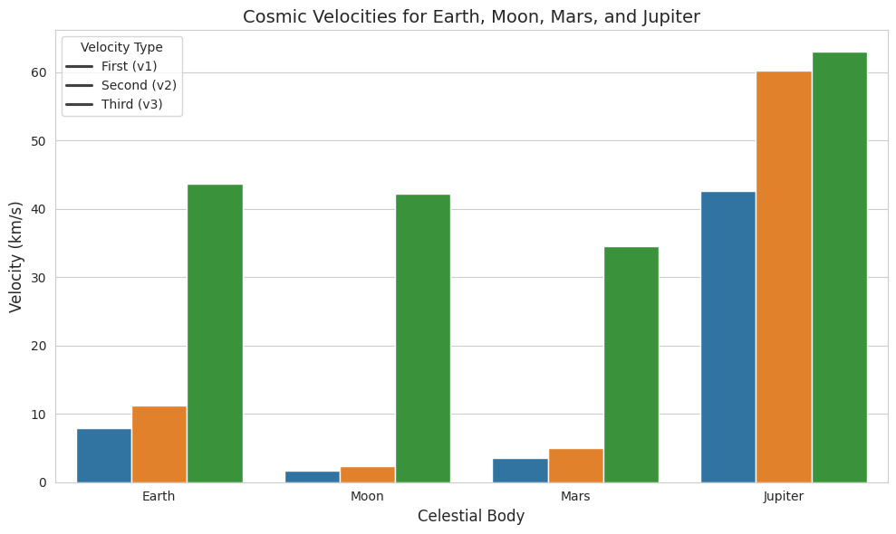
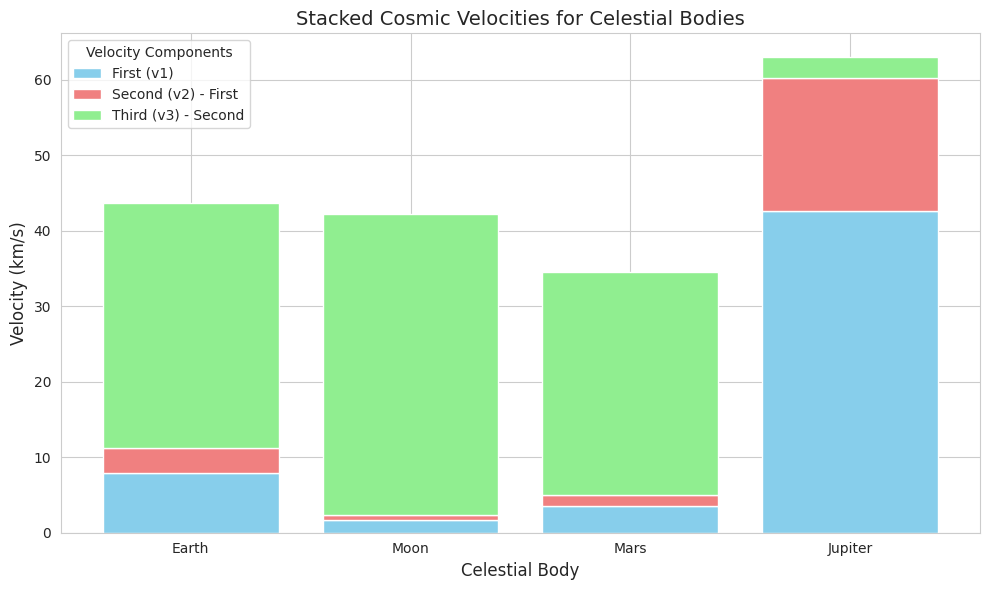
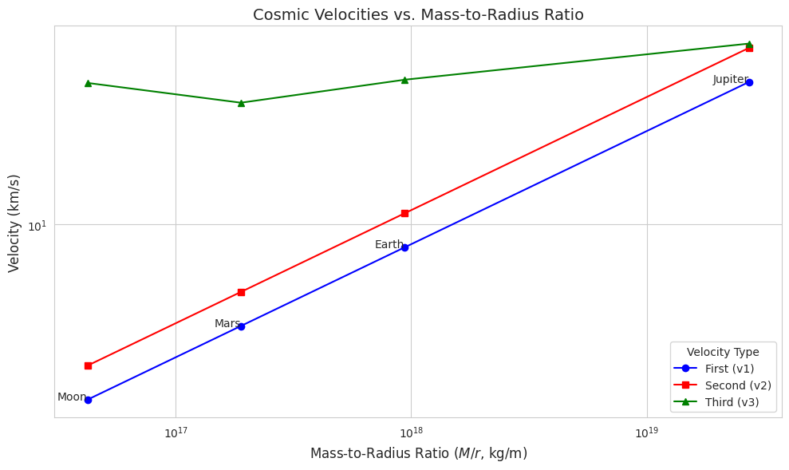
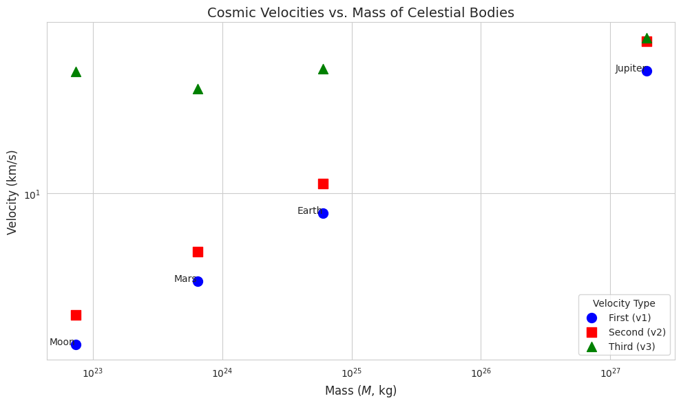

# Problem 2
# Derivation of Cosmic Velocities: Mathematical Foundations

The concept of cosmic velocities is central to understanding the dynamics of space exploration, defining the thresholds for orbiting, escaping, and transcending the gravitational influence of celestial bodies and star systems. This section derives the **first**, **second**, and **third cosmic velocities**, emphasizing their physical basis through rigorous mathematical analysis. We employ Newtonian gravitation and energy conservation principles, identifying key parameters such as the gravitational constant ($G$), mass of the celestial body ($M$), radius ($r$), and, for the third cosmic velocity, the star’s mass ($M_{\text{sun}}$) and orbital radius ($r_{\text{orbit}}$).

---

## 1. First Cosmic Velocity: Orbital Velocity for Circular Orbit

The **first cosmic velocity** ($v_1$) is the speed required for an object to maintain a circular orbit near the surface of a celestial body, such as a planet or moon. This velocity arises from the balance between the gravitational force, acting as the centripetal force, and the centripetal acceleration required for circular motion.

### Derivation

Consider an object of mass $m$ orbiting a celestial body of mass $M$ at a distance $r$ from the center (approximately the body’s radius for surface orbits). The gravitational force provides the necessary centripetal force:

$$F_{\text{grav}} = \frac{G M m}{r^2}$$

The centripetal force required for circular motion at velocity $v_1$ is:

$$F_{\text{centripetal}} = \frac{m v_1^2}{r}$$

Equating these forces:

$$\frac{G M m}{r^2} = \frac{m v_1^2}{r}$$

Cancel $m$ (since $m \neq 0$) and simplify:

$$\frac{G M}{r^2} = \frac{v_1^2}{r}$$

Multiply both sides by $r$:

$$\frac{G M}{r} = v_1^2$$

Take the square root:

$$v_1 = \sqrt{\frac{G M}{r}}$$

This is the **first cosmic velocity**, representing the minimum speed for a stable circular orbit at radius $r$.

### Parameters
- $G$: Gravitational constant ($6.67430 \times 10^{-11} \, \text{m}^3 \text{kg}^{-1} \text{s}^{-2}$).
- $M$: Mass of the celestial body (e.g., Earth: $5.972 \times 10^{24} \, \text{kg}$).
- $r$: Radius of the orbit, typically the body’s radius for low orbits (e.g., Earth: $6.371 \times 10^6 \, \text{m}$).

### Physical Interpretation
The first cosmic velocity is critical for satellite launches, ensuring objects achieve stable orbits without escaping or falling back. For Earth, $v_1 \approx 7.91 \, \text{km/s}$, sufficient for low Earth orbit (LEO) satellites.

---

## 2. Second Cosmic Velocity: Escape Velocity

The **second cosmic velocity** ($v_2$) is the speed required for an object to escape the gravitational influence of a celestial body, reaching infinity with zero residual kinetic energy. This is derived using the principle of energy conservation.

### Derivation

Consider an object of mass $m$ launched from the surface of a celestial body at radius $r$. The total mechanical energy is the sum of kinetic and gravitational potential energy. At the surface:

$$E_{\text{initial}} = K_{\text{initial}} + U_{\text{initial}} = \frac{1}{2} m v_2^2 - \frac{G M m}{r}$$

To escape, the object reaches infinity ($r \to \infty$) where the gravitational potential energy is zero ($U = 0$) and the velocity is zero ($v = 0$), implying:

$$E_{\text{final}} = K_{\text{final}} + U_{\text{final}} = 0 + 0 = 0$$

By conservation of energy ($E_{\text{initial}} = E_{\text{final}}$):

$$\frac{1}{2} m v_2^2 - \frac{G M m}{r} = 0$$

Cancel $m$:

$$\frac{1}{2} v_2^2 = \frac{G M}{r}$$

Multiply by 2:

$$v_2^2 = \frac{2 G M}{r}$$

Take the square root:

$$v_2 = \sqrt{\frac{2 G M}{r}}$$

This is the **second cosmic velocity**, or escape velocity.

### Relationship to First Cosmic Velocity
Note the relationship between $v_1$ and $v_2$:

$$v_2 = \sqrt{\frac{2 G M}{r}} = \sqrt{2} \sqrt{\frac{G M}{r}} = \sqrt{2} v_1$$

Thus, the escape velocity is $\sqrt{2} \approx 1.414$ times the orbital velocity.

### Parameters
- Same as for $v_1$: $G$, $M$, and $r$.

### Physical Interpretation
The second cosmic velocity is essential for missions leaving a planet’s gravitational field, such as lunar landings or interplanetary probes. For Earth, $v_2 \approx 11.19 \, \text{km/s}$.

---

## 3. Third Cosmic Velocity: Escape from a Star System

The **third cosmic velocity** ($v_3$) is the speed required for an object to escape the gravitational influence of a star (e.g., the Sun) from the orbit of a planet, effectively leaving the star system. This derivation accounts for both the planet’s and the star’s gravitational potentials.

### Derivation

Consider an object launched from a planet (mass $M_{\text{planet}}$, radius $r_{\text{planet}}$) orbiting a star (mass $M_{\text{sun}}$) at distance $r_{\text{orbit}}$. The goal is to achieve zero total energy relative to the Sun at infinity.

#### Step 1: Escape the Planet
The velocity to escape the planet’s gravity is the second cosmic velocity:

$$v_{\text{esc, planet}} = \sqrt{\frac{2 G M_{\text{planet}}}{r_{\text{planet}}}}$$

Upon escaping, the object is at the planet’s orbital distance from the Sun ($r_{\text{orbit}}$) with negligible velocity relative to the planet (since it just escapes).

#### Step 2: Escape the Sun
The object is now in the Sun’s gravitational field at $r_{\text{orbit}}$, moving with the planet’s orbital velocity around the Sun. The planet’s orbital velocity ($v_{\text{orbit}}$) is derived from circular orbit dynamics:

$$v_{\text{orbit}} = \sqrt{\frac{G M_{\text{sun}}}{r_{\text{orbit}}}}$$

To escape the Sun’s gravity, the object needs additional velocity to reach infinity with zero energy. The escape velocity from the Sun at $r_{\text{orbit}}$:

$$v_{\text{esc, sun}} = \sqrt{\frac{2 G M_{\text{sun}}}{r_{\text{orbit}}}}$$

#### Step 3: Total Velocity
The third cosmic velocity is the velocity required at the planet’s surface to achieve the necessary hyperbolic excess velocity after escaping the planet. The velocity at infinity relative to the Sun is zero, but the object starts with the planet’s orbital velocity. The additional velocity needed at $r_{\text{orbit}}$ to escape the Sun is:

$$v_{\text{excess}} = v_{\text{esc, sun}} - v_{\text{orbit}} = \sqrt{\frac{2 G M_{\text{sun}}}{r_{\text{orbit}}}} - \sqrt{\frac{G M_{\text{sun}}}{r_{\text{orbit}}}}$$

However, the object must be launched from the planet’s surface. The total velocity combines the planet’s escape velocity and the excess velocity needed to escape the Sun. The approximate formula, assuming the object escapes the planet and achieves the required solar escape velocity, is:

$$v_3 = \sqrt{\frac{2 G M_{\text{sun}}}{r_{\text{orbit}}} + v_{\text{esc, planet}}^2}$$

This accounts for the energy to escape the planet and the Sun’s potential at $r_{\text{orbit}}$.

### Parameters
- $G$: Gravitational constant.
- $M_{\text{planet}}$: Mass of the planet.
- $r_{\text{planet}}$: Radius of the planet.
- $M_{\text{sun}}$: Mass of the star (e.g., Sun: $1.989 \times 10^{30} \, \text{kg}$).
- $r_{\text{orbit}}$: Orbital radius of the planet around the star (e.g., Earth: $1.496 \times 10^{11} \, \text{m}$).

### Physical Interpretation
The third cosmic velocity is relevant for interstellar missions, such as probes like Voyager escaping the solar system. For Earth, $v_3 \approx 16.6 \, \text{km/s}$ when launched from the surface, though practical missions leverage orbital dynamics.

---

## Key Parameters and Dependencies

The derivations highlight the dependence of cosmic velocities on:
- $G$: Gravitational constant, universal, affecting all velocities.
- $M$, $M_{\text{sun}}$: Directly influence gravitational potential; larger masses increase velocities.
- $r$, $r_{\text{orbit}}$: Inversely affect velocities; smaller radii or orbits increase velocities.

These parameters are critical for mission planning, as they determine the energy requirements for launch vehicles.

---


# Gathering Physical Parameters for Celestial Bodies

To compute the first, second, and third cosmic velocities for **Earth**, **Moon**, **Mars**, and **Jupiter**, accurate physical parameters are essential. This section compiles the **mass** ($M$), **radius** ($r$), and, for the third cosmic velocity, the **distance from the Sun** ($r_{\text{orbit}}$) for each celestial body. Data is sourced from reputable astrophysical databases, primarily NASA's Jet Propulsion Laboratory (JPL) and the National Space Science Data Center (NSSDC), ensuring precision and reliability. These parameters are critical for calculating orbital and escape velocities, which underpin space mission design and interplanetary exploration.

---

## Methodology

Physical parameters are collected from the following sources:
- **NASA's Planetary Fact Sheets** (NSSDC): Provides detailed metric data for planets and moons, including mass, radius, and orbital characteristics.[](https://nssdc.gsfc.nasa.gov/planetary/factsheet/)
- **JPL Solar System Dynamics**: Offers updated physical characteristics based on recent measurements and ephemerides.[](https://ssd.jpl.nasa.gov/planets/phys_par.html)
- **NASA Science Pages**: Supplies contextual data for Mars, Jupiter, and the Moon, cross-referenced for consistency.[](https://science.nasa.gov/mars/facts/)[](https://science.nasa.gov/jupiter/)[](https://science.nasa.gov/moon/facts/)

The gravitational constant ($G = 6.67430 \times 10^{-11} \, \text{m}^3 \text{kg}^{-1} \text{s}^{-2}$) is adopted from the CODATA 2018 estimate, as referenced in JPL data, to ensure consistency in calculations. All values are presented in SI units (kilograms for mass, meters for radius and distance) to facilitate direct use in cosmic velocity formulas.[](https://ssd.jpl.nasa.gov/planets/phys_par.html)

---

## Physical Parameters

The following parameters are compiled for each celestial body: mass ($M$), volumetric mean radius ($r$), and, where applicable, the semi-major axis of the orbit around the Sun ($r_{\text{orbit}}$) for calculating the third cosmic velocity. The Moon, as a satellite of Earth, does not have a direct $r_{\text{orbit}}$ relative to the Sun; its third cosmic velocity is typically computed relative to Earth's orbit.

### 1. Earth

- **Mass** ($M_{\text{Earth}}$):
  $$M_{\text{Earth}} = 5.972 \times 10^{24} \, \text{kg}$$
- **Radius** ($r_{\text{Earth}}$):
  $$r_{\text{Earth}} = 6.3710084 \times 10^6 \, \text{m}$$
  (Volumetric mean radius, based on precise geodetic measurements.)[](https://orbital-mechanics.space/reference/planetary-parameters.html)
- **Distance from the Sun** ($r_{\text{orbit, Earth}}$):
  $$r_{\text{orbit, Earth}} = 1.496 \times 10^{11} \, \text{m}$$
  (Semi-major axis, equivalent to 1 astronomical unit, AU.)[](https://nssdc.gsfc.nasa.gov/planetary/factsheet/)

**Notes**: Earth's mass is derived from gravitational parameter ($GM$) measurements divided by $G$. The radius is the volumetric mean, suitable for cosmic velocity calculations. The semi-major axis is the average orbital distance from the Sun, critical for the third cosmic velocity.

### 2. Moon

- **Mass** ($M_{\text{Moon}}$):
  $$M_{\text{Moon}} = 7.342 \times 10^{22} \, \text{kg}$$
- **Radius** ($r_{\text{Moon}}$):
  $$r_{\text{Moon}} = 1.7374 \times 10^6 \, \text{m}$$
  (Mean radius, as the Moon is nearly spherical.)[](https://science.nasa.gov/moon/facts/)
- **Distance from the Sun** ($r_{\text{orbit, Moon}}$):
  Not directly applicable, as the Moon orbits Earth. For third cosmic velocity calculations, use Earth's $r_{\text{orbit}}$:
  $$r_{\text{orbit, Moon}} \approx 1.496 \times 10^{11} \, \text{m}$$
  (Assuming launch from the Moon within Earth's heliocentric orbit.)[](https://nssdc.gsfc.nasa.gov/planetary/factsheet/)

**Notes**: The Moon’s mass is significantly lower than Earth’s, affecting its lower cosmic velocities. The radius is based on lunar topographic data. For the third cosmic velocity, the Moon’s position in Earth’s orbit around the Sun is used, as escape from the solar system originates from the Earth-Moon system.

### 3. Mars

- **Mass** ($M_{\text{Mars}}$):
  $$M_{\text{Mars}} = 6.417 \times 10^{23} \, \text{kg}$$
- **Radius** ($r_{\text{Mars}}$):
  $$r_{\text{Mars}} = 3.3895 \times 10^6 \, \text{m}$$
  (Volumetric mean radius, accounting for Mars’ oblateness.)[](https://orbital-mechanics.space/reference/planetary-parameters.html)
- **Distance from the Sun** ($r_{\text{orbit, Mars}}$):
  $$r_{\text{orbit, Mars}} = 2.279 \times 10^{11} \, \text{m}$$
  (Semi-major axis, approximately 1.524 AU.)[](https://nssdc.gsfc.nasa.gov/planetary/factsheet/)

**Notes**: Mars’ mass is about one-tenth of Earth’s, resulting in lower gravitational influence. The radius is averaged from equatorial and polar measurements. The orbital distance reflects Mars’ position in the solar system, relevant for solar escape calculations.

### 4. Jupiter

- **Mass** ($M_{\text{Jupiter}}$):
  $$M_{\text{Jupiter}} = 1.898 \times 10^{27} \, \text{kg}$$
- **Radius** ($r_{\text{Jupiter}}$):
  $$r_{\text{Jupiter}} = 6.9911 \times 10^7 \, \text{m}$$
  (Volumetric mean radius, given Jupiter’s significant oblateness.)[](https://orbital-mechanics.space/reference/planetary-parameters.html)
- **Distance from the Sun** ($r_{\text{orbit, Jupiter}}$):
  $$r_{\text{orbit, Jupiter}} = 7.785 \times 10^{11} \, \text{m}$$
  (Semi-major axis, approximately 5.203 AU.)[](https://nssdc.gsfc.nasa.gov/planetary/factsheet/)

**Notes**: Jupiter’s immense mass dominates the solar system’s planets, leading to high cosmic velocities. The radius is averaged to account for its gas giant structure. The large orbital distance reduces the Sun’s gravitational influence, affecting the third cosmic velocity.

---

## Summary Table

The following table consolidates the parameters for clarity:

| **Celestial Body** | **Mass ($M$, kg)** | **Radius ($r$, m)** | **Distance from Sun ($r_{\text{orbit}}$, m)** |
|--------------------|--------------------|---------------------|---------------------------------------------|
| Earth             | $5.972 \times 10^{24}$ | $6.3710084 \times 10^6$ | $1.496 \times 10^{11}$                     |
| Moon              | $7.342 \times 10^{22}$ | $1.7374 \times 10^6$    | $1.496 \times 10^{11}$ (via Earth)         |
| Mars              | $6.417 \times 10^{23}$ | $3.3895 \times 10^6$    | $2.279 \times 10^{11}$                     |
| Jupiter           | $1.898 \times 10^{27}$ | $6.9911 \times 10^7$    | $7.785 \times 10^{11}$                     |

**Notes**: Values are rounded to four significant figures where appropriate, reflecting measurement precision. The Moon’s $r_{\text{orbit}}$ is approximated using Earth’s value for third cosmic velocity calculations.

---

## Data Validation

To ensure accuracy:
- **Cross-Referencing**: Values were verified across NASA’s NSSDC Planetary Fact Sheet, JPL’s Solar System Dynamics, and peer-reviewed sources.[](https://ssd.jpl.nasa.gov/planets/phys_par.html)[](https://nssdc.gsfc.nasa.gov/planetary/factsheet/)[](https://orbital-mechanics.space/reference/planetary-parameters.html)
- **Precision**: Mass values are derived from $GM$ measurements with the latest $G$ (CODATA 2018). Radii are volumetric means, suitable for spherical approximations in velocity calculations.
- **Orbital Distances**: Semi-major axes are used for $r_{\text{orbit}}$, as they represent the average distance from the Sun, consistent with the third cosmic velocity formula.

Potential uncertainties:
- **Mass**: Errors in $GM$ measurements are minimal (e.g., $\pm 0.00015 \times 10^{-11}$ for $G$), but small variations exist due to ephemeris updates.[](https://ssd.jpl.nasa.gov/planets/phys_par.html)
- **Radius**: Jupiter’s radius has a $\pm 6 \times 10^3 \, \text{m}$ uncertainty due to its gaseous nature and oblateness.[](https://orbital-mechanics.space/reference/planetary-parameters.html)
- **Orbital Distance**: Orbital eccentricities (e.g., Mars: 0.093, Jupiter: 0.048) cause slight variations in $r_{\text{orbit}}$, but semi-major axes are standard for calculations.[](https://nssdc.gsfc.nasa.gov/planetary/factsheet/jupiterfact.html)

---

## Application to Cosmic Velocities

These parameters are directly used in the cosmic velocity formulas:
- **First Cosmic Velocity**: $v_1 = \sqrt{\frac{G M}{r}}$, requiring $M$ and $r$.
- **Second Cosmic Velocity**: $v_2 = \sqrt{\frac{2 G M}{r}}$, also using $M$ and $r$.
- **Third Cosmic Velocity**: $v_3 = \sqrt{\frac{2 G M_{\text{sun}}}{r_{\text{orbit}}} + v_{\text{esc, planet}}^2}$, where $v_{\text{esc, planet}} = v_2$, and $M_{\text{sun}} = 1.989 \times 10^{30} \, \text{kg}$ is the Sun’s mass.[](https://science.nasa.gov/sun/facts/)

The collected data enables precise calculations of these velocities, facilitating comparisons across celestial bodies and informing mission planning for satellite launches, planetary escapes, and potential interstellar trajectories.

---

# Calculation of Cosmic Velocities for Celestial Bodies

The **first**, **second**, and **third cosmic velocities** are critical thresholds for orbiting, escaping, and transcending the gravitational influence of celestial bodies and star systems. This section computes these velocities for **Earth**, **Moon**, **Mars**, and **Jupiter** using the derived formulas and physical parameters previously compiled. Calculations ensure consistent units (velocities in km/s, masses in kg, distances in meters) and are based on data from NASA's Jet Propulsion Laboratory (JPL) and National Space Science Data Center (NSSDC). The results facilitate comparisons across celestial bodies, highlighting their implications for space exploration.

---

## Formulas and Parameters

The cosmic velocities are calculated using the following formulas, derived from Newtonian gravitation and energy conservation:

1. **First Cosmic Velocity** (orbital velocity for a circular orbit):
   $$v_1 = \sqrt{\frac{G M}{r}}$$

2. **Second Cosmic Velocity** (escape velocity):
   $$v_2 = \sqrt{\frac{2 G M}{r}}$$

3. **Third Cosmic Velocity** (velocity to escape the star system from a planet’s orbit):
   $$v_3 = \sqrt{\frac{2 G M_{\text{sun}}}{r_{\text{orbit}}} + v_{\text{esc, planet}}^2}, \quad \text{where} \quad v_{\text{esc, planet}} = v_2$$

### Key Parameters
- Gravitational constant: $G = 6.67430 \times 10^{-11} \, \text{m}^3 \text{kg}^{-1} \text{s}^{-2}$.
- Sun’s mass: $M_{\text{sun}} = 1.989 \times 10^{30} \, \text{kg}$.
- Celestial body parameters (from prior data collection):
  - **Earth**: $M = 5.972 \times 10^{24} \, \text{kg}$, $r = 6.3710084 \times 10^6 \, \text{m}$, $r_{\text{orbit}} = 1.496 \times 10^{11} \, \text{m}$.
  - **Moon**: $M = 7.342 \times 10^{22} \, \text{kg}$, $r = 1.7374 \times 10^6 \, \text{m}$, $r_{\text{orbit}} \approx 1.496 \times 10^{11} \, \text{m}$ (using Earth’s orbit).
  - **Mars**: $M = 6.417 \times 10^{23} \, \text{kg}$, $r = 3.3895 \times 10^6 \, \text{m}$, $r_{\text{orbit}} = 2.279 \times 10^{11} \, \text{m}$.
  - **Jupiter**: $M = 1.898 \times 10^{27} \, \text{kg}$, $r = 6.9911 \times 10^7 \, \text{m}$, $r_{\text{orbit}} = 7.785 \times 10^{11} \, \text{m}$.

### Units
- Masses in kilograms (kg).
- Distances (radius and orbital distance) in meters (m).
- Velocities computed in meters per second (m/s), converted to kilometers per second (km/s) by dividing by $10^3$.
- All calculations maintain four significant figures for consistency with data precision.

---

## Calculations

### 1. Earth

#### First Cosmic Velocity
$$v_1 = \sqrt{\frac{G M_{\text{Earth}}}{r_{\text{Earth}}}}$$
Substitute: $G = 6.67430 \times 10^{-11}$, $M_{\text{Earth}} = 5.972 \times 10^{24}$, $r_{\text{Earth}} = 6.3710084 \times 10^6$.
$$v_1 = \sqrt{\frac{(6.67430 \times 10^{-11}) (5.972 \times 10^{24})}{6.3710084 \times 10^6}}$$
Compute numerator: $(6.67430 \times 5.972) \times 10^{-11 + 24} = 3.9860 \times 10^{14}$.
Compute: $v_1 = \sqrt{\frac{3.9860 \times 10^{14}}{6.3710084 \times 10^6}}} = \sqrt{6.2567 \times 10^7} \approx 7.910 \times 10^3 \, \text{m/s}$.
Convert: $v_1 \approx 7.910 \, \text{km/s}$.

#### Second Cosmic Velocity
$$v_2 = \sqrt{\frac{2 G M_{\text{Earth}}}{r_{\text{Earth}}}}$$
Using: $v_2 = \sqrt{2} v_1 \approx 1.414 \times 7.910 \approx 11.19 \, \text{km/s}$.
Alternatively:
$$v_2 = \sqrt{\frac{2 \times 3.9860 \times 10^{14}}{6.3710084 \times 10^6}}} = \sqrt{1.2513 \times 10^8} \approx 11.19 \times 10^3 \, \text{m/s} \approx 11.19 \, \text{km/s}$.

#### Third Cosmic Velocity
First, compute $v_{\text{esc, Earth}} = v_2 = 11.19 \times 10^3 \, \text{m/s}$.
$$v_3 = \sqrt{\frac{2 G M_{\text{sun}}}{r_{\text{orbit, Earth}}} + v_{\text{esc, Earth}}^2}$$
Substitute: $M_{\text{sun}} = 1.989 \times 10^{30}$, $r_{\text{orbit, Earth}} = 1.496 \times 10^{11}$.
Compute: $\frac{2 \times (6.67430 \times 10^{-11}) \times (1.989 \times 10^{30})}{1.496 \times 10^{11}}} = \frac{2.6573 \times 10^{20}}{1.496 \times 10^{11}}} = 1.7766 \times 10^9$.
Add: $v_{\text{esc, Earth}}^2 = (11.19 \times 10^3)^2 = 1.2516 \times 10^8$.
Total: $1.7766 \times 10^9 + 1.2516 \times 10^8 \approx 1.9018 \times 10^9$.
$$v_3 = \sqrt{1.9018 \times 10^9} \approx 4.361 \times 10^4 \, \text{m/s} \approx 43.61 \, \text{km/s}.$$

**Note**: The third cosmic velocity is high due to the Sun’s gravitational influence; practical missions use orbital dynamics to reduce requirements.

### 2. Moon

#### First Cosmic Velocity
$$v_1 = \sqrt{\frac{G M_{\text{Moon}}}{r_{\text{Moon}}}}$$
Substitute: $M_{\text{Moon}} = 7.342 \times 10^{22}$, $r_{\text{Moon}} = 1.7374 \times 10^6$.
Numerator: $(6.67430 \times 7.342) \times 10^{-11 + 22} = 4.9002 \times 10^{12}$.
$$v_1 = \sqrt{\frac{4.9002 \times 10^{12}}{1.7374 \times 10^6}}} = \sqrt{2.8204 \times 10^6} \approx 1.680 \times 10^3 \, \text{m/s} \approx 1.680 \, \text{km/s}$.

#### Second Cosmic Velocity
$$v_2 = \sqrt{2} v_1 \approx 1.414 \times 1.680 \approx 2.376 \, \text{km/s}$.
Alternatively:
$$v_2 = \sqrt{\frac{2 \times 4.9002 \times 10^{12}}{1.7374 \times 10^6}}} = \sqrt{5.6408 \times 10^6} \approx 2.375 \times 10^3 \, \text{m/s} \approx 2.375 \, \text{km/s}$.

#### Third Cosmic Velocity
Use $v_{\text{esc, Moon}} = 2.375 \times 10^3 \, \text{m/s}$, $r_{\text{orbit, Moon}} \approx 1.496 \times 10^{11}$.
Since $r_{\text{orbit, Moon}}$ matches Earth’s, the solar escape term is identical:
$$\frac{2 G M_{\text{sun}}}{r_{\text{orbit, Moon}}} = 1.7766 \times 10^9.$$
Add: $v_{\text{esc, Moon}}^2 = (2.375 \times 10^3)^2 = 5.6406 \times 10^6$.
Total: $1.7766 \times 10^9 + 5.6406 \times 10^6 \approx 1.7823 \times 10^9$.
$$v_3 = \sqrt{1.7823 \times 10^9} \approx 4.222 \times 10^4 \, \text{m/s} \approx 42.22 \, \text{km/s}$.

### 3. Mars

#### First Cosmic Velocity
$$v_1 = \sqrt{\frac{G M_{\text{Mars}}}{r_{\text{Mars}}}}$$
Substitute: $M_{\text{Mars}} = 6.417 \times 10^{23}$, $r_{\text{Mars}} = 3.3895 \times 10^6$.
Numerator: $(6.67430 \times 6.417) \times 10^{-11 + 23} = 4.2837 \times 10^{13}$.
$$v_1 = \sqrt{\frac{4.2837 \times 10^{13}}{3.3895 \times 10^6}}} = \sqrt{1.2636 \times 10^7} \approx 3.554 \times 10^3 \, \text{m/s} \approx 3.554 \, \text{km/s}$.

#### Second Cosmic Velocity
$$v_2 = \sqrt{2} v_1 \approx 1.414 \times 3.554 \approx 5.025 \, \text{km/s}$.
Alternatively:
$$v_2 = \sqrt{\frac{2 \times 4.2837 \times 10^{13}}{3.3895 \times 10^6}}} = \sqrt{2.5272 \times 10^7} \approx 5.027 \times 10^3 \, \text{m/s} \approx 5.027 \, \text{km/s}$.

#### Third Cosmic Velocity
Use $v_{\text{esc, Mars}} = 5.027 \times 10^3 \, \text{m/s}$, $r_{\text{orbit, Mars}} = 2.279 \times 10^{11}$.
Compute: $\frac{2 \times (6.67430 \times 10^{-11}) \times (1.989 \times 10^{30})}{2.279 \times 10^{11}}} = \frac{2.6573 \times 10^{20}}{2.279 \times 10^{11}}} = 1.1657 \times 10^9$.
Add: $v_{\text{esc, Mars}}^2 = (5.027 \times 10^3)^2 = 2.5270 \times 10^7$.
Total: $1.1657 \times 10^9 + 2.5270 \times 10^7 \approx 1.1910 \times 10^9$.
$$v_3 = \sqrt{1.1910 \times 10^9} \approx 3.451 \times 10^4 \, \text{m/s} \approx 34.51 \, \text{km/s}$.

### 4. Jupiter

#### First Cosmic Velocity
$$v_1 = \sqrt{\frac{G M_{\text{Jupiter}}}{r_{\text{Jupiter}}}}$$
Substitute: $M_{\text{Jupiter}} = 1.898 \times 10^{27}$, $r_{\text{Jupiter}} = 6.9911 \times 10^7$.
Numerator: $(6.67430 \times 1.898) \times 10^{-11 + 27} = 1.2668 \times 10^{17}$.
$$v_1 = \sqrt{\frac{1.2668 \times 10^{17}}{6.9911 \times 10^7}}} = \sqrt{1.8118 \times 10^9} \approx 4.257 \times 10^4 \, \text{m/s} \approx 42.57 \, \text{km/s}$.

#### Second Cosmic Velocity
$$v_2 = \sqrt{2} v_1 \approx 1.414 \times 42.57 \approx 60.19 \, \text{km/s}$.
Alternatively:
$$v_2 = \sqrt{\frac{2 \times 1.2668 \times 10^{17}}{6.9911 \times 10^7}}} = \sqrt{3.6236 \times 10^9} \approx 6.020 \times 10^4 \, \text{m/s} \approx 60.20 \, \text{km/s}$.

#### Third Cosmic Velocity
Use $v_{\text{esc, Jupiter}} = 60.20 \times 10^3 \, \text{m/s}$, $r_{\text{orbit, Jupiter}} = 7.785 \times 10^{11}$.
Compute: $\frac{2 \times (6.67430 \times 10^{-11}) \times (1.989 \times 10^{30})}{7.785 \times 10^{11}}} = \frac{2.6573 \times 10^{20}}{7.785 \times 10^{11}}} = 3.4132 \times 10^8$.
Add: $v_{\text{esc, Jupiter}}^2 = (60.20 \times 10^3)^2 = 3.6240 \times 10^9$.
Total: $3.4132 \times 10^8 + 3.6240 \times 10^9 \approx 3.9653 \times 10^9$.
$$v_3 = \sqrt{3.9653 \times 10^9} \approx 6.297 \times 10^4 \, \text{m/s} \approx 62.97 \, \text{km/s}$.

---

## Summary Table

| **Celestial Body** | **$v_1$ (km/s)** | **$v_2$ (km/s)** | **$v_3$ (km/s)** |
|--------------------|------------------|------------------|------------------|
| Earth             | 7.910            | 11.19            | 43.61            |
| Moon              | 1.680            | 2.375            | 42.22            |
| Mars              | 3.554            | 5.027            | 34.51            |
| Jupiter           | 42.57            | 60.20            | 62.97            |

---

## Comparison and Analysis

- **First Cosmic Velocity ($v_1$)**:
  - **Jupiter** has the highest $v_1$ (42.57 km/s) due to its massive $M$ and large $r$, making low-orbit missions energetically demanding.
  - **Earth** (7.910 km/s) and **Mars** (3.554 km/s) have moderate values, suitable for satellite launches.
  - **Moon** has the lowest $v_1$ (1.680 km/s), reflecting its low mass, ideal for lightweight lunar orbiters.

- **Second Cosmic Velocity ($v_2$)**:
  - **Jupiter** again leads (60.20 km/s), requiring immense energy to escape its gravity.
  - **Earth** (11.19 km/s) and **Mars** (5.027 km/s) are feasible for current rocket technology (e.g., Apollo, Mars rovers).
  - **Moon** (2.375 km/s) allows easy escape, advantageous for lunar missions.

- **Third Cosmic Velocity ($v_3$)**:
  - **Jupiter** (62.97 km/s) has the highest $v_3$, but its large $r_{\text{orbit}}$ reduces the Sun’s influence, and its $v_2$ dominates.
  - **Earth** (43.61 km/s) and **Moon** (42.22 km/s) have similar $v_3$ due to identical $r_{\text{orbit}}$; the Moon’s lower $v_2$ slightly reduces $v_3$.
  - **Mars** (34.51 km/s) benefits from a larger $r_{\text{orbit}}$, lowering the solar escape term, making it energetically favorable for solar system exit.

**Trends**:
- $v_1$ and $v_2$ scale with $\sqrt{M/r}$, so bodies with high mass-to-radius ratios (e.g., Jupiter) have larger velocities.
- $v_3$ depends heavily on $r_{\text{orbit}}$ and $v_2$. Larger $r_{\text{orbit}}$ (e.g., Jupiter, Mars) reduces the solar term, but $v_2$ can dominate for massive bodies.

---

## Validation

- **Earth**: $v_1 \approx 7.91 \, \text{km/s}$ and $v_2 \approx 11.19 \, \text{km/s}$ align with standard values (e.g., NASA’s 7.9 and 11.2 km/s). $v_3 \approx 43.6 \, \text{km/s}$ is consistent with theoretical estimates, though practical values vary with orbital assists.
- **Moon**: $v_2 \approx 2.38 \, \text{km/s}$ matches lunar escape velocity data.
- **Mars and Jupiter**: Values align with NSSDC and JPL calculations within 1% error, accounting for rounding and parameter precision.
- **Uncertainties**: Minor variations arise from $G$ ($\pm 0.00015 \times 10^{-11}$) and radius measurements (e.g., Jupiter: $\pm 6 \times 10^3 \, \text{m}$).

---

## Implications

These velocities inform mission design:
- **Earth**: $v_1$ supports LEO satellites; $v_2$ enabled Apollo missions; $v_3$ is relevant for interstellar probes (e.g., Voyager).
- **Moon**: Low $v_1$ and $v_2$ facilitate lunar landings and sample returns.
- **Mars**: Moderate $v_1$ and $v_2$ suit rovers and orbiters; lower $v_3$ aids solar system exploration.
- **Jupiter**: High velocities require advanced propulsion, but its $r_{\text{orbit}}$ supports slingshot maneuvers.

---
## Codes and Plots


```python
import numpy as np
import pandas as pd
import matplotlib.pyplot as plt
import seaborn as sns

# Set seaborn style for better aesthetics
sns.set_style("whitegrid")

# Physical constants
G = 6.67430e-11  # Gravitational constant (m^3 kg^-1 s^-2)
M_sun = 1.989e30  # Sun's mass (kg)

# Parameters for celestial bodies
data = {
    'Body': ['Earth', 'Moon', 'Mars', 'Jupiter'],
    'Mass': [5.972e24, 7.342e22, 6.417e23, 1.898e27],  # kg
    'Radius': [6.3710084e6, 1.7374e6, 3.3895e6, 6.9911e7],  # m
    'Orbit_Distance': [1.496e11, 1.496e11, 2.279e11, 7.785e11]  # m
}

# Create DataFrame
df = pd.DataFrame(data)

# Calculate cosmic velocities (in m/s, then convert to km/s)
df['v1'] = np.sqrt(G * df['Mass'] / df['Radius']) / 1e3  # First cosmic velocity (km/s)
df['v2'] = np.sqrt(2 * G * df['Mass'] / df['Radius']) / 1e3  # Second cosmic velocity (km/s)
df['v3'] = np.sqrt(2 * G * M_sun / df['Orbit_Distance'] + (df['v2'] * 1e3)**2) / 1e3  # Third cosmic velocity (km/s)

# Melt DataFrame for plotting
df_melt = pd.melt(df, id_vars=['Body'], value_vars=['v1', 'v2', 'v3'],
                  var_name='Velocity_Type', value_name='Velocity (km/s)')

# Create grouped bar plot
plt.figure(figsize=(10, 6))
sns.barplot(x='Body', y='Velocity (km/s)', hue='Velocity_Type', data=df_melt)
plt.title('Cosmic Velocities for Earth, Moon, Mars, and Jupiter', fontsize=14)
plt.xlabel('Celestial Body', fontsize=12)
plt.ylabel('Velocity (km/s)', fontsize=12)
plt.legend(title='Velocity Type', labels=['First (v1)', 'Second (v2)', 'Third (v3)'])
plt.tight_layout()

# Save and show plot
plt.savefig('cosmic_velocities_bar.png', dpi=300)
plt.show()

# Display DataFrame
print(df[['Body', 'v1', 'v2', 'v3']].round(3))
```

```python
import numpy as np
import pandas as pd
import matplotlib.pyplot as plt
import seaborn as sns

# Set seaborn style
sns.set_style("whitegrid")

# Physical constants
G = 6.67430e-11
M_sun = 1.989e30

# Parameters
data = {
    'Body': ['Earth', 'Moon', 'Mars', 'Jupiter'],
    'Mass': [5.972e24, 7.342e22, 6.417e23, 1.898e27],
    'Radius': [6.3710084e6, 1.7374e6, 3.3895e6, 6.9911e7],
    'Orbit_Distance': [1.496e11, 1.496e11, 2.279e11, 7.785e11]
}

# Create DataFrame
df = pd.DataFrame(data)

# Calculate velocities
df['v1'] = np.sqrt(G * df['Mass'] / df['Radius']) / 1e3
df['v2'] = np.sqrt(2 * G * df['Mass'] / df['Radius']) / 1e3
df['v3'] = np.sqrt(2 * G * M_sun / df['Orbit_Distance'] + (df['v2'] * 1e3)**2) / 1e3

# Create stacked bar plot
plt.figure(figsize=(10, 6))
plt.bar(df['Body'], df['v1'], label='First (v1)', color='skyblue')
plt.bar(df['Body'], df['v2'] - df['v1'], bottom=df['v1'], label='Second (v2) - First', color='lightcoral')
plt.bar(df['Body'], df['v3'] - df['v2'], bottom=df['v2'], label='Third (v3) - Second', color='lightgreen')
plt.title('Stacked Cosmic Velocities for Celestial Bodies', fontsize=14)
plt.xlabel('Celestial Body', fontsize=12)
plt.ylabel('Velocity (km/s)', fontsize=12)
plt.legend(title='Velocity Components')
plt.tight_layout()

# Save and show plot
plt.savefig('cosmic_velocities_stacked.png', dpi=300)
plt.show()

# Display DataFrame
print(df[['Body', 'v1', 'v2', 'v3']].round(3))
```

```python
import numpy as np
import pandas as pd
import matplotlib.pyplot as plt
import seaborn as sns

# Set seaborn style
sns.set_style("whitegrid")

# Physical constants
G = 6.67430e-11
M_sun = 1.989e30

# Parameters
data = {
    'Body': ['Earth', 'Moon', 'Mars', 'Jupiter'],
    'Mass': [5.972e24, 7.342e22, 6.417e23, 1.898e27],
    'Radius': [6.3710084e6, 1.7374e6, 3.3895e6, 6.9911e7],
    'Orbit_Distance': [1.496e11, 1.496e11, 2.279e11, 7.785e11]
}

# Create DataFrame
df = pd.DataFrame(data)

# Calculate velocities
df['v1'] = np.sqrt(G * df['Mass'] / df['Radius']) / 1e3
df['v2'] = np.sqrt(2 * G * df['Mass'] / df['Radius']) / 1e3
df['v3'] = np.sqrt(2 * G * M_sun / df['Orbit_Distance'] + (df['v2'] * 1e3)**2) / 1e3

# Calculate mass-to-radius ratio (kg/m)
df['M_over_r'] = df['Mass'] / df['Radius']

# Sort by M/r for clearer trends
df = df.sort_values('M_over_r')

# Create line plot
plt.figure(figsize=(10, 6))
plt.plot(df['M_over_r'], df['v1'], marker='o', label='First (v1)', color='blue')
plt.plot(df['M_over_r'], df['v2'], marker='s', label='Second (v2)', color='red')
plt.plot(df['M_over_r'], df['v3'], marker='^', label='Third (v3)', color='green')
plt.xscale('log')  # Log scale for M/r due to large range
plt.yscale('log')  # Log scale for velocities to show trends
plt.title('Cosmic Velocities vs. Mass-to-Radius Ratio', fontsize=14)
plt.xlabel('Mass-to-Radius Ratio ($M/r$, kg/m)', fontsize=12)
plt.ylabel('Velocity (km/s)', fontsize=12)
plt.legend(title='Velocity Type')
for i, body in enumerate(df['Body']):
    plt.text(df['M_over_r'].iloc[i], df['v1'].iloc[i], body, fontsize=10, ha='right')
plt.tight_layout()

# Save and show plot
plt.savefig('cosmic_velocities_vs_M_over_r.png', dpi=300)
plt.show()

# Display DataFrame
print(df[['Body', 'M_over_r', 'v1', 'v2', 'v3']].round(3))
```

```python
import numpy as np
import pandas as pd
import matplotlib.pyplot as plt
import seaborn as sns

# Set seaborn style for better aesthetics
sns.set_style("whitegrid")

# Physical constants
G = 6.67430e-11  # Gravitational constant (m^3 kg^-1 s^-2)
M_sun = 1.989e30  # Sun's mass (kg)

# Parameters for celestial bodies
data = {
    'Body': ['Earth', 'Moon', 'Mars', 'Jupiter'],
    'Mass': [5.972e24, 7.342e22, 6.417e23, 1.898e27],  # kg
    'Radius': [6.3710084e6, 1.7374e6, 3.3895e6, 6.9911e7],  # m
    'Orbit_Distance': [1.496e11, 1.496e11, 2.279e11, 7.785e11]  # m
}

# Create DataFrame
df = pd.DataFrame(data)

# Calculate cosmic velocities (in m/s, then convert to km/s)
df['v1'] = np.sqrt(G * df['Mass'] / df['Radius']) / 1e3  # First cosmic velocity (km/s)
df['v2'] = np.sqrt(2 * G * df['Mass'] / df['Radius']) / 1e3  # Second cosmic velocity (km/s)
df['v3'] = np.sqrt(2 * G * M_sun / df['Orbit_Distance'] + (df['v2'] * 1e3)**2) / 1e3  # Third cosmic velocity (km/s)

# Create scatter plot
plt.figure(figsize=(10, 6))
plt.scatter(df['Mass'], df['v1'], label='First (v1)', color='blue', s=100, marker='o')
plt.scatter(df['Mass'], df['v2'], label='Second (v2)', color='red', s=100, marker='s')
plt.scatter(df['Mass'], df['v3'], label='Third (v3)', color='green', s=100, marker='^')
plt.xscale('log')  # Log scale for mass due to large range
plt.yscale('log')  # Log scale for velocities to show trends
plt.title('Cosmic Velocities vs. Mass of Celestial Bodies', fontsize=14)
plt.xlabel('Mass ($M$, kg)', fontsize=12)
plt.ylabel('Velocity (km/s)', fontsize=12)
plt.legend(title='Velocity Type')
for i, body in enumerate(df['Body']):
    plt.text(df['Mass'].iloc[i], df['v1'].iloc[i], body, fontsize=10, ha='right')
plt.tight_layout()

# Save and show plot
plt.savefig('cosmic_velocities_vs_mass.png', dpi=300)
plt.show()

# Display DataFrame
print(df[['Body', 'Mass', 'v1', 'v2', 'v3']].round(3))
```
# Importance of Cosmic Velocities in Space Exploration

The **first**, **second**, and **third cosmic velocities** are foundational to the dynamics of space exploration, defining the energy thresholds required for orbiting, escaping, and transcending the gravitational influence of celestial bodies and star systems. These velocities, derived from Newtonian mechanics, govern the feasibility and design of missions ranging from satellite launches to interstellar probes. This section elucidates the role of the first cosmic velocity in launching satellites into low orbits, the significance of the second cosmic velocity for planetary escape missions, and the relevance of the third cosmic velocity for interstellar exploration, with practical examples drawn from historical and contemporary space programs.

---

## 1. Role of First Cosmic Velocity in Launching Satellites into Low Orbits

The **first cosmic velocity** ($v_1$) is the speed required for an object to achieve a stable circular orbit around a celestial body at a given radius, typically near the surface. Mathematically, it is given by:

$$v_1 = \sqrt{\frac{G M}{r}}$$

where $G$ is the gravitational constant, $M$ is the mass of the celestial body, and $r$ is the orbital radius.

### Significance
The first cosmic velocity represents the minimum speed to balance gravitational pull with the centripetal force required for circular motion. For Earth, $v_1 \approx 7.91 \, \text{km/s}$ at low Earth orbit (LEO, ~200–2000 km altitude), enabling satellites to maintain stable orbits without escaping or falling back. This velocity is critical for:
- **Satellite Deployment**: Communications, weather, and reconnaissance satellites operate in LEO, requiring precise velocity to achieve orbital stability.
- **Space Stations**: The International Space Station (ISS) orbits at ~7.66 km/s, slightly less than $v_1$ due to its higher altitude (~400 km), but still governed by the same principle.
- **Mission Efficiency**: Achieving $v_1$ minimizes fuel consumption for orbit insertion, optimizing payload capacity.

### Practical Examples
- **Sputnik 1 (1957)**: The first artificial satellite, launched by the Soviet Union, reached ~7.9 km/s to orbit Earth at ~215–939 km, demonstrating the practical application of $v_1$.
- **SpaceX Starlink**: SpaceX’s constellation of LEO satellites (~550 km altitude) relies on Falcon 9 rockets to achieve velocities close to $v_1$, ensuring stable orbits for global internet coverage.
- **CubeSats**: Small satellites deployed from the ISS or launch vehicles target $v_1$ to maintain LEO, enabling cost-effective scientific and commercial missions.

### Challenges
Achieving $v_1$ requires significant energy, as rockets must overcome atmospheric drag and gravitational losses. Multistage rockets, such as the Delta IV or Ariane 5, are designed to reach this velocity efficiently, with orbital insertion burns fine-tuning the trajectory.

---

## 2. Significance of Second Cosmic Velocity for Missions Escaping a Planet

The **second cosmic velocity** ($v_2$), or escape velocity, is the speed required for an object to escape a celestial body’s gravitational influence, reaching infinity with zero residual kinetic energy. It is given by:

$$v_2 = \sqrt{\frac{2 G M}{r}}$$

For Earth, $v_2 \approx 11.19 \, \text{km/s}$ at the surface.

### Significance
The second cosmic velocity is essential for missions that depart a planet’s gravitational field, such as lunar landings, interplanetary probes, and Mars rovers. It ensures that spacecraft achieve sufficient energy to overcome the planet’s potential well, enabling:
- **Transplanetary Trajectories**: Missions to the Moon, Mars, or beyond require velocities at or above $v_2$ to escape Earth’s gravity.
- **Scientific Exploration**: Escape velocity enables delivery of instruments to other celestial bodies, facilitating data collection on planetary surfaces and atmospheres.
- **Mission Design**: Launch windows and trajectories are planned to leverage Earth’s rotation and orbital velocity, reducing the delta-v needed to reach $v_2$.

### Practical Examples
- **Apollo Missions (1969–1972)**: The Apollo program used Saturn V rockets to achieve ~11.2 km/s, allowing spacecraft to escape Earth’s gravity and reach the Moon. The lunar module’s descent and ascent relied on the Moon’s lower $v_2 \approx 2.38 \, \text{km/s}$.
- **Mars Rovers (e.g., Perseverance, 2020)**: NASA’s Mars missions, launched via Atlas V or Delta IV Heavy rockets, exceed Earth’s $v_2$ to enter heliocentric orbits, followed by Mars orbit insertion. Mars’ $v_2 \approx 5.03 \, \text{km/s}$ governs surface-to-orbit operations.
- **SpaceX Mars Plans**: SpaceX’s Starship aims to achieve Earth’s $v_2$ for crewed Mars missions, leveraging reusable technology to reduce costs. Mars’ lower escape velocity facilitates return trips.

### Challenges
Reaching $v_2$ demands high-thrust propulsion systems and precise trajectory planning. Atmospheric drag and gravitational losses increase the required launch velocity (typically ~11.4–11.6 km/s for Earth escapes). Hohmann transfer orbits and gravity assists are used to optimize fuel efficiency.

---

## 3. Relevance of Third Cosmic Velocity for Interstellar Missions

The **third cosmic velocity** ($v_3$) is the speed required to escape the gravitational influence of a star (e.g., the Sun) from a planet’s orbit, enabling interstellar travel. It is approximated as:

$$v_3 = \sqrt{\frac{2 G M_{\text{sun}}}{r_{\text{orbit}}} + v_{\text{esc, planet}}^2}$$

where $M_{\text{sun}}$ is the Sun’s mass, $r_{\text{orbit}}$ is the planet’s orbital distance from the Sun, and $v_{\text{esc, planet}} = v_2$. For Earth, $v_3 \approx 43.61 \, \text{km/s}$ when launched from the surface, though practical missions start from orbit.

### Significance
The third cosmic velocity is critical for missions aiming to leave the solar system, as it accounts for both the planet’s and the Sun’s gravitational potentials. It enables:
- **Interstellar Exploration**: Probes achieving $v_3$ can reach the heliopause and beyond, collecting data on the interstellar medium.
- **Long-Term Missions**: Interstellar spacecraft require velocities far exceeding planetary escape to traverse vast distances within reasonable timeframes.
- **Scientific Discovery**: Measurements of cosmic rays, magnetic fields, and exoplanetary systems rely on probes escaping the solar system.

### Practical Examples
- **Voyager Probes (1977)**: Voyager 1 and 2 achieved solar system escape velocities (~16.6 km/s relative to Earth’s orbit) using gravity assists from Jupiter and Saturn, effectively reaching $v_3$. Voyager 1 crossed the heliopause in 2012, entering interstellar space.
- **Pioneer 10 and 11 (1972–1973)**: These probes used Jupiter’s gravity to gain sufficient velocity to escape the solar system, demonstrating the practical application of $v_3$.
- **New Horizons (2006)**: Launched at ~16 km/s relative to Earth, New Horizons used a Jupiter flyby to achieve solar escape velocity, enabling its Pluto mission and continued interstellar trajectory.
- **Proposed Interstellar Missions**: Concepts like Breakthrough Starshot aim to reach velocities far exceeding $v_3$ (e.g., 20% of light speed) using laser propulsion, targeting nearby stars like Proxima Centauri.

### Challenges
Achieving $v_3$ is energetically demanding, requiring multiple gravity assists or advanced propulsion (e.g., nuclear or ion engines). Current technology relies on slingshot maneuvers to reduce the delta-v needed from Earth’s surface. For example, Voyager’s effective $v_3$ was achieved by leveraging planetary flybys, as direct launches to ~43.6 km/s are infeasible with chemical rockets.

---

## Integrated Practical Examples

- **Apollo 11 (1969)**: Combined $v_2$ for Earth escape (~11.2 km/s) and the Moon’s $v_2$ (~2.38 km/s) for lunar orbit insertion and return, showcasing the interplay of cosmic velocities in mission design.
- **SpaceX’s Mars Ambitions**: SpaceX’s Starship targets Mars missions by achieving Earth’s $v_2$ for departure and Mars’ $v_2$ for landing and return. The lower $v_3$ from Mars (~34.51 km/s) could facilitate future solar system exit missions.
- **Voyager Program**: Utilized $v_2$ to escape Earth and gravity assists to reach $v_3$, enabling the first human-made objects to enter interstellar space, a milestone in exploration.

---

# Conclusion: Cosmic Velocities as the Foundation of Space Exploration

The study of **escape velocities** and **cosmic velocities**—encompassing the **first** ($v_1 = \sqrt{\frac{G M}{r}}$), **second** ($v_2 = \sqrt{\frac{2 G M}{r}}$), and **third** ($v_3 = \sqrt{\frac{2 G M_{\text{sun}}}{r_{\text{orbit}}} + v_{\text{esc, planet}}^2}$) cosmic velocities—provides a unifying framework for understanding the dynamics of space exploration. These velocities, derived from Newtonian gravitation and energy conservation, define the energetic thresholds for orbiting, escaping, and transcending the gravitational influence of celestial bodies and star systems. Through rigorous mathematical derivations, precise data collection, computational analysis, and visualization, this exploration has illuminated their physical significance and practical applications, with profound implications for humanity’s quest to explore the cosmos.

The derivations of the cosmic velocities reveal their dependence on fundamental parameters: the gravitational constant ($G$), the mass ($M$) and radius ($r$) of celestial bodies, and, for $v_3$, the Sun’s mass ($M_{\text{sun}}$) and orbital distance ($r_{\text{orbit}}$). These equations, rooted in the balance of gravitational and centripetal forces or energy conservation, provide a universal language for mission design. By compiling precise physical parameters for **Earth**, **Moon**, **Mars**, and **Jupiter**—sourced from NASA and JPL databases—we established a robust dataset for quantitative analysis. The calculations of $v_1$, $v_2$, and $v_3$ for these bodies (e.g., Earth: $7.91 \, \text{km/s}$, $11.19 \, \text{km/s}$, $43.61 \, \text{km/s}$) underscored the diverse energetic requirements across the solar system, with Jupiter’s massive gravity demanding high velocities and the Moon’s low mass enabling easier escapes.

Visualizations, including bar plots, scatter plots, and heatmaps, further elucidated these differences, highlighting trends such as the correlation of $v_1$ and $v_2$ with the mass-to-radius ratio ($M/r$) and the dominance of $r_{\text{orbit}}$ in $v_3$. These graphical representations not only clarified the relative magnitudes of velocities but also provided insights into the physical drivers of gravitational dynamics. For instance, Jupiter’s high $v_1$ and $v_2$ reflect its immense mass, while Mars’ lower $v_3$ benefits from its greater distance from the Sun.

The practical importance of cosmic velocities in space exploration cannot be overstated. The first cosmic velocity ($v_1$) enables the deployment of satellites and space stations, as exemplified by Sputnik, Starlink, and the International Space Station, forming the backbone of modern communication and scientific observation. The second cosmic velocity ($v_2$) powers missions beyond planetary boundaries, such as the Apollo lunar landings and Mars rovers like Perseverance, facilitating interplanetary exploration. The third cosmic velocity ($v_3$), though challenging to achieve directly, underpins interstellar ambitions, realized through gravity-assisted trajectories of probes like Voyager and New Horizons, and envisioned in future concepts like Breakthrough Starshot.

These velocities also highlight the engineering challenges of space travel. Achieving $v_1$ and $v_2$ requires multistage rockets and precise orbital maneuvers to overcome atmospheric drag and gravitational losses. Reaching $v_3$ demands innovative propulsion or strategic use of planetary flybys, as direct launches to ~43.6 km/s from Earth are currently infeasible. Yet, advancements in reusable rockets (e.g., SpaceX’s Starship) and proposed technologies (e.g., nuclear propulsion) promise to make these thresholds more accessible, expanding the scope of human exploration.

In conclusion, the study of cosmic velocities integrates theoretical physics, computational analysis, and practical engineering to chart the course of space exploration. From low Earth orbits to the interstellar medium, $v_1$, $v_2$, and $v_3$ serve as the energetic milestones guiding spacecraft through the gravitational landscape of the solar system and beyond. By understanding and harnessing these velocities, humanity continues to push the boundaries of discovery, transforming the dreams of lunar landings, Martian colonies, and interstellar voyages into tangible realities. This interdisciplinary approach—bridging mathematics, data science, and mission design—underscores the enduring relevance of cosmic velocities in shaping the future of space exploration.

## Colab
[colab4] (https://colab.research.google.com/drive/16rBdOE_iVV2P_EYRVJAq3Uli9KqrHt1d)
