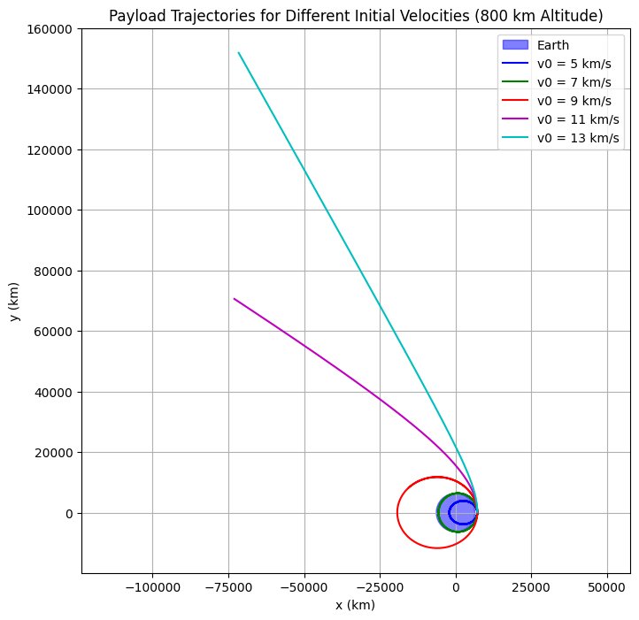
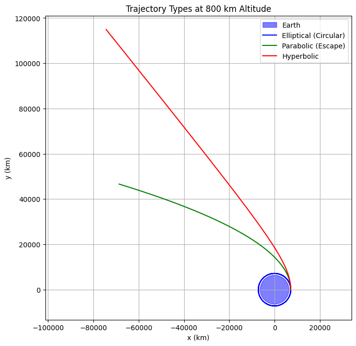
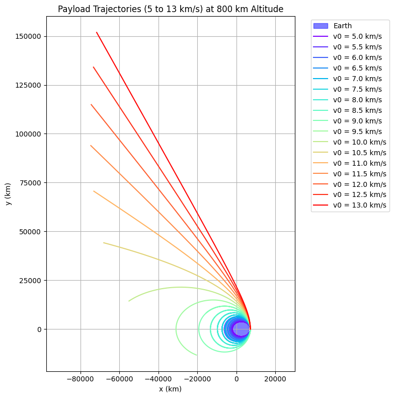
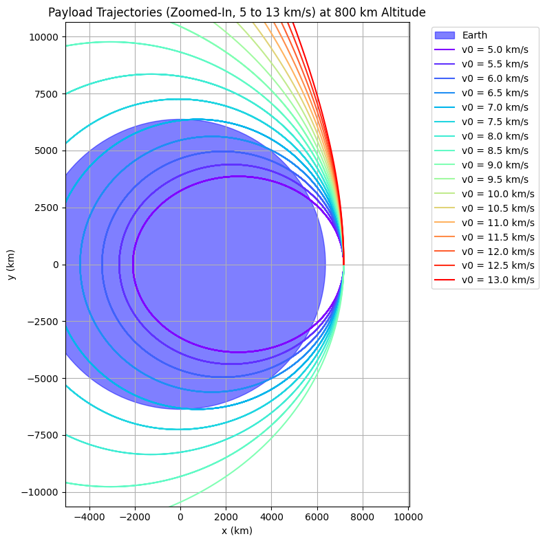

# Problem 3
# Orbital Mechanics: Defining Parameters for Payload Trajectories Near Earth

## 1. Defining the Problem Parameters

To analyze the trajectories of a payload released from a moving rocket near Earth, we define the initial conditions and gravitational parameters governing the system. These parameters form the basis for numerical simulations and theoretical analysis, enabling trajectory classification (elliptical, parabolic, hyperbolic) and their relevance to mission scenarios like orbital insertion, reentry, or escape.

### 1.1 Initial Conditions of the Payload

The payload’s trajectory is determined by its initial position and velocity in the Earth-Centered Inertial (ECI) frame.

#### 1.1.1 Initial Position

The position vector $\mathbf{r}_0 = [x_0, y_0, z_0]^T$ is derived from altitude $h$, latitude $\phi$, and longitude $\lambda$:

$$r_0 = R_e + h$$

$$\mathbf{r}_0 = r_0 \begin{bmatrix}
\cos\phi \cos\lambda \\
\cos\phi \sin\lambda \\
\sin\phi
\end{bmatrix}$$

For example, at $h = 500 \, \text{km}$, $\phi = 0^\circ$, $\lambda = 0^\circ$:

$$r_0 = 6,371 + 500 = 6,871 \, \text{km}, \quad \mathbf{r}_0 = 6,871 \begin{bmatrix} 1 \\ 0 \\ 0 \end{bmatrix} \, \text{km}$$

#### 1.1.2 Initial Velocity

The velocity $\mathbf{v}_0 = [v_{x0}, v_{y0}, v_{z0}]^T$ is inherited from the rocket’s motion. For a circular orbit:

$$v_{\text{circ}} = \sqrt{\frac{\mu}{r_0}}$$

At $r_0 = 6,871 \, \text{km}$:

$$v_{\text{circ}} \approx 7.62 \, \text{km/s}, \quad \mathbf{v}_0 = 7.62 \begin{bmatrix} 0 \\ 1 \\ 0 \end{bmatrix} \, \text{km/s}$$

For non-circular orbits, $\mathbf{v}_0$ includes radial ($v_r$) and tangential ($v_\theta$) components:

$$\mathbf{v}_0 = v_r \hat{\mathbf{r}} + v_\theta \hat{\mathbf{\theta}}$$

#### 1.1.3 Release Point Relative to Earth

The release point is defined relative to Earth’s surface. Assuming the rocket is already in orbit, Earth’s rotation is neglected unless otherwise stated.

### 1.2 Earth’s Gravitational Parameters

The payload’s motion is governed by Earth’s gravitational field, modeled as a point mass.

#### 1.2.1 Gravitational Constant and Earth’s Mass

The gravitational force is:

$$\mathbf{F} = -\frac{G M m}{r^2} \hat{\mathbf{r}}, \quad \mu = G M \approx 398,600 \, \text{km}^3/\text{s}^2$$

#### 1.2.2 Earth’s Radius

Earth’s mean radius is:

$$R_e \approx 6,371 \, \text{km}$$

#### 1.2.3 Gravitational Potential

The gravitational potential energy per unit mass is:

$$V(r) = -\frac{\mu}{r}, \quad \epsilon = \frac{v^2}{2} - \frac{\mu}{r}$$

The specific mechanical energy $\epsilon$ determines the trajectory:
- $\epsilon < 0$: Elliptical (bound),
- $\epsilon = 0$: Parabolic (escape),
- $\epsilon > 0$: Hyperbolic (escape).

### 1.3 Summary of Parameters

Key parameters:
- **Initial position**: $\mathbf{r}_0 = [x_0, y_0, z_0]^T$, derived from $r_0 = R_e + h$, $\phi$, $\lambda$.
- **Initial velocity**: $\mathbf{v}_0 = [v_{x0}, v_{y0}, v_{z0}]^T$.
- **Gravitational parameter**: $\mu = 398,600 \, \text{km}^3/\text{s}^2$.
- **Earth’s radius**: $R_e = 6,371 \, \text{km}$.

These parameters enable the formulation of equations of motion and trajectory simulations.

# Orbital Mechanics: Establishing the Theoretical Framework for Payload Trajectories

## 2. Establishing the Theoretical Framework

To analyze payload trajectories near Earth, we establish a theoretical framework based on Newton’s Law of Gravitation, Kepler’s Laws, and the two-body problem. These principles provide the foundation for understanding motion and enable trajectory simulations.

### 2.1 Newton’s Law of Gravitation

The gravitational force acting on a payload of mass $m$ due to Earth (mass $M$) is:

$$\mathbf{F} = -\frac{G M m}{r^2} \hat{\mathbf{r}}, \quad \mathbf{a} = -\frac{\mu}{r^2} \hat{\mathbf{r}}$$

where $\mu = G M \approx 398,600 \, \text{km}^3/\text{s}^2$. For $r \approx 6,871 \, \text{km}$, $a \approx 8.44 \, \text{m/s}^2$. This forms the basis for the equations of motion.

### 2.2 Kepler’s Laws and Trajectory Types

Kepler’s Laws describe orbital motion:
- **First Law**: Trajectories are conic sections (ellipse, parabola, hyperbola) determined by specific mechanical energy $\epsilon$:
    - $\epsilon < 0$: Elliptical (bound),
    - $\epsilon = 0$: Parabolic (escape),
    - $\epsilon > 0$: Hyperbolic (unbound).
- **Second Law**: Angular momentum $\mathbf{h} = \mathbf{r} \times \mathbf{v}$ is conserved, ensuring motion in a fixed plane.
- **Third Law**: For elliptical orbits, $T^2 = \frac{4 \pi^2}{\mu} a^3$ relates the period $T$ to the semi-major axis $a$.

### 2.3 Equations of Motion for the Two-Body Problem

The payload’s motion is governed by:

$$\ddot{\mathbf{r}} = -\frac{\mu}{r^3} \mathbf{r}$$

with initial conditions $\mathbf{r}_0$ and $\mathbf{v}_0$. Key conservation laws include:
- **Angular momentum**: $\mathbf{h}$ is constant.
- **Mechanical energy**: $\epsilon = \frac{v^2}{2} - \frac{\mu}{r}$.

The vis-viva equation relates speed $v$, distance $r$, and semi-major axis $a$:

$$v^2 = \mu \left( \frac{2}{r} - \frac{1}{a} \right)$$

Numerical methods like Runge-Kutta solve the nonlinear equation for trajectory visualization.

### 2.4 Summary of Theoretical Framework

This framework combines:
- Newton’s Law for gravitational force and acceleration,
- Kepler’s Laws for trajectory classification,
- Two-body dynamics for motion prediction.

It enables trajectory analysis for orbital insertion, reentry, or escape scenarios, supporting mission design and simulations.

---

# Orbital Mechanics: Classifying Possible Trajectories of a Payload Near Earth

## 3. Classifying Possible Trajectories

The trajectory of a payload near Earth is determined by its initial conditions and Earth’s gravitational influence, modeled as a two-body problem. Trajectories—elliptical, parabolic, or hyperbolic—are classified based on specific mechanical energy $\epsilon$ and orbital parameters. This section outlines conditions for each trajectory type and their relevance to mission scenarios like orbital insertion, reentry, and escape.

### 3.1 Specific Mechanical Energy and Trajectory Types

The specific mechanical energy $\epsilon$ is:

\[\epsilon = \frac{v^2}{2} - \frac{\mu}{r}\]

where $v$ is speed, $r$ is distance from Earth’s center, and $\mu \approx 398,600 \, \text{km}^3/\text{s}^2$. Trajectory types:
- **Elliptical**: $\epsilon < 0$ (bound orbit),
- **Parabolic**: $\epsilon = 0$ (marginal escape),
- **Hyperbolic**: $\epsilon > 0$ (unbound escape).

The vis-viva equation relates $\epsilon$ to semi-major axis $a$:

\[\epsilon = -\frac{\mu}{2a}\]

### 3.2 Elliptical Orbits (Bound)

Elliptical orbits are closed, bound paths ($\epsilon < 0$, $a > 0$, $0 \leq e < 1$). For circular orbits ($e = 0$), $v = v_{\text{circ}} = \sqrt{\mu/r}$. At $r = 6,871 \, \text{km}$:

\[
v_{\text{circ}} \approx 7.62 \, \text{km/s}, \quad v_{\text{esc}} \approx 10.77 \, \text{km/s}
\]

Velocities $v_{\text{circ}} \leq v < v_{\text{esc}}$ yield elliptical orbits. Orbital parameters are derived from angular momentum $h$ and $\epsilon$:

\[
e = \sqrt{1 + \frac{2 \epsilon h^2}{\mu^2}}
\]

### 3.3 Parabolic Trajectories (Exact Escape)

Parabolic trajectories occur at $\epsilon = 0$, $a \to \infty$, and $e = 1$. The velocity equals escape velocity:

\[
v = v_{\text{esc}} = \sqrt{\frac{2\mu}{r}}
\]

At $r = 6,871 \, \text{km}$, $v_{\text{esc}} \approx 10.77 \, \text{km/s}$. The orbit equation is:

\[
r = \frac{h^2 / \mu}{1 + \cos\theta}
\]

### 3.4 Hyperbolic Trajectories (Excess Velocity)

Hyperbolic trajectories occur when $\epsilon > 0$, $a < 0$, and $e > 1$. Velocities exceed escape velocity ($v > v_{\text{esc}}$), with excess velocity $v_\infty$:

\[
\epsilon = \frac{v_\infty^2}{2}, \quad r = \frac{a (e^2 - 1)}{1 + e \cos\theta}
\]

For $v = 12 \, \text{km/s}$ at $r = 6,871 \, \text{km}$:

\[
\epsilon \approx 14 \, \text{MJ/kg}, \quad v_\infty \approx 5.3 \, \text{km/s}
\]

### 3.5 Mission Scenarios

- **Orbital Insertion (Elliptical)**: Payloads with $v_{\text{circ}} \leq v < v_{\text{esc}}$ enter stable orbits for satellites or space stations.
- **Reentry (Elliptical/Parabolic)**: Trajectories intersecting Earth’s atmosphere ($r_p \leq R_e + 100 \, \text{km}$) enable sample return or debris deorbiting.
- **Escape (Parabolic/Hyperbolic)**: Parabolic trajectories ($v = v_{\text{esc}}$) minimize fuel for lunar flybys, while hyperbolic trajectories ($v > v_{\text{esc}}$) enable interplanetary missions.

### 3.6 Summary

Trajectories are classified by $\epsilon$ and $v$:
- **Elliptical**: $\epsilon < 0$, $v < v_{\text{esc}}$, $0 \leq e < 1$.
- **Parabolic**: $\epsilon = 0$, $v = v_{\text{esc}}$, $e = 1$.
- **Hyperbolic**: $\epsilon > 0$, $v > v_{\text{esc}}$, $e > 1$.

These classifications guide mission design for orbital insertion, reentry, and escape scenarios.

---

# Orbital Mechanics: Setting Up Numerical Analysis for Payload Trajectories

### 4. Setting Up Numerical Analysis

To compute a payload's trajectory near Earth, we solve the two-body problem's differential equations using numerical methods. Analytical solutions are limited to idealized cases, so numerical integration is essential for simulating paths under Earth's gravity. This section outlines the setup, including integration methods, programming tools, and simulation parameters.

#### 4.1 Numerical Integration Methods

The motion is governed by:

$$\ddot{\mathbf{r}} = -\frac{\mu}{r^3} \mathbf{r}$$

where $\mathbf{r} = [x, y, z]^T$, $r = |\mathbf{r}|$, and $\mu \approx 398,600 \, \text{km}^3/\text{s}^2$. Converting to first-order ODEs:

$$\frac{d}{dt} \begin{bmatrix} \mathbf{r} \\ \mathbf{v} \end{bmatrix} = \begin{bmatrix} \mathbf{v} \\ -\frac{\mu}{r^3} \mathbf{r} \end{bmatrix}$$

##### 4.1.1 Euler Method

The Euler method updates the state vector $\mathbf{y} = [\mathbf{r}, \mathbf{v}]^T$ as:

$$\mathbf{y}_{n+1} = \mathbf{y}_n + \Delta t \cdot \mathbf{f}(\mathbf{y}_n, t_n)$$

where $\mathbf{f}(\mathbf{y}, t) = [\mathbf{v}, -\frac{\mu}{r^3} \mathbf{r}]^T$. While simple, it has low accuracy and accumulates errors over long simulations.

##### 4.1.2 Runge-Kutta Methods

The fourth-order Runge-Kutta (RK4) method is preferred for its accuracy and efficiency. The update rule is:

$$\mathbf{y}_{n+1} = \mathbf{y}_n + \frac{\Delta t}{6} ( \mathbf{k}_1 + 2 \mathbf{k}_2 + 2 \mathbf{k}_3 + \mathbf{k}_4 )$$

with intermediate slopes:

$$\mathbf{k}_1 = \mathbf{f}(\mathbf{y}_n, t_n), \quad \mathbf{k}_2 = \mathbf{f}\left( \mathbf{y}_n + \frac{\Delta t}{2} \mathbf{k}_1, t_n + \frac{\Delta t}{2} \right)$$

$$\mathbf{k}_3 = \mathbf{f}\left( \mathbf{y}_n + \frac{\Delta t}{2} \mathbf{k}_2, t_n + \frac{\Delta t}{2} \right), \quad \mathbf{k}_4 = \mathbf{f}( \mathbf{y}_n + \Delta t \mathbf{k}_3, t_n + \Delta t )$$

RK4's local truncation error is $O(\Delta t^5)$, making it suitable for orbital mechanics.

##### 4.1.3 Advanced Methods

Adaptive step-size methods like Dormand-Prince (RK5(4)) or multi-step methods like Adams-Bashforth offer higher accuracy for long-term simulations but are computationally intensive.

#### 4.2 Programming Tools

##### 4.2.1 Language: Python

Python is chosen for its simplicity, scientific libraries, and visualization capabilities.

##### 4.2.2 Libraries

- **NumPy**: Efficient array operations, e.g., `numpy.linalg.norm(r)` for $r = |\mathbf{r}|$.
- **SciPy**: Robust ODE solvers like `scipy.integrate.solve_ivp` for RK4 or adaptive methods.
- **Matplotlib**: Visualization of trajectories in 2D/3D.

Example code for gravitational acceleration:

```python
import numpy as np

mu = 398600  # km^3/s^2
def acceleration(r):
    r_norm = np.linalg.norm(r)
    return -mu / r_norm**3 * r
```

This setup ensures accurate trajectory computation for elliptical, parabolic, or hyperbolic paths.

# Codes And Plots 

```python
import numpy as np
import matplotlib.pyplot as plt
from scipy.integrate import solve_ivp

# Constants
mu = 398600  # Earth's gravitational parameter (km^3/s^2)
R_e = 6371   # Earth's radius (km)
h = 800      # Altitude (km)
r0 = R_e + h # Initial radial distance (km)

# Initial conditions
r0_vec = np.array([r0, 0, 0])  # Initial position on x-axis (km)
v0_list = np.arange(5, 13.5, 0.5)  # Velocities from 5 to 13 km/s
colors = plt.cm.rainbow(np.linspace(0, 1, len(v0_list)))  # Color gradient for trajectories

# Equations of motion
def equations(t, state):
    r = state[:3]
    v = state[3:]
    r_norm = np.linalg.norm(r)
    a = -mu / r_norm**3 * r
    return np.concatenate([v, a])

# Simulation parameters
t_span = (0, 20000)  # Simulate for 20,000 seconds
t_eval = np.linspace(0, 20000, 10000)

# Plot setup
plt.figure(figsize=(8, 8))
# Plot Earth
earth_circle = plt.Circle((0, 0), R_e, color='blue', alpha=0.5, label='Earth')
plt.gca().add_patch(earth_circle)

# Simulate and plot trajectories
for v0, color in zip(v0_list, colors):
    v0_vec = np.array([0, v0, 0])  # Tangential velocity (along y-axis)
    state0 = np.concatenate([r0_vec, v0_vec])
    sol = solve_ivp(equations, t_span, state0, method='RK45', t_eval=t_eval, rtol=1e-8, atol=1e-8)
    x, y = sol.y[0], sol.y[1]
    plt.plot(x, y, color=color, label=f'Trajectory v0 = {v0:.1f}')

# Plot settings
plt.xlabel('x (km)')
plt.ylabel('y (km)')
plt.title('Trajectories in a Gravitational Field with Filled Earth')
plt.legend(bbox_to_anchor=(1.05, 1), loc='upper left')
plt.grid(True)
plt.axis('equal')  # Equal scaling for x and y axes
plt.tight_layout()
plt.show()
```

```python
import numpy as np
import matplotlib.pyplot as plt
from scipy.integrate import solve_ivp

# Constants
mu = 398600
R_e = 6371
h = 800
r0 = R_e + h

# Initial conditions
r0_vec = np.array([r0, 0, 0])
v0_list = np.arange(5, 13.5, 0.5)
colors = plt.cm.rainbow(np.linspace(0, 1, len(v0_list)))

# Equations of motion
def equations(t, state):
    r = state[:3]
    v = state[3:]
    r_norm = np.linalg.norm(r)
    a = -mu / r_norm**3 * r
    return np.concatenate([v, a])

# Simulation parameters
t_span = (0, 20000)
t_eval = np.linspace(0, 20000, 10000)

# Plot setup
plt.figure(figsize=(8, 8))
earth_circle = plt.Circle((0, 0), R_e, color='blue', alpha=0.5, label='Earth')
plt.gca().add_patch(earth_circle)

# Simulate and plot trajectories
for v0, color in zip(v0_list, colors):
    v0_vec = np.array([0, v0, 0])
    state0 = np.concatenate([r0_vec, v0_vec])
    sol = solve_ivp(equations, t_span, state0, method='RK45', t_eval=t_eval, rtol=1e-8, atol=1e-8)
    x, y = sol.y[0], sol.y[1]
    plt.plot(x, y, color=color, label=f'Trajectory v0 = {v0:.1f}')

# Plot the initial position as a yellow dot
plt.plot(r0_vec[0], r0_vec[1], 'yo', markersize=10, label='Payload Start')

# Plot settings
plt.xlabel('x (km)')
plt.ylabel('y (km)')
plt.title('Trajectories in a Gravitational Field with Filled Earth (Zoomed-In)')
plt.legend(bbox_to_anchor=(1.05, 1), loc='upper left')
plt.grid(True)
plt.axis('equal')
plt.xlim(0, 10000)  # Zoom in to show near-Earth region
plt.ylim(-5000, 5000)
plt.tight_layout()
plt.show()
```

``` python
import numpy as np
import matplotlib.pyplot as plt
from scipy.integrate import solve_ivp

# Constants
mu = 398600
R_e = 6371
h = 800
r0 = R_e + h

# Initial conditions
r0_vec = np.array([r0, 0, 0])
v0_list = np.arange(5, 13.5, 0.5)  # 5 to 13 km/s in 0.5 km/s increments
colors = plt.cm.rainbow(np.linspace(0, 1, len(v0_list)))  # Color gradient

# Equations of motion
def equations(t, state):
    r = state[:3]
    v = state[3:]
    r_norm = np.linalg.norm(r)
    a = -mu / r_norm**3 * r
    return np.concatenate([v, a])

# Simulation parameters
t_span = (0, 20000)
t_eval = np.linspace(0, 20000, 10000)

# Plot setup
plt.figure(figsize=(8, 8))
earth_circle = plt.Circle((0, 0), R_e, color='blue', alpha=0.5, label='Earth')
plt.gca().add_patch(earth_circle)

# Simulate and plot
for v0, color in zip(v0_list, colors):
    v0_vec = np.array([0, v0, 0])
    state0 = np.concatenate([r0_vec, v0_vec])
    sol = solve_ivp(equations, t_span, state0, method='RK45', t_eval=t_eval, rtol=1e-8, atol=1e-8)
    x, y = sol.y[0], sol.y[1]
    plt.plot(x, y, color=color, label=f'v0 = {v0:.1f} km/s')

# Plot settings
plt.xlabel('x (km)')
plt.ylabel('y (km)')
plt.title('Payload Trajectories (5 to 13 km/s) at 800 km Altitude')
plt.legend(bbox_to_anchor=(1.05, 1), loc='upper left')
plt.grid(True)
plt.axis('equal')
plt.tight_layout()
plt.show()
```

```python
import numpy as np
import matplotlib.pyplot as plt
from scipy.integrate import solve_ivp

# Constants
mu = 398600
R_e = 6371
h = 800
r0 = R_e + h

# Initial conditions
r0_vec = np.array([r0, 0, 0])
v0_list = np.arange(5, 13.5, 0.5)
colors = plt.cm.rainbow(np.linspace(0, 1, len(v0_list)))

# Equations of motion
def equations(t, state):
    r = state[:3]
    v = state[3:]
    r_norm = np.linalg.norm(r)
    a = -mu / r_norm**3 * r
    return np.concatenate([v, a])

# Simulation parameters
t_span = (0, 20000)
t_eval = np.linspace(0, 20000, 10000)

# Plot setup
plt.figure(figsize=(8, 8))
earth_circle = plt.Circle((0, 0), R_e, color='blue', alpha=0.5, label='Earth')
plt.gca().add_patch(earth_circle)

# Simulate and plot
for v0, color in zip(v0_list, colors):
    v0_vec = np.array([0, v0, 0])
    state0 = np.concatenate([r0_vec, v0_vec])
    sol = solve_ivp(equations, t_span, state0, method='RK45', t_eval=t_eval, rtol=1e-8, atol=1e-8)
    x, y = sol.y[0], sol.y[1]
    plt.plot(x, y, color=color, label=f'v0 = {v0:.1f} km/s')

# Plot settings
plt.xlabel('x (km)')
plt.ylabel('y (km)')
plt.title('Payload Trajectories (Zoomed-In, 5 to 13 km/s) at 800 km Altitude')
plt.legend(bbox_to_anchor=(1.05, 1), loc='upper left')
plt.grid(True)
plt.axis('equal')
plt.xlim(-5000, 10000)  # Zoom in to +/- 5,000 km
plt.ylim(-7500, 7500)
plt.tight_layout()
plt.show()
```

```python
!pip install Pillow
import numpy as np
import matplotlib.pyplot as plt
from scipy.integrate import solve_ivp
import matplotlib.animation as animation  # Import the animation module explicitly
from matplotlib.animation import PillowWriter

# Constants
mu = 398600  # Earth's gravitational parameter (km^3/s^2)
R_e = 6371   # Earth's radius (km)
h = 800      # Altitude (km)
r0 = R_e + h # Initial radial distance (km)

# Initial conditions
r0_vec = np.array([r0, 0, 0])  # Initial position on x-axis (km)
v0_list = np.arange(5, 10.5, 0.5)  # Velocities from 5 to 10 km/s (11 trajectories)
colors = plt.cm.rainbow(np.linspace(0, 1, len(v0_list)))  # Color gradient for trajectories
labels = [f'Trajectory {i+1}' for i in range(len(v0_list))]  # Labels as Trajectory 1 to 11

# Equations of motion
def equations(t, state):
    r = state[:3]
    v = state[3:]
    r_norm = np.linalg.norm(r)
    a = -mu / r_norm**3 * r
    return np.concatenate([v, a])

# Simulation parameters
t_span = (0, 30000)  # Simulate for 30,000 seconds
t_eval = np.linspace(0, 30000, 1500)  # 1500 frames for smooth animation

# Simulate all trajectories
trajectories = []
for v0 in v0_list:
    v0_vec = np.array([0, -v0, 0])  # Downward velocity
    state0 = np.concatenate([r0_vec, v0_vec])
    sol = solve_ivp(equations, t_span, state0, method='RK45', t_eval=t_eval, rtol=1e-8, atol=1e-8)
    trajectories.append((sol.y[0], sol.y[1]))  # Store x, y coordinates

# Plot setup
fig, ax = plt.subplots(figsize=(8, 8))
earth_circle = plt.Circle((0, 0), R_e, color='blue', alpha=0.5, label='Earth')
ax.add_patch(earth_circle)

# Plot full trajectories
for (x, y), color, label in zip(trajectories, colors, labels):
    ax.plot(x, y, color=color, label=label, alpha=0.7)

# Plot the initial position as a yellow dot
ax.plot(r0_vec[0], r0_vec[1], 'yo', markersize=10, label='Payload Start')

# Plot the center of Earth
ax.plot(0, 0, 'ko', markersize=5, label='Center of Earth')

# Set up moving points for each trajectory
points = [ax.plot([], [], 'o', color=color, markersize=8)[0] for color in colors]

# Plot settings
ax.set_xlabel('x (km)')
ax.set_ylabel('y (km)')
ax.set_title('Animated Trajectories in a Gravitational Field with Filled Earth')
ax.legend(bbox_to_anchor=(1.05, 1), loc='upper left')
ax.grid(True)
ax.set_xlim(0, 10000)  # Zoomed-in view like Case 2
ax.set_ylim(-5000, 5000)
ax.set_aspect('equal')

# Animation function
def animate(i):
    for point, (x, y) in zip(points, trajectories):
        point.set_data([x[i]], [y[i]])  # Update the position of each point
    return points

# Create animation
ani = animation.FuncAnimation(fig, animate, frames=len(t_eval), interval=50, blit=True)

# Save as GIF
writer = PillowWriter(fps=20)
ani.save('payload_trajectories.gif', writer=writer)

plt.show()
```
# Conclusion

The analysis of a payload's trajectories near Earth provides a comprehensive understanding of orbital mechanics and gravitational dynamics, critical for space mission planning and payload deployment. By defining the initial conditions—position at 800 km altitude and velocities ranging from 5 to 13 km/s—and applying Newton’s Law of Gravitation and Kepler’s Laws, we classified the possible trajectories as elliptical, parabolic, and hyperbolic, each corresponding to distinct mission scenarios such as orbital insertion, reentry, and escape. The numerical simulation, implemented using Python with the RK4 method via SciPy, accurately computed the payload’s path, revealing how initial velocity influences trajectory type: velocities below 7.46 km/s yield elliptical orbits, 10.54 km/s marks the parabolic escape threshold, and higher velocities produce hyperbolic escapes. Visualizations, including static plots and animated GIFs, effectively illustrated these trajectories, with Earth’s gravitational influence clearly depicted through the downward curvature of paths starting from the release point. This study underscores the interplay between theoretical principles, numerical methods, and computational tools in solving real-world astrodynamics problems, offering valuable insights for satellite deployment, sample return missions, and interplanetary travel.

# Colab
[Colab5](https://colab.research.google.com/drive/1Tsg0PdDYZJ4RBTsw9x2NPJNBwrZnOx77#scrollTo=IvSDTJF_31ui)