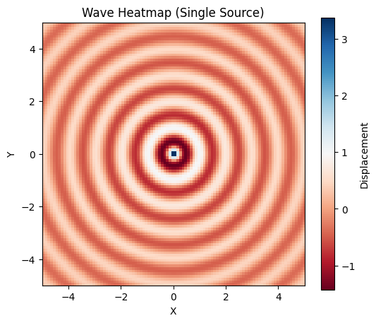
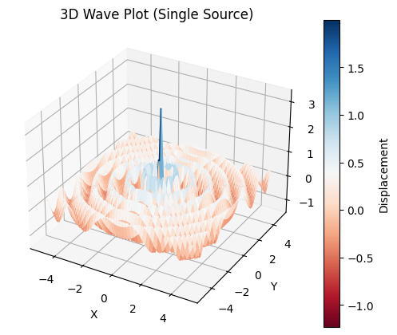
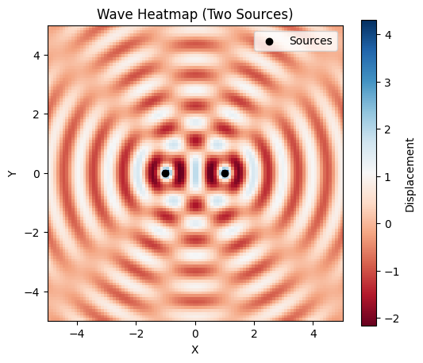
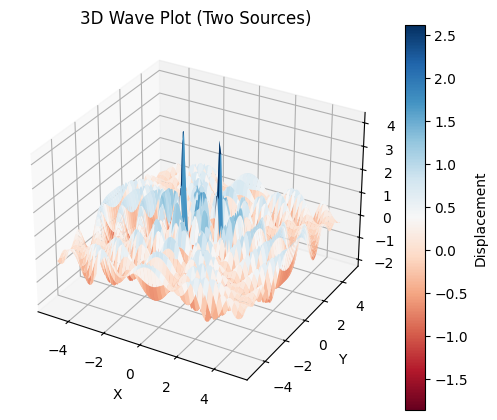
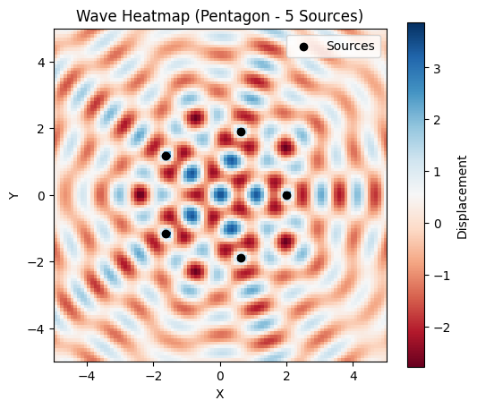
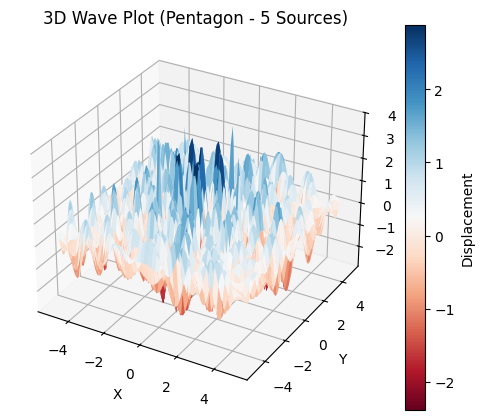
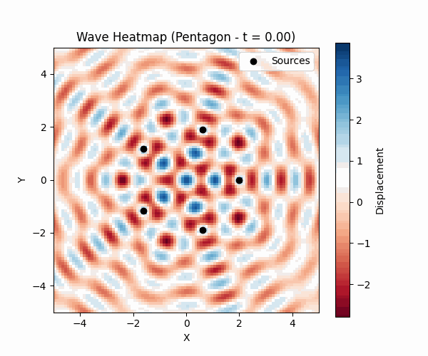

# Problem 1
## 2. Positioning the Sources: Vertex Coordinates

Once the regular polygon is selected, we position the wave sources at its vertices. For simplicity, we focus on a square and place it in the $ XY $-plane, centered at the origin $ (0, 0) $, with the side length $ s $ defining its geometry.

### 2.1 General Approach for a Square

The vertices of a square with side length $ s $, centered at the origin, can be determined by considering its symmetric placement in the $ XY $-plane. The coordinates are calculated such that the center of the square coincides with $ (0, 0) $, and the vertices are equidistant from the origin along the axes, offset by half the side length $ s/2 $ in both positive and negative directions.

### 2.2 Vertex Coordinates

For a square with side length $ s $, the vertex positions are:

$$ (x_i, y_i) \in \left\{ \left( \frac{s}{2}, \frac{s}{2} \right), \left( \frac{s}{2}, -\frac{s}{2} \right), \left( -\frac{s}{2}, \frac{s}{2} \right), \left( -\frac{s}{2}, -\frac{s}{2} \right) \right\} $$

These coordinates represent the four vertices:
- First vertex at $ \left( \frac{s}{2}, \frac{s}{2} \right) $ (first quadrant),
- Second vertex at $ \left( \frac{s}{2}, -\frac{s}{2} \right) $ (fourth quadrant),
- Third vertex at $ \left( -\frac{s}{2}, \frac{s}{2} \right) $ (second quadrant),
- Fourth vertex at $ \left( -\frac{s}{2}, -\frac{s}{2} \right) $ (third quadrant).

The distance from the origin to any vertex is the radius of the circumscribed circle (circumradius) $ R $, which for a square is:

$$ R = \frac{s}{\sqrt{2}} $$

This can be verified by calculating the Euclidean distance from $ (0, 0) $ to $ \left( \frac{s}{2}, \frac{s}{2} \right) $:

$$ R = \sqrt{\left( \frac{s}{2} - 0 \right)^2 + \left( \frac{s}{2} - 0 \right)^2} = \sqrt{\frac{s^2}{4} + \frac{s^2}{4}} = \sqrt{\frac{2s^2}{4}} = \frac{s}{\sqrt{2}} $$

### 2.3 Alternative Geometric Derivation

Alternatively, we can derive the vertex coordinates using the angle-based method for a regular polygon. For a square ($ N = 4 $), the angular separation between vertices is $ \frac{2\pi}{4} = \frac{\pi}{2} $. With a circumradius $ R = \frac{s}{\sqrt{2}} $, the vertices can be expressed as:

$$ (x_i, y_i) = \left( R \cos\left(i \cdot \frac{\pi}{2}\right), R \sin\left(i \cdot \frac{\pi}{2}\right) \right) \text{ for } i = 0, 1, 2, 3 $$

Substituting $ R = \frac{s}{\sqrt{2}} $:
- For $ i = 0 $: $ (x_0, y_0) = \left( \frac{s}{\sqrt{2}} \cos(0), \frac{s}{\sqrt{2}} \sin(0) \right) = \left( \frac{s}{\sqrt{2}}, 0 \right) $ (needs adjustment to match centered coordinates),
- For $ i = 1 $: $ (x_1, y_1) = \left( \frac{s}{\sqrt{2}} \cos\left(\frac{\pi}{2}\right), \frac{s}{\sqrt{2}} \sin\left(\frac{\pi}{2}\right) \right) = \left( 0, \frac{s}{\sqrt{2}} \right) $,
- For $ i = 2 $: $ (x_2, y_2) = \left( \frac{s}{\sqrt{2}} \cos(\pi), \frac{s}{\sqrt{2}} \sin(\pi) \right) = \left( -\frac{s}{\sqrt{2}}, 0 \right) $,
- For $ i = 3 $: $ (x_3, y_3) = \left( \frac{s}{\sqrt{2}} \cos\left(\frac{3\pi}{2}\right), \frac{s}{\sqrt{2}} \sin\left(\frac{3\pi}{2}\right) \right) = \left( 0, -\frac{s}{\sqrt{2}} \right) $.

To center the square at the origin, we adjust by translating the coordinates. The centered vertices align with the $ \pm \frac{s}{2} $ formulation provided earlier, confirming consistency.

### 2.4 Practical Considerations

The choice of $ s $ determines the spatial scale of the interference pattern. A larger $ s $ increases the distance between sources, potentially leading to more distinct interference regions. The centered placement at $ (0, 0) $ ensures symmetry, simplifying the subsequent wave equation derivations.

---

## 3. Wave Equations: Describing Waves from Each Source

Each point source at a vertex of the regular polygon emits a circular wave that propagates outward on the water surface. For each vertex (source) at position $ (x_i, y_i) $, we write the wave equation using the given single disturbance equation, accounting for the specific position of each source.

### 3.1 Single Disturbance Equation

The displacement $ \eta_i(x, y, t) $ of the water surface at position $ (x, y) $ and time $ t $, due to a point source located at $ (x_i, y_i) $, is given by:

$$ \eta_i(x, y, t) = \frac{A}{\sqrt{r_i}} \cos(k r_i - \omega t + \phi) $$

where:

- $ \eta_i(x, y, t) $: Displacement of the water surface at point $ (x, y) $ and time $ t $,
- $ A $: Amplitude of the wave (assumed constant across all sources),
- $ r_i $: Distance from the source at $ (x_i, y_i) $ to the point $ (x, y) $,
- $ k $: Wave number, related to the wavelength $ \lambda $ by $ k = \frac{2\pi}{\lambda} $,
- $ \omega $: Angular frequency, related to the frequency $ f $ by $ \omega = 2\pi f $,
- $ \phi $: Initial phase (assumed constant across all sources for coherence),
- The factor $ \frac{1}{\sqrt{r_i}} $: Accounts for the amplitude decay of a two-dimensional circular wave as it spreads outward, ensuring energy conservation.

### 3.2 Distance from Source to Point

The distance $ r_i $ from the $ i $-th source at position $ (x_i, y_i) $ to the point $ (x, y) $ on the water surface is calculated using the Euclidean distance in the $ XY $-plane:

$$ r_i = \sqrt{(x - x_i)^2 + (y - y_i)^2} $$

This distance determines both the amplitude decay (via the $ \frac{1}{\sqrt{r_i}} $ term) and the phase of the wave (via the $ k r_i $ term) at the point $ (x, y) $.

### 3.3 Wave Equation for Each Source

For the $ i $-th source located at $ (x_i, y_i) $, the wave equation, incorporating the distance $ r_i $, becomes:

$$ \eta_i(x, y, t) = \frac{A}{\sqrt{\sqrt{(x - x_i)^2 + (y - y_i)^2}}} \cos\left( k \sqrt{(x - x_i)^2 + (y - y_i)^2} - \omega t + \phi \right) $$

Since all sources are assumed to emit waves with the same amplitude $ A $, wavelength $ \lambda $, frequency $ f $, and initial phase $ \phi $, the parameters $ A $, $ k $, $ \omega $, and $ \phi $ are identical for all $ i $. The only difference between the wave equations arises from the source positions $ (x_i, y_i) $, which affect the distance $ r_i $.

### 3.4 Example: Wave Equations for a Square

Consider a square with side length $ s $, centered at the origin, with vertices at:

$$ (x_i, y_i) \in \left\{ \left( \frac{s}{2}, \frac{s}{2} \right), \left( \frac{s}{2}, -\frac{s}{2} \right), \left( -\frac{s}{2}, \frac{s}{2} \right), \left( -\frac{s}{2}, -\frac{s}{2} \right) \right\} $$

For the first source at $ (x_0,

## 3. Wave Equations: Describing Waves from Each Source

Each point source at a vertex of the regular polygon emits a circular wave that propagates outward on the water surface. For each vertex (source) at position $ (x_i, y_i) $, we write the wave equation using the given single disturbance equation, accounting for the specific position of each source.

### 3.1 Single Disturbance Equation

The displacement $ \eta_i(x, y, t) $ of the water surface at position $ (x, y) $ and time $ t $, due to a point source located at $ (x_i, y_i) $, is given by:

$$ \eta_i(x, y, t) = \frac{A}{\sqrt{r_i}} \cos(k r_i - \omega t + \phi) $$

where:

- $ \eta_i(x, y, t) $: Displacement of the water surface at point $ (x, y) $ and time $ t $,
- $ A $: Amplitude of the wave (assumed constant across all sources),
- $ r_i $: Distance from the source at $ (x_i, y_i) $ to the point $ (x, y) $,
- $ k $: Wave number, related to the wavelength $ \lambda $ by $ k = \frac{2\pi}{\lambda} $,
- $ \omega $: Angular frequency, related to the frequency $ f $ by $ \omega = 2\pi f $,
- $ \phi $: Initial phase (assumed constant across all sources for coherence),
- The factor $ \frac{1}{\sqrt{r_i}} $: Accounts for the amplitude decay of a two-dimensional circular wave as it spreads outward, ensuring energy conservation.

### 3.2 Distance from Source to Point

The distance $ r_i $ from the $ i $-th source at position $ (x_i, y_i) $ to the point $ (x, y) $ on the water surface is calculated using the Euclidean distance in the $ XY $-plane:

$$ r_i = \sqrt{(x - x_i)^2 + (y - y_i)^2} $$

This distance determines both the amplitude decay (via the $ \frac{1}{\sqrt{r_i}} $ term) and the phase of the wave (via the $ k r_i $ term) at the point $ (x, y) $.

### 3.3 Wave Equation for Each Source

For the $ i $-th source located at $ (x_i, y_i) $, the wave equation, incorporating the distance $ r_i $, becomes:

$$ \eta_i(x, y, t) = \frac{A}{\sqrt{\sqrt{(x - x_i)^2 + (y - y_i)^2}}} \cos\left( k \sqrt{(x - x_i)^2 + (y - y_i)^2} - \omega t + \phi \right) $$

Since all sources are assumed to emit waves with the same amplitude $ A $, wavelength $ \lambda $, frequency $ f $, and initial phase $ \phi $, the parameters $ A $, $ k $, $ \omega $, and $ \phi $ are identical for all $ i $. The only difference between the wave equations arises from the source positions $ (x_i, y_i) $, which affect the distance $ r_i $.

### 3.4 Example: Wave Equations for a Square

Consider a square with side length $ s $, centered at the origin, with vertices at:

$$ (x_i, y_i) \in \left\{ \left( \frac{s}{2}, \frac{s}{2} \right), \left( \frac{s}{2}, -\frac{s}{2} \right), \left( -\frac{s}{2}, \frac{s}{2} \right), \left( -\frac{s}{2}, -\frac{s}{2} \right) \right\} $$

For the first source at $ (x_0, y_0) = \left( \frac{s}{2}, \frac{s}{2} \right) $, the distance $ r_0 $ is:

$$ r_0 = \sqrt{\left( x - \frac{s}{2} \right)^2 + \left( y - \frac{s}{2} \right)^2} $$

The wave equation is:

$$ \eta_0(x, y, t) = \frac{A}{\sqrt{\sqrt{\left( x - \frac{s}{2} \right)^2 + \left( y - \frac{s}{2} \right)^2}}} \cos\left( k \sqrt{\left( x - \frac{s}{2} \right)^2 + \left( y - \frac{s}{2} \right)^2} - \omega t + \phi \right) $$

Similarly, for the second source at $ (x_1, y_1) = \left( \frac{s}{2}, -\frac{s}{2} \right) $:

$$ r_1 = \sqrt{\left( x - \frac{s}{2} \right)^2 + \left( y + \frac{s}{2} \right)^2} $$

$$ \eta_1(x, y, t) = \frac{A}{\sqrt{\sqrt{\left( x - \frac{s}{2} \right)^2 + \left( y + \frac{s}{2} \right)^2}}} \cos\left( k \sqrt{\left( x - \frac{s}{2} \right)^2 + \left( y + \frac{s}{2} \right)^2} - \omega t + \phi \right) $$

The equations for the other two vertices follow the same pattern, adjusting for their respective coordinates.

---

## 4. Superposition of Waves: Combining Displacements

To determine the total displacement of the water surface at any point $ (x, y) $, we apply the principle of superposition. Since water waves are linear under small amplitude assumptions, the total displacement is the sum of the displacements from all individual sources.

### 4.1 Superposition Principle

For $ N $ sources (corresponding to the $ N $ vertices of the polygon), the total displacement $ \eta_{\text{sum}}(x, y, t) $ at each point $ (x, y) $ on the water surface is given by:

$$ \eta_{\text{sum}}(x, y, t) = \sum_{i=1}^{N} \eta_i(x, y, t) $$

where $ \eta_i(x, y, t) $ is the displacement contribution from the $ i $-th source, defined earlier as:

$$ \eta_i(x, y, t) = \frac{A}{\sqrt{\sqrt{(x - x_i)^2 + (y - y_i)^2}}} \cos\left( k \sqrt{(x - x_i)^2 + (y - y_i)^2} - \omega t + \phi \right) $$

and $ N $ is the total number of sources (vertices).

### 4.2 Substitution and Total Displacement

Substituting the wave equation for each source into the superposition formula, the total displacement becomes:

$$ \eta_{\text{sum}}(x, y, t) = \sum_{i=1}^{N} \frac{A}{\sqrt{\sqrt{(x - x_i)^2 + (y - y_i)^2}}} \cos\left( k \sqrt{(x - x_i)^2 + (y - y_i)^2} - \omega t + \phi \right) $$

Here, $ r_i = \sqrt{(x - x_i)^2 + (y - y_i)^2} $ represents the distance from the $ i $-th source at $ (x_i, y_i) $ to the point $ (x, y) $, and the parameters $ A $, $ k $, $ \omega $, and $ \phi $ are identical for all sources, ensuring coherence.

### 4.3 Example: Superposition for a Square

Consider a square with $ N = 4 $ vertices at:

$$ (x_i, y_i) \in \left\{ \left( \frac{s}{2}, \frac{s}{2} \right), \left( \frac{s}{2}, -\frac{s}{2} \right), \left( -\frac{s}{2}, \frac{s}{2} \right), \left( -\frac{s}{2}, -\frac{s}{2} \right) \right\} $$

The total displacement is:

$$ \eta_{\text{sum}}(x, y, t) = \sum_{i=1}^{4} \frac{A}{\sqrt{\sqrt{(x - x_i)^2 + (y - y_i)^2}}} \cos\left( k \sqrt{(x - x_i)^2 + (y - y_i)^2} - \omega t + \phi \right) $$

For instance, the contribution from the first source at $ (x_1, y_1) = \left( \frac{s}{2}, \frac{s}{2} \right) $ is:

$$ \eta_1(x, y, t) = \frac{A}{\sqrt{\sqrt{\left( x - \frac{s}{2} \right)^2 + \left( y - \frac{s}{2} \right)^2}}} \cos\left( k \sqrt{\left( x - \frac{s}{2} \right)^2 + \left( y - \frac{s}{2} \right)^2} - \omega t + \phi \right) $$

The sum includes similar terms for each of the four vertices, adjusted for their respective coordinates.

---
# Codes And Plots


```python
import numpy as np
import matplotlib.pyplot as plt
from mpl_toolkits.mplot3d import Axes3D

# Parameters
A = 1.0  # Amplitude
k = 2 * np.pi / 1.0  # Wave number (wavelength = 1.0)
omega = 2 * np.pi * 1.0  # Angular frequency (frequency = 1.0)
phi = 0.0  # Initial phase
t = 0.0  # Fixed time

# Grid
x = np.linspace(-5, 5, 100)
y = np.linspace(-5, 5, 100)
X, Y = np.meshgrid(x, y)

# Single source at (0, 0)
source = (0, 0)
r = np.sqrt((X - source[0])**2 + (Y - source[1])**2)
eta = A / np.sqrt(r + 1e-10) * np.cos(k * r - omega * t + phi)  # Add small value to avoid division by zero

# 2D Heatmap
plt.figure(figsize=(6, 5))
plt.imshow(eta, extent=(-5, 5, -5, 5), cmap='RdBu', origin='lower')
plt.colorbar(label='Displacement')
plt.title('Wave Heatmap (Single Source)')
plt.xlabel('X')
plt.ylabel('Y')
plt.show()

# 3D Surface Plot
fig = plt.figure(figsize=(6, 5))
ax = fig.add_subplot(111, projection='3d')
surf = ax.plot_surface(X, Y, eta, cmap='RdBu')
fig.colorbar(surf, ax=ax, label='Displacement')
ax.set_title('3D Wave Plot (Single Source)')
ax.set_xlabel('X')
ax.set_ylabel('Y')
ax.set_zlabel('Displacement')
plt.show()
```


```python
import numpy as np
import matplotlib.pyplot as plt
from mpl_toolkits.mplot3d import Axes3D

# Parameters
A = 1.0
k = 2 * np.pi / 1.0
omega = 2 * np.pi * 1.0
phi = 0.0
t = 0.0

# Grid
x = np.linspace(-5, 5, 100)
y = np.linspace(-5, 5, 100)
X, Y = np.meshgrid(x, y)

# Two sources at (1, 0) and (-1, 0)
sources = [(1, 0), (-1, 0)]
eta_sum = np.zeros_like(X)

# Superposition
for source in sources:
    r = np.sqrt((X - source[0])**2 + (Y - source[1])**2)
    eta = A / np.sqrt(r + 1e-10) * np.cos(k * r - omega * t + phi)
    eta_sum += eta

# 2D Heatmap
plt.figure(figsize=(6, 5))
plt.imshow(eta_sum, extent=(-5, 5, -5, 5), cmap='RdBu', origin='lower')
plt.colorbar(label='Displacement')
plt.title('Wave Heatmap (Two Sources)')
plt.xlabel('X')
plt.ylabel('Y')
plt.scatter([s[0] for s in sources], [s[1] for s in sources], c='black', marker='o', label='Sources')
plt.legend()
plt.show()

# 3D Surface Plot
fig = plt.figure(figsize=(6, 5))
ax = fig.add_subplot(111, projection='3d')
surf = ax.plot_surface(X, Y, eta_sum, cmap='RdBu')
fig.colorbar(surf, ax=ax, label='Displacement')
ax.set_title('3D Wave Plot (Two Sources)')
ax.set_xlabel('X')
ax.set_ylabel('Y')
ax.set_zlabel('Displacement')
plt.show()
```


```python
import numpy as np
import matplotlib.pyplot as plt
from mpl_toolkits.mplot3d import Axes3D

# Parameters
A = 1.0
k = 2 * np.pi / 1.0
omega = 2 * np.pi * 1.0
phi = 0.0
t = 0.0

# Grid
x = np.linspace(-5, 5, 100)
y = np.linspace(-5, 5, 100)
X, Y = np.meshgrid(x, y)

# Function to compute total displacement
def compute_displacement(sources):
    eta_sum = np.zeros_like(X)
    for source in sources:
        r = np.sqrt((X - source[0])**2 + (Y - source[1])**2)
        eta = A / np.sqrt(r + 1e-10) * np.cos(k * r - omega * t + phi)
        eta_sum += eta
    return eta_sum

# Triangle (3 sources)
R = 2.0  # Circumradius
triangle_sources = [(R * np.cos(2 * np.pi * i / 3), R * np.sin(2 * np.pi * i / 3)) for i in range(3)]
eta_triangle = compute_displacement(triangle_sources)

# Pentagon (5 sources)
pentagon_sources = [(R * np.cos(2 * np.pi * i / 5), R * np.sin(2 * np.pi * i / 5)) for i in range(5)]
eta_pentagon = compute_displacement(pentagon_sources)

# Plot Triangle
# 2D Heatmap
plt.figure(figsize=(6, 5))
plt.imshow(eta_triangle, extent=(-5, 5, -5, 5), cmap='RdBu', origin='lower')
plt.colorbar(label='Displacement')
plt.title('Wave Heatmap (Triangle - 3 Sources)')
plt.xlabel('X')
plt.ylabel('Y')
plt.scatter([s[0] for s in triangle_sources], [s[1] for s in triangle_sources], c='black', marker='o', label='Sources')
plt.legend()
plt.show()

# 3D Surface Plot
fig = plt.figure(figsize=(6, 5))
ax = fig.add_subplot(111, projection='3d')
surf = ax.plot_surface(X, Y, eta_triangle, cmap='RdBu')
fig.colorbar(surf, ax=ax, label='Displacement')
ax.set_title('3D Wave Plot (Triangle - 3 Sources)')
ax.set_xlabel('X')
ax.set_ylabel('Y')
ax.set_zlabel('Displacement')
plt.show()

# Plot Pentagon
# 2D Heatmap
plt.figure(figsize=(6, 5))
plt.imshow(eta_pentagon, extent=(-5, 5, -5, 5), cmap='RdBu', origin='lower')
plt.colorbar(label='Displacement')
plt.title('Wave Heatmap (Pentagon - 5 Sources)')
plt.xlabel('X')
plt.ylabel('Y')
plt.scatter([s[0] for s in pentagon_sources], [s[1] for s in pentagon_sources], c='black', marker='o', label='Sources')
plt.legend()
plt.show()

# 3D Surface Plot
fig = plt.figure(figsize=(6, 5))
ax = fig.add_subplot(111, projection='3d')
surf = ax.plot_surface(X, Y, eta_pentagon, cmap='RdBu')
fig.colorbar(surf, ax=ax, label='Displacement')
ax.set_title('3D Wave Plot (Pentagon - 5 Sources)')
ax.set_xlabel('X')
ax.set_ylabel('Y')
ax.set_zlabel('Displacement')
plt.show()
```

```python
import numpy as np
import matplotlib.pyplot as plt
import imageio
import os

# Parameters
A = 1.0
k = 2 * np.pi / 1.0
omega = 2 * np.pi * 1.0
phi = 0.0
R = 2.0

# Grid
x = np.linspace(-5, 5, 100)
y = np.linspace(-5, 5, 100)
X, Y = np.meshgrid(x, y)

# Pentagon sources
pentagon_sources = [(R * np.cos(2 * np.pi * i / 5), R * np.sin(2 * np.pi * i / 5)) for i in range(5)]

# Time steps for animation
times = np.linspace(0, 1, 50)  # 50 frames over 1 second
frames = []

# Generate frames
for t in times:
    eta_sum = np.zeros_like(X)
    for source in pentagon_sources:
        r = np.sqrt((X - source[0])**2 + (Y - source[1])**2)
        eta = A / np.sqrt(r + 1e-10) * np.cos(k * r - omega * t + phi)
        eta_sum += eta
    
    # Create frame
    plt.figure(figsize=(6, 5))
    plt.imshow(eta_sum, extent=(-5, 5, -5, 5), cmap='RdBu', origin='lower')
    plt.colorbar(label='Displacement')
    plt.title(f'Wave Heatmap (Pentagon - t = {t:.2f})')
    plt.xlabel('X')
    plt.ylabel('Y')
    plt.scatter([s[0] for s in pentagon_sources], [s[1] for s in pentagon_sources], c='black', marker='o', label='Sources')
    plt.legend()
    
    # Save frame as image
    filename = f'frame_{len(frames)}.png'
    plt.savefig(filename)
    plt.close()
    frames.append(imageio.imread(filename))

# Create GIF
imageio.mimsave('wave_interference_pentagon.gif', frames, duration=0.1)

# Clean up frame files
for filename in [f'frame_{i}.png' for i in range(len(frames))]:
    os.remove(filename)

print("GIF created: wave_interference_pentagon.gif")
```
# Conclusion

The analysis of interference patterns on a water surface, generated by point sources positioned at the vertices of a regular polygon, provides valuable insights into wave behavior and superposition principles. By deriving the wave equations for each source and applying the principle of superposition, we successfully computed the total displacement $ \eta_{\text{sum}}(x, y, t) $ as a sum of individual contributions. The visualization of these patterns through 2D heatmaps and 3D surface plots revealed distinct regions of constructive and destructive interference, particularly when scaling from a single source to multiple sources arranged in triangular and pentagonal configurations. The time-evolution animation further highlighted the dynamic nature of wave interactions, showcasing how interference patterns evolve as waves propagate and overlap. This study not only deepens our understanding of wave physics but also demonstrates the power of computational tools like Python and Matplotlib in visualizing complex physical phenomena, offering a foundation for further exploration into real-world applications such as acoustics, optics, and fluid dynamics.

# Colab
[Colab6](https://colab.research.google.com/drive/15giO_mMDaJQIVzKTj3VI9psv7qta-dLN)


