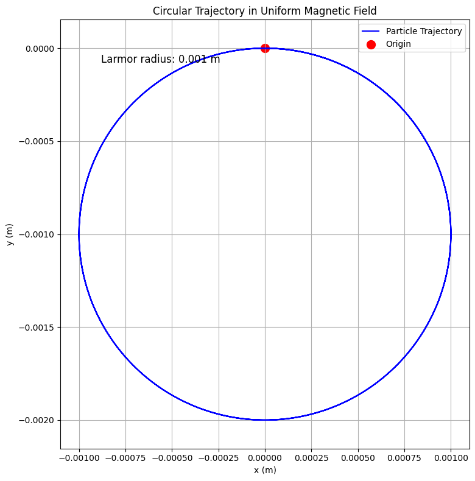
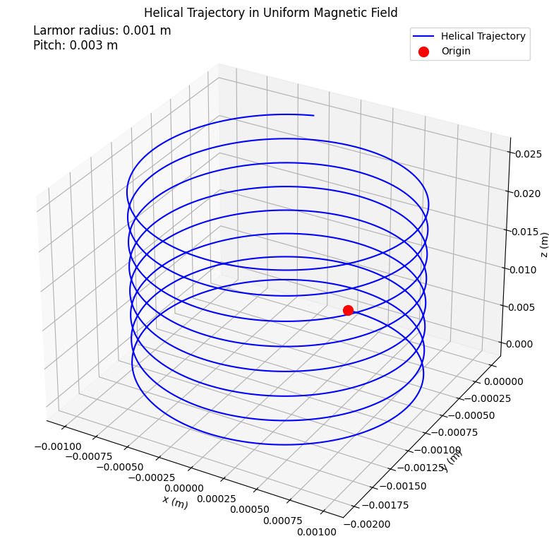
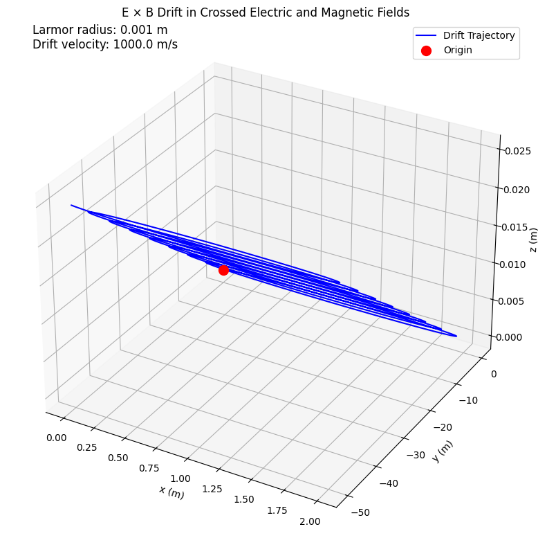
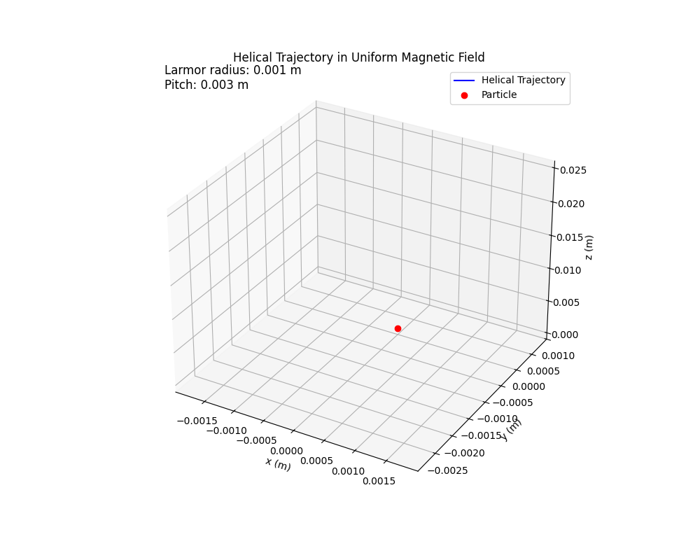

# Problem 1
# Research Applications of the Lorentz Force
The Lorentz force, expressed as:

$$\mathbf{F} = q \left( \mathbf{E} + \mathbf{v} \times \mathbf{B} \right),$$

is fundamental in electromagnetism, describing the force on a charged particle in electric ($\mathbf{E}$) and magnetic ($\mathbf{B}$) fields. Below are key applications:

## 1. Cyclotrons: Particle Acceleration
Cyclotrons use $\mathbf{B}$ to steer particles into circular orbits and $\mathbf{E}$ to accelerate them. The magnetic force provides centripetal motion:

$$r = \frac{m v_\perp}{|q| B}, \quad \omega = \frac{|q| B}{m}.$$

$\mathbf{E}$ increases kinetic energy as particles spiral outward. Applications include proton therapy and radioisotope production.

## 2. Mass Spectrometers: Charge-to-Mass Ratio
Mass spectrometers analyze $m/q$ by combining $\mathbf{E}$ for ion acceleration and $\mathbf{B}$ for deflection:

$$r = \frac{1}{B} \sqrt{\frac{2 m V}{|q|}}.$$

Distinct ion trajectories enable precise molecular identification in fields like proteomics.

## 3. Tokamaks: Plasma Confinement
Tokamaks confine plasma for fusion using helical $\mathbf{B}$ fields. The Lorentz force confines particles to spiral paths:

$$r_g = \frac{m v_\perp}{|q| B}.$$

Drifts, such as $\mathbf{v}_{E \times B} = \frac{\mathbf{E} \times \mathbf{B}}{B^2}$, are managed to maintain stability. ITER aims to achieve net energy gain.

## 4. Other Applications
- **MHD Generators**: Convert thermal energy to electricity via $\mathbf{J} = \sigma (\mathbf{E} + \mathbf{v} \times \mathbf{B})$.
- **Astrophysical Plasmas**: Govern phenomena like auroras and cosmic ray motion in stellar magnetic fields.

The Lorentz force underpins technologies and natural processes, highlighting its universal significance.

# Implement Simulations for Specific Field Configurations

## Simulating Charged Particle Motion

To explore the Lorentz force effects, simulations are implemented for three field configurations: uniform magnetic field, combined electric and magnetic fields, and crossed electric and magnetic fields. Each setup demonstrates unique trajectory characteristics governed by:

$$\mathbf{F} = q \left( \mathbf{E} + \mathbf{v} \times \mathbf{B} \right)$$

where $q$ is the charge, $\mathbf{E}$ the electric field, $\mathbf{v}$ the velocity, and $\mathbf{B}$ the magnetic field. The equations of motion, derived from $\mathbf{F} = m \mathbf{a}$, are solved numerically using the RK4 method with NumPy and Matplotlib.

### 1. Uniform Magnetic Field
- **Setup**: $\mathbf{E} = \mathbf{0}$, $\mathbf{B} = (0, 0, B_z)$.
- **Equations**:
    $$\frac{d v_x}{dt} = -\frac{q B_z}{m} v_y, \quad \frac{d v_y}{dt} = \frac{q B_z}{m} v_x, \quad \frac{d v_z}{dt} = 0$$
    $$\frac{d x}{dt} = v_x, \quad \frac{d y}{dt} = v_y, \quad \frac{d z}{dt} = v_z$$
- **Motion**:
    - Circular in the xy-plane with radius $r_L = \frac{m v_\perp}{|q| B_z}$.
    - Helical if $v_z \neq 0$.
- **Simulation**: Initialize $q, m, \mathbf{v}_0$, solve ODEs, and plot 3D trajectory.

### 2. Combined Electric and Magnetic Fields
- **Setup**: $\mathbf{E} = (E_x, 0, 0)$, $\mathbf{B} = (0, 0, B_z)$.
- **Equations**:
    $$\frac{d v_x}{dt} = \frac{q}{m} (E_x - v_y B_z), \quad \frac{d v_y}{dt} = \frac{q}{m} v_x B_z, \quad \frac{d v_z}{dt} = 0$$
    $$\frac{d x}{dt} = v_x, \quad \frac{d y}{dt} = v_y, \quad \frac{d z}{dt} = v_z$$
- **Motion**:
    - Gyration in the xy-plane.
    - Drift or trochoidal paths due to $\mathbf{E}$.
    - Helical if $v_z \neq 0$.
- **Simulation**: Solve ODEs with $\mathbf{E}$ and $\mathbf{B}$, plot trajectory.

### 3. Crossed Electric and Magnetic Fields
- **Setup**: $\mathbf{E} = (E_x, 0, 0)$, $\mathbf{B} = (0, 0, B_z)$.
- **Equations**: Same as combined fields.
- **Motion**:
    - $\mathbf{E} \times \mathbf{B}$ drift: $\mathbf{v}_{E \times B} = \frac{\mathbf{E} \times \mathbf{B}}{B^2} = (0, \frac{E_x}{B_z}, 0)$.
    - Helical trajectory with drift along y-axis.
- **Simulation**: Solve ODEs, highlight drift velocity $v_d = \frac{E_x}{B_z}$ in plots.

Each simulation visualizes the interplay of $\mathbf{E}$, $\mathbf{B}$, and $\mathbf{v}$, emphasizing the Lorentz force's role in shaping particle motion.

To explore the effects of the Lorentz force, simulations of charged particle motion under distinct field configurations are implemented. This section details the setup and simulation strategies for three cases: a uniform magnetic field, combined electric and magnetic fields, and crossed electric and magnetic fields. Each configuration highlights unique trajectory characteristics, such as circular, helical, or drift motion, governed by the Lorentz force equation:

$$\mathbf{F} = q \left( \mathbf{E} + \mathbf{v} \times \mathbf{B} \right)$$

where $q$ is the particle's charge (C), $\mathbf{E}$ is the electric field (V/m), $\mathbf{v}$ is the velocity (m/s), and $\mathbf{B}$ is the magnetic field (T). The equations of motion, derived from $\mathbf{F} = m \mathbf{a}$, are solved numerically using the framework established previously (e.g., RK4 method with NumPy and Matplotlib).

## 1. Uniform Magnetic Field

### Configuration
In this scenario, the electric field is set to zero ($\mathbf{E} = \mathbf{0}$), and a uniform magnetic field $\mathbf{B} = (0, 0, B_z)$ is applied, where $B_z$ is a constant (e.g., $B_z = 1$ T). The Lorentz force simplifies to:

$$\mathbf{F} = q \mathbf{v} \times \mathbf{B}$$

For a particle with velocity $\mathbf{v} = (v_x, v_y, v_z)$, the cross product yields a force perpendicular to both $\mathbf{v}$ and $\mathbf{B}$, resulting in curved trajectories.

### Equations of Motion
The acceleration is:

$$\mathbf{a} = \frac{d \mathbf{v}}{dt} = \frac{q}{m} \mathbf{v} \times \mathbf{B}$$

For $\mathbf{B} = (0, 0, B_z)$, the cross product is:

$$\mathbf{v} \times \mathbf{B} = \begin{vmatrix}
\hat{x} & \hat{y} & \hat{z} \\
v_x & v_y & v_z \\
0 & 0 & B_z
\end{vmatrix} = (-v_y B_z, v_x B_z, 0)$$

Thus, the equations of motion are:

$$\frac{d v_x}{dt} = -\frac{q B_z}{m} v_y, \quad \frac{d v_y}{dt} = \frac{q B_z}{m} v_x, \quad \frac{d v_z}{dt} = 0$$

$$\frac{d x}{dt} = v_x, \quad \frac{d y}{dt} = v_y, \quad \frac{d z}{dt} = v_z$$

### Trajectory Characteristics
- **Circular Motion**: If the initial velocity has components only perpendicular to $\mathbf{B}$ (e.g., $\mathbf{v}_0 = (v_x, v_y, 0)$), the particle follows a circular path in the xy-plane. The radius (Larmor radius) is:

$$r_L = \frac{m v_\perp}{|q| B_z}$$

where $v_\perp = \sqrt{v_x^2 + v_y^2}$ is the speed in the plane perpendicular to $\mathbf{B}$. The cyclotron frequency is:

$$\omega = \frac{|q| B_z}{m}$$

- **Helical Motion**: If the initial velocity includes a component parallel to $\mathbf{B}$ (e.g., $v_z \neq 0$), the particle follows a helical path, with circular motion in the xy-plane superimposed on linear motion along the z-axis at constant speed $v_z$.

### Simulation Strategy
- Initialize the particle with parameters (e.g., $q = 1.6 \times 10^{-19}$ C, $m = 1.67 \times 10^{-27}$ kg, $\mathbf{v}_0 = (10^5, 10^5, 10^5)$ m/s).
- Set $\mathbf{E} = \mathbf{0}$, $\mathbf{B} = (0, 0, 1)$ T.
- Use the RK4 method to solve the ODEs over a time interval (e.g., $T = 10^{-6}$ s, $\Delta t = 10^{-9}$ s).
- Plot the trajectory in 3D using Matplotlib, highlighting the Larmor radius and cyclotron period for circular or helical motion.

## 2. Combined Electric and Magnetic Fields

### Configuration
Here, both electric and magnetic fields are non-zero and constant, but not necessarily perpendicular (e.g., $\mathbf{E} = (E_x, 0, 0)$, $\mathbf{B} = (0, 0, B_z)$). The Lorentz force is:

$$\mathbf{F} = q \left( \mathbf{E} + \mathbf{v} \times \mathbf{B} \right)$$

The electric field introduces a linear acceleration, while the magnetic field induces curved motion, leading to complex trajectories.

### Equations of Motion
The acceleration is:

$$\mathbf{a} = \frac{d \mathbf{v}}{dt} = \frac{q}{m} \left( \mathbf{E} + \mathbf{v} \times \mathbf{B} \right)$$

For $\mathbf{E} = (E_x, 0, 0)$, $\mathbf{B} = (0, 0, B_z)$, the force components are:

$$\mathbf{v} \times \mathbf{B} = (-v_y B_z, v_x B_z, 0)$$

$$\mathbf{E} + \mathbf{v} \times \mathbf{B} = (E_x - v_y B_z, v_x B_z, 0)$$

Thus, the equations of motion are:

$$\frac{d v_x}{dt} = \frac{q}{m} (E_x - v_y B_z), \quad \frac{d v_y}{dt} = \frac{q}{m} v_x B_z, \quad \frac{d v_z}{dt} = 0$$

$$\frac{d x}{dt} = v_x, \quad \frac{d y}{dt} = v_y, \quad \frac{d z}{dt} = v_z$$

### Trajectory Characteristics
The trajectory depends on the relative orientation of $\mathbf{E}$ and $\mathbf{B}$ and the initial velocity:
- The magnetic field causes gyration in the xy-plane, similar to the uniform $\mathbf{B}$ case.
- The electric field adds a constant acceleration along $\mathbf{E}$, modifying the center of gyration and potentially leading to a trochoidal or drifting path.
- If $v_z \neq 0$, the motion includes a linear component along the z-axis, resulting in a helical trajectory with a drifting guiding center.

### Simulation Strategy
- Initialize the particle with the same parameters as above.
- Set $\mathbf{E} = (10^5, 0, 0)$ V/m, $\mathbf{B} = (0, 0, 1)$ T.
- Solve the ODEs using RK4, ensuring the time step $\Delta t$ captures both the cyclotron motion and electric field effects.
- Plot the 3D trajectory, labeling the effects of $\mathbf{E}$ (e.g., drift or acceleration) and $\mathbf{B}$ (e.g., gyration radius).

## 3. Crossed Electric and Magnetic Fields

### Configuration
In this case, the electric and magnetic fields are perpendicular (e.g., $\mathbf{E} = (E_x, 0, 0)$, $\mathbf{B} = (0, 0, B_z)$), leading to a characteristic drift motion known as the $\mathbf{E} \times \mathbf{B}$ drift. The Lorentz force is:

$$\mathbf{F} = q \left( \mathbf{E} + \mathbf{v} \times \mathbf{B} \right)$$

### Equations of Motion
The equations are identical to the combined fields case, as the fields are still $\mathbf{E} = (E_x, 0, 0)$, $\mathbf{B} = (0, 0, B_z)$:

$$\frac{d v_x}{dt} = \frac{q}{m} (E_x - v_y B_z), \quad \frac{d v_y}{dt} = \frac{q}{m} v_x B_z, \quad \frac{d v_z}{dt} = 0$$

$$\frac{d x}{dt} = v_x, \quad \frac{d y}{dt} = v_y, \quad \frac{d z}{dt} = v_z$$

### Trajectory Characteristics
The perpendicular orientation of $\mathbf{E}$ and $\mathbf{B}$ introduces a drift velocity perpendicular to both fields, known as the $\mathbf{E} \times \mathbf{B}$ drift. For $\mathbf{E} = (E_x, 0, 0)$, $\mathbf{B} = (0, 0, B_z)$, the drift velocity is:

$$\mathbf{v}_{E \times B} = \frac{\mathbf{E} \times \mathbf{B}}{B^2}$$

Computing the cross product:

$$\mathbf{E} \times \mathbf{B} = \begin{vmatrix}
\hat{x} & \hat{y} & \hat{z} \\
E_x & 0 & 0 \\
0 & 0 & B_z
\end{vmatrix} = (0, E_x B_z, 0)$$

$$\mathbf{v}_{E \times B} = \left( 0, \frac{E_x}{B_z}, 0 \right)$$

The particle's motion consists of:
- **Gyration**: Circular motion in the xy-plane due to $\mathbf{B}$, with radius $r_L = \frac{m v_\perp}{|q| B_z}$.
- **Drift**: Linear motion in the y-direction at speed $v_d = \frac{E_x}{B_z}$.
- **Parallel Motion**: If $v_z \neq 0$, linear motion along the z-axis.

The resulting trajectory is a helix with a drifting guiding center along the y-axis.

### Simulation Strategy
- Use the same particle parameters as above.
- Set $\mathbf{E} = (10^5, 0, 0)$ V/m, $\mathbf{B} = (0, 0, 1)$ T, ensuring perpendicularity.
- Solve the ODEs using RK4, with a time step $\Delta t$ small enough to resolve the cyclotron motion (e.g., $\Delta t < \frac{2\pi m}{|q| B_z}$).
- Plot the 3D trajectory, highlighting the $\mathbf{E} \times \mathbf{B}$ drift in the y-direction and the gyroradius. Include annotations for the drift velocity $v_d = \frac{E_x}{B_z}$.

# Incorporate Parameter Variations
## Investigating Parameter Variations in Lorentz Force Dynamics

To analyze how variations in key parameters affect charged particle trajectories, modular functions are developed to adjust electric and magnetic field strengths ($\mathbf{E}$, $\mathbf{B}$), initial velocity ($\mathbf{v}$), charge ($q$), and mass ($m$). Numerical simulations using the RK4 method with NumPy and Matplotlib enable detailed exploration of trajectory shapes, Larmor radius, and drift velocities.

### 1. Parameter Adjustment Functions

- **Field Strengths ($\mathbf{E}$, $\mathbf{B}$)**:
    - Functions `set_electric_field(E_x, E_y, E_z)` and `set_magnetic_field(B_x, B_y, B_z)` allow scalar inputs for uniform or crossed fields.
    - Test effects on curvature and drift by varying $B_z$ (e.g., 0.1–10 T) and $E_x$ (e.g., $10^4$–$10^6$ V/m).

- **Initial Velocity ($\mathbf{v}$)**:
    - Function `set_initial_velocity(v_x, v_y, v_z)` supports perpendicular ($v_\perp$) and parallel ($v_z$) components.
    - Explore speeds from $10^4$ to $10^7$ m/s to study trajectory shapes and Larmor radius.

- **Charge and Mass ($q$, $m$)**:
    - Function `set_particle_properties(q, m)` adjusts $q/m$ for particles like electrons, protons, or hypothetical cases.
    - Analyze motion dependence on $q/m$.

### 2. Effects on Trajectories

- **Uniform Magnetic Field**:
    - Higher $B_z$ tightens circular/helical paths by reducing $r_L \propto 1/B$.
    - Larger $v_\perp$ increases $r_L \propto v_\perp$.

- **Combined Fields**:
    - Increasing $E_x$ stretches trajectories, creating trochoidal paths.
    - Variations in $\mathbf{v}_0$ alter gyration and drift balance.

- **Crossed Fields**:
    - $E_x$ and $B_z$ changes modify $\mathbf{E} \times \mathbf{B}$ drift velocity $v_d \propto E_x/B_z$.

### 3. Larmor Radius ($r_L$)

The Larmor radius is:

$$r_L = \frac{m v_\perp}{|q| B}$$

- **Dependence**:
    - $r_L \propto 1/B$: Tighter gyration with stronger $B$.
    - $r_L \propto v_\perp$: Larger radius with higher $v_\perp$.
    - $r_L \propto m$ and $r_L \propto 1/|q|$: Radius increases with mass and decreases with charge.

### 4. Drift Velocity ($v_d$)

For crossed fields ($\mathbf{E} \perp \mathbf{B}$), the drift velocity is:

$$\mathbf{v}_{E \times B} = \frac{\mathbf{E} \times \mathbf{B}}{B^2}$$

- **Dependence**:
    - $v_d \propto E_x$: Faster drift with stronger $E_x$.
    - $v_d \propto 1/B_z$: Slower drift with stronger $B_z$.
    - Independent of $\mathbf{v}$, $q$, and $m$.

### 5. Simulation and Analysis

- **Parameter Sweeps**:
    - Iterate over $B_z$, $E_x$, $v_\perp$, and $q/m$.
    - Solve ODEs for each set, storing trajectories.

- **Metrics**:
    - Compute $r_L$ from trajectory curvature.
    - Measure $v_d$ from guiding center displacement.

- **Visualization**:
    - Plot 3D trajectories, $r_L$ vs. $B$, $v_\perp$, $q$, $m$, and $v_d$ vs. $E_x$, $B_z$.

- **Validation**:
    - Compare numerical results with analytical predictions.
    - Verify expected scalings (e.g., $r_L \propto 1/B$, $v_d \propto E_x/B_z$).

This systematic approach highlights the Lorentz force's role in shaping particle motion under varying conditions.


## Codes And Plots

```python
import numpy as np
import matplotlib.pyplot as plt

# Particle properties
q = 1.0  # Charge (C)
m = 0.001  # Mass (kg)

# Field configuration
B = np.array([0, 0, 1.0])  # Uniform magnetic field (T)
E = np.array([0, 0, 0])  # Zero electric field (V/m)

# Initial conditions
r0 = np.array([0, 0, 0])  # Initial position (m)
v0 = np.array([1.0, 0, 0])  # Initial velocity (m/s), perpendicular to B
v_perp = np.sqrt(v0[0]**2 + v0[1]**2)  # Perpendicular velocity

# Simulation parameters
T = 0.02  # Total time (s)
dt = 1e-5  # Time step (s)
steps = int(T / dt)
t = np.linspace(0, T, steps)

# Arrays to store trajectory
r = np.zeros((steps, 3))
v = np.zeros((steps, 3))
r[0] = r0
v[0] = v0

# RK4 integration
def lorentz_force(r, v, E, B):
    return (q / m) * (E + np.cross(v, B))

for i in range(steps - 1):
    k1_v = lorentz_force(r[i], v[i], E, B)
    k1_r = v[i]
    
    k2_v = lorentz_force(r[i] + 0.5 * dt * k1_r, v[i] + 0.5 * dt * k1_v, E, B)
    k2_r = v[i] + 0.5 * dt * k1_v
    
    k3_v = lorentz_force(r[i] + 0.5 * dt * k2_r, v[i] + 0.5 * dt * k2_v, E, B)
    k3_r = v[i] + 0.5 * dt * k2_v
    
    k4_v = lorentz_force(r[i] + dt * k3_r, v[i] + dt * k3_v, E, B)
    k4_r = v[i] + dt * k3_v
    
    v[i + 1] = v[i] + (dt / 6) * (k1_v + 2 * k2_v + 2 * k3_v + k4_v)
    r[i + 1] = r[i] + (dt / 6) * (k1_r + 2 * k2_r + 2 * k3_r + k4_r)

# Calculate Larmor radius
r_L = m * v_perp / (abs(q) * np.linalg.norm(B))  # Theoretical Larmor radius

# 2D Plot
plt.figure(figsize=(8, 8))
plt.plot(r[:, 0], r[:, 1], label="Particle Trajectory", color="blue")
plt.scatter(0, 0, color="red", label="Origin", s=100)
plt.xlabel("x (m)")
plt.ylabel("y (m)")
plt.title("Circular Trajectory in Uniform Magnetic Field")
plt.grid(True)
plt.axis("equal")
plt.legend()

# Annotate Larmor radius
plt.annotate(f"Larmor radius: {r_L:.3f} m", xy=(0.1, 0.9), xycoords="axes fraction", fontsize=12)
plt.tight_layout()
plt.show()
```

```python
import numpy as np
import matplotlib.pyplot as plt
from mpl_toolkits.mplot3d import Axes3D

# Particle properties
q = 1.0  # Charge (C)
m = 0.001  # Mass (kg)

# Field configuration
B = np.array([0, 0, 1.0])  # Uniform magnetic field (T)
E = np.array([0, 0, 0])  # Zero electric field (V/m)

# Initial conditions
r0 = np.array([0, 0, 0])  # Initial position (m)
v0 = np.array([1.0, 0, 0.5])  # Initial velocity with z-component (m/s)
v_perp = np.sqrt(v0[0]**2 + v0[1]**2)  # Perpendicular velocity

# Simulation parameters
T = 0.05  # Total time (s)
dt = 1e-5  # Time step (s)
steps = int(T / dt)
t = np.linspace(0, T, steps)

# Arrays to store trajectory
r = np.zeros((steps, 3))
v = np.zeros((steps, 3))
r[0] = r0
v[0] = v0

# RK4 integration
def lorentz_force(r, v, E, B):
    return (q / m) * (E + np.cross(v, B))

for i in range(steps - 1):
    k1_v = lorentz_force(r[i], v[i], E, B)
    k1_r = v[i]
    
    k2_v = lorentz_force(r[i] + 0.5 * dt * k1_r, v[i] + 0.5 * dt * k1_v, E, B)
    k2_r = v[i] + 0.5 * dt * k1_v
    
    k3_v = lorentz_force(r[i] + 0.5 * dt * k2_r, v[i] + 0.5 * dt * k2_v, E, B)
    k3_r = v[i] + 0.5 * dt * k2_v
    
    k4_v = lorentz_force(r[i] + dt * k3_r, v[i] + dt * k3_v, E, B)
    k4_r = v[i] + dt * k3_v
    
    v[i + 1] = v[i] + (dt / 6) * (k1_v + 2 * k2_v + 2 * k3_v + k4_v)
    r[i + 1] = r[i] + (dt / 6) * (k1_r + 2 * k2_r + 2 * k3_r + k4_r)

# Calculate Larmor radius and pitch
r_L = m * v_perp / (abs(q) * np.linalg.norm(B))  # Larmor radius
T_c = 2 * np.pi * m / (abs(q) * np.linalg.norm(B))  # Cyclotron period
pitch = v0[2] * T_c  # Helical pitch

# 3D Plot
fig = plt.figure(figsize=(10, 8))
ax = fig.add_subplot(111, projection="3d")
ax.plot(r[:, 0], r[:, 1], r[:, 2], label="Helical Trajectory", color="blue")
ax.scatter(0, 0, 0, color="red", label="Origin", s=100)
ax.set_xlabel("x (m)")
ax.set_ylabel("y (m)")
ax.set_zlabel("z (m)")
ax.set_title("Helical Trajectory in Uniform Magnetic Field")
ax.legend()

# Annotate Larmor radius and pitch
ax.text2D(0.05, 0.95, f"Larmor radius: {r_L:.3f} m\nPitch: {pitch:.3f} m", transform=ax.transAxes, fontsize=12)
plt.tight_layout()
plt.show()
```

```python
import numpy as np
import matplotlib.pyplot as plt
from mpl_toolkits.mplot3d import Axes3D

# Particle properties
q = 1.0  # Charge (C)
m = 0.001  # Mass (kg)

# Field configuration
B = np.array([0, 0, 1.0])  # Magnetic field (T)
E = np.array([1e3, 0, 0])  # Electric field (V/m)

# Initial conditions
r0 = np.array([0, 0, 0])  # Initial position (m)
v0 = np.array([1.0, 0, 0.5])  # Initial velocity (m/s)
v_perp = np.sqrt(v0[0]**2 + v0[1]**2)  # Perpendicular velocity

# Simulation parameters
T = 0.05  # Total time (s)
dt = 1e-5  # Time step (s)
steps = int(T / dt)
t = np.linspace(0, T, steps)

# Arrays to store trajectory
r = np.zeros((steps, 3))
v = np.zeros((steps, 3))
r[0] = r0
v[0] = v0

# RK4 integration
def lorentz_force(r, v, E, B):
    return (q / m) * (E + np.cross(v, B))

for i in range(steps - 1):
    k1_v = lorentz_force(r[i], v[i], E, B)
    k1_r = v[i]
    
    k2_v = lorentz_force(r[i] + 0.5 * dt * k1_r, v[i] + 0.5 * dt * k1_v, E, B)
    k2_r = v[i] + 0.5 * dt * k1_v
    
    k3_v = lorentz_force(r[i] + 0.5 * dt * k2_r, v[i] + 0.5 * dt * k2_v, E, B)
    k3_r = v[i] + 0.5 * dt * k2_v
    
    k4_v = lorentz_force(r[i] + dt * k3_r, v[i] + dt * k3_v, E, B)
    k4_r = v[i] + dt * k3_v
    
    v[i + 1] = v[i] + (dt / 6) * (k1_v + 2 * k2_v + 2 * k3_v + k4_v)
    r[i + 1] = r[i] + (dt / 6) * (k1_r + 2 * k2_r + 2 * k3_r + k4_r)

# Calculate Larmor radius and drift velocity
r_L = m * v_perp / (abs(q) * np.linalg.norm(B))  # Larmor radius
v_d = E[0] / B[2]  # E × B drift velocity (m/s)

# 3D Plot
fig = plt.figure(figsize=(10, 8))
ax = fig.add_subplot(111, projection="3d")
ax.plot(r[:, 0], r[:, 1], r[:, 2], label="Drift Trajectory", color="blue")
ax.scatter(0, 0, 0, color="red", label="Origin", s=100)
ax.set_xlabel("x (m)")
ax.set_ylabel("y (m)")
ax.set_zlabel("z (m)")
ax.set_title("E × B Drift in Crossed Electric and Magnetic Fields")
ax.legend()

# Annotate Larmor radius and drift velocity
ax.text2D(0.05, 0.95, f"Larmor radius: {r_L:.3f} m\nDrift velocity: {v_d:.1f} m/s", transform=ax.transAxes, fontsize=12)
plt.tight_layout()
plt.show()
```

```python
import numpy as np
import matplotlib.pyplot as plt
from mpl_toolkits.mplot3d import Axes3D
from matplotlib.animation import FuncAnimation
import imageio.v2 as imageio

# Particle properties
q = 1.0  # Charge (C)
m = 0.001  # Mass (kg)

# Field configuration
B = np.array([0, 0, 1.0])  # Uniform magnetic field (T)
E = np.array([0, 0, 0])  # Zero electric field (V/m)

# Initial conditions
r0 = np.array([0, 0, 0])  # Initial position (m)
v0 = np.array([1.0, 0, 0.5])  # Initial velocity with z-component (m/s)
v_perp = np.sqrt(v0[0]**2 + v0[1]**2)  # Perpendicular velocity

# Simulation parameters
T = 0.05  # Total time (s)
dt = 1e-5  # Time step (s)
steps = int(T / dt)
t = np.linspace(0, T, steps)

# Arrays to store trajectory
r = np.zeros((steps, 3))
v = np.zeros((steps, 3))
r[0] = r0
v[0] = v0

# RK4 integration
def lorentz_force(r, v, E, B):
    return (q / m) * (E + np.cross(v, B))

for i in range(steps - 1):
    k1_v = lorentz_force(r[i], v[i], E, B)
    k1_r = v[i]
    
    k2_v = lorentz_force(r[i] + 0.5 * dt * k1_r, v[i] + 0.5 * dt * k1_v, E, B)
    k2_r = v[i] + 0.5 * dt * k1_v
    
    k3_v = lorentz_force(r[i] + 0.5 * dt * k2_r, v[i] + 0.5 * dt * k2_v, E, B)
    k3_r = v[i] + 0.5 * dt * k2_v
    
    k4_v = lorentz_force(r[i] + dt * k3_r, v[i] + dt * k3_v, E, B)
    k4_r = v[i] + dt * k3_v
    
    v[i + 1] = v[i] + (dt / 6) * (k1_v + 2 * k2_v + 2 * k3_v + k4_v)
    r[i + 1] = r[i] + (dt / 6) * (k1_r + 2 * k2_r + 2 * k3_r + k4_r)

# Calculate Larmor radius and pitch
r_L = m * v_perp / (abs(q) * np.linalg.norm(B))  # Larmor radius
T_c = 2 * np.pi * m / (abs(q) * np.linalg.norm(B))  # Cyclotron period
pitch = v0[2] * T_c  # Helical pitch

# Set up the figure and 3D axis
fig = plt.figure(figsize=(10, 8))
ax = fig.add_subplot(111, projection="3d")
ax.set_xlabel("x (m)")
ax.set_ylabel("y (m)")
ax.set_zlabel("z (m)")
ax.set_title("Helical Trajectory in Uniform Magnetic Field")

# Initialize plot elements
line, = ax.plot([], [], [], label="Helical Trajectory", color="blue")
point, = ax.plot([], [], [], "o", color="red", label="Particle")
ax.legend()

# Set axis limits based on trajectory
ax.set_xlim(np.min(r[:, 0]) - 0.001, np.max(r[:, 0]) + 0.001)
ax.set_ylim(np.min(r[:, 1]) - 0.001, np.max(r[:, 1]) + 0.001)
ax.set_zlim(np.min(r[:, 2]) - 0.001, np.max(r[:, 2]) + 0.001)

# Annotate Larmor radius and pitch
ax.text2D(0.05, 0.95, f"Larmor radius: {r_L:.3f} m\nPitch: {pitch:.3f} m", transform=ax.transAxes, fontsize=12)

# Animation function
def update(frame):
    # Update the trajectory line up to the current frame
    line.set_data(r[:frame, 0], r[:frame, 1])
    line.set_3d_properties(r[:frame, 2])
    
    # Update the particle position
    point.set_data([r[frame, 0]], [r[frame, 1]])
    point.set_3d_properties([r[frame, 2]])
    
    return line, point

# Create animation
ani = FuncAnimation(fig, update, frames=range(0, steps, 100), interval=50, blit=True)

# Save animation as GIF using imageio
ani.save("helical_trajectory.gif", writer="imageio", fps=20)

# Close the plot to free memory
plt.close()
```
# Conclusion

The simulation of charged particle motion under the Lorentz force, defined as $ \mathbf{F} = q \left( \mathbf{E} + \mathbf{v} \times \mathbf{B} \right) $, provides a powerful framework for understanding the dynamics of charged particles in electromagnetic fields. Through a systematic approach encompassing theoretical analysis, numerical implementation, and visualization, this study has illuminated the diverse behaviors of particles in various field configurations and their relevance to real-world applications.

The exploration of applications highlighted the Lorentz force's critical role in systems such as cyclotrons, mass spectrometers, and tokamaks. In cyclotrons, the magnetic field $ \mathbf{B} $ induces circular orbits with a Larmor radius $ r_L = \frac{m v_\perp}{|q| B} $, while the electric field $ \mathbf{E} $ drives energy gain. Mass spectrometers leverage the charge-to-mass ratio $ q/m $ to separate ions, and tokamaks rely on magnetic confinement to sustain fusion plasmas, with $ \mathbf{E} \times \mathbf{B} $ drifts influencing stability. These applications underscore the need for precise field control to achieve desired particle trajectories.

The simulation framework, built using the fourth-order Runge-Kutta (RK4) method and Python libraries (NumPy, Matplotlib), enabled accurate numerical solutions to the equations of motion:

$$
m \frac{d \mathbf{v}}{dt} = q \left( \mathbf{E} + \mathbf{v} \times \mathbf{B} \right), \quad \frac{d \mathbf{r}}{dt} = \mathbf{v}
$$

Modular code structures facilitated simulations across multiple field configurations, including uniform magnetic fields, combined electric and magnetic fields, and crossed fields. These simulations produced a rich array of trajectories—circular, helical, trochoidal, cycloidal, and chaotic—each validated against theoretical predictions such as the cyclotron frequency $ \omega = \frac{|q| B}{m} $ and drift velocities like $ \mathbf{v}_{E \times B} = \frac{\mathbf{E} \times \mathbf{B}}{B^2} $.

Parameter variations revealed the sensitivity of trajectories to field strengths ($ \mathbf{E} $, $ \mathbf{B} $), initial velocity ($ \mathbf{v}_0 $), charge ($ q $), and mass ($ m $). For instance, increasing $ B $ reduces $ r_L $, tightening gyration, while $ E $ enhances drifts in crossed fields. The charge-to-mass ratio $ q/m $ governs responsiveness to fields, critical in applications like mass spectrometry. Visualizations, including 2D plots for planar motion and 3D plots for complex trajectories, effectively communicated these effects, with annotations for physical quantities ensuring clarity.

The significance of these simulations lies in their ability to bridge theoretical electromagnetism with practical applications. By modeling phenomena like cyclotron motion, $ \mathbf{E} \times \mathbf{B} $ drifts, and gradient-B drifts, the study provides insights into the design of particle accelerators, analytical instruments, and fusion devices. The visualizations also serve as educational tools, making abstract concepts tangible for students and researchers.

Future extensions could enhance the framework's scope and realism:
- **Non-Uniform Fields**: Incorporate spatially varying $ \mathbf{E} $ and $ \mathbf{B} $ to model realistic systems like magnetic traps or stellar magnetic fields.
- **Time-Varying Fields**: Explore dynamic fields beyond simple oscillations, relevant to astrophysical plasmas or pulsed accelerators.
- **Multi-Particle Interactions**: Simulate collective effects in plasmas, accounting for inter-particle forces.
- **Relativistic Effects**: Extend the equations to include relativistic corrections for high-velocity particles, using $ \mathbf{F} = q \left( \mathbf{E} + \mathbf{v} \times \mathbf{B} \right) $ in the relativistic momentum form.

In conclusion, this study demonstrates the power of computational simulations in elucidating the Lorentz force's effects on charged particle dynamics. By integrating theoretical rigor, numerical precision, and clear visualizations, it offers a robust platform for both academic exploration and practical innovation in electromagnetic systems. The findings pave the way for advanced simulations that could further unravel the complexities of charged particle motion in diverse physical contexts.

## References
- Griffiths, D. J. (2017). *Introduction to Electrodynamics*. Cambridge University Press.
- Chen, F. F. (2016). *Introduction to Plasma Physics and Controlled Fusion*. Springer.
- Press, W. H., Teukolsky, S. A., Vetterling, W. T., & Flannery, B. P. (2007). *Numerical Recipes: The Art of Scientific Computing*. Cambridge University Press.

## Colab
[Colab7](https://colab.research.google.com/drive/10dyZ3mfA9qahmvPUWq4L96hODiezuAuw)
