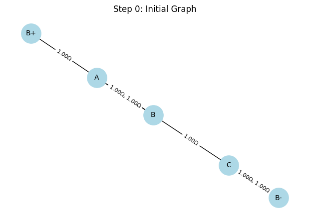
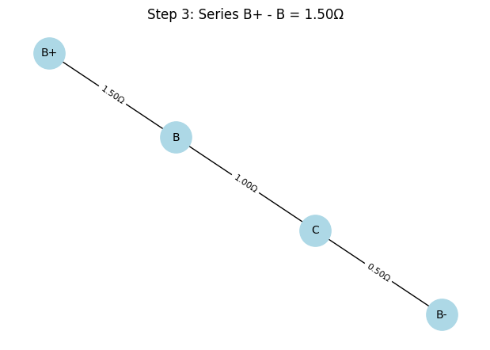

# Modeling Electrical Circuits as Graphs: A Graph-Theoretic Approach to Equivalent Resistance

## 1. Understanding the Circuit-to-Graph Representation

The analysis of electrical circuits, particularly for calculating equivalent resistance, is a cornerstone of electrical engineering. Traditional methods rely on iterative applications of series and parallel resistor formulas, which can become computationally intensive for complex networks. Graph theory provides a robust and systematic framework to model and simplify such circuits, enabling both analytical insights and computational efficiency. This section explores how to represent an electrical circuit as a graph, emphasizing the mapping of circuit components to graph elements and the underlying graph-theoretic concepts.

### 1.1 Circuit-to-Graph Mapping

An electrical circuit can be modeled as a **weighted undirected graph** $G = (V, E, w)$, where:
- **Nodes ($V$)**: Represent junctions or connection points in the circuit where two or more circuit elements (e.g., resistors, wires) meet. These are points of equal potential (equipotential points) in the circuit.
- **Edges ($E$)**: Represent resistors connecting pairs of junctions. Each edge corresponds to a resistor bridging two nodes.
- **Weights ($w : E \to \mathbb{R}^+$)**: Represent the resistance values of the resistors, typically measured in ohms ($\Omega$). For an edge $e \in E$ connecting nodes $u, v \in V$, the weight $w(e) = R_{uv}$ is the resistance of the resistor.

Formally, let $V = \{ v_1, v_2, \dots, v_n \}$ denote the set of nodes (junctions), and $E = \{ e_1, e_2, \dots, e_m \}$ denote the set of edges (resistors). The graph $G$ is undirected because resistors have no directional preference, and the weight function $w(e_i) = R_i$ assigns a positive real number to each edge, reflecting the resistance.

#### Example: Simple Series Circuit
Consider a circuit with three resistors in series: $R_1 = 2\Omega$, $R_2 = 3\Omega$, $R_3 = 4\Omega$. The circuit can be represented as a graph with:
- Nodes: $v_1, v_2, v_3, v_4$ (junctions between resistors and at the terminals).
- Edges: $e_1 = (v_1, v_2)$ with $w(e_1) = 2\Omega$, $e_2 = (v_2, v_3)$ with $w(e_2) = 3\Omega$, $e_3 = (v_3, v_4)$ with $w(e_3) = 4\Omega$.
- Graph structure: A linear path $v_1 \to v_2 \to v_3 \to v_4$.

The equivalent resistance $R_{\text{eq}}$ is computed as:
$$R_{\text{eq}} = R_1 + R_2 + R_3 = 2 + 3 + 4 = 9\Omega$$

This linear graph reflects the series configuration, where the total resistance is the sum of individual resistances.

#### Example: Simple Parallel Circuit
For two resistors in parallel, $R_1 = 4\Omega$, $R_2 = 4\Omega$, connected between two junctions:
- Nodes: $v_1, v_2$ (the two junctions).
- Edges: $e_1 = (v_1, v_2)$ with $w(e_1) = 4\Omega$, $e_2 = (v_1, v_2)$ with $w(e_2) = 4\Omega$.
- Graph structure: Two parallel edges between $v_1$ and $v_2$.

The equivalent resistance is given by the parallel resistance formula:
$$\frac{1}{R_{\text{eq}}} = \frac{1}{R_1} + \frac{1}{R_2} = \frac{1}{4} + \frac{1}{4} = \frac{2}{4} = \frac{1}{2}$$
$$R_{\text{eq}} = 2\Omega$$

This graph representation captures the parallel configuration, where multiple edges between the same node pair indicate resistors in parallel.

### 1.2 Graph Theory Concepts for Circuit Analysis

To effectively model and analyze circuits as graphs, a solid understanding of fundamental graph theory concepts is essential. These concepts provide the mathematical foundation for identifying series and parallel connections and simplifying complex networks.

#### 1.2.1 Nodes and Degree
The **degree** of a node $v \in V$, denoted $\deg(v)$, is the number of edges incident to it. In a circuit graph:
- A node with $\deg(v) = 2$ typically indicates a junction between two resistors in series, as it connects exactly two resistors (e.g., $v_2$ in the series example above).
- A node with $\deg(v) > 2$ may indicate a junction where multiple resistors converge, potentially forming parallel or more complex configurations.

For a graph with $n$ nodes and $m$ edges, the sum of degrees satisfies the handshaking lemma:
$$\sum_{v \in V} \deg(v) = 2m$$

This property ensures consistency in the circuit’s connectivity.

#### 1.2.2 Edges and Weights
Edges in the circuit graph are weighted by resistance values. For an edge $e = (u, v)$, the weight $w(e) = R_{uv}$ is a positive real number. The weight function is critical for computations, as it directly influences the equivalent resistance. For parallel edges between nodes $u$ and $v$, say $e_1, e_2$ with weights $R_1, R_2$, the equivalent resistance is:
$$R_{\text{eq}} = \left( \frac{1}{R_1} + \frac{1}{R_2} \right)^{-1}$$

This formula generalizes to $k$ parallel edges:
$$\frac{1}{R_{\text{eq}}} = \sum_{i=1}^k \frac{1}{R_i}$$

#### 1.2.3 Cycles
A **cycle** in a graph is a closed path where the starting and ending nodes are the same, and no edges are repeated. In circuit graphs, cycles often indicate parallel or more complex configurations. For example:
- A cycle of length 2 (two edges between the same pair of nodes) represents parallel resistors.
- Longer cycles may indicate configurations like Wheatstone bridges or delta-star transformations, which require advanced simplification techniques.

The presence of cycles can be detected using graph traversal algorithms like **depth-first search (DFS)**, which explores the graph to identify closed paths. The cycle structure informs the reduction strategy, as parallel resistors form the simplest type of cycle.

#### 1.2.4 Connectivity and Paths
A graph is **connected** if there is a path between any pair of nodes. In circuit analysis, we assume the circuit graph is connected, as disconnected components would represent separate circuits. A **path** between nodes $u$ and $v$ is a sequence of edges connecting them. For series configurations, the path is unique and linear, with intermediate nodes of degree 2. The resistance along a path in series is:
$$R_{\text{path}} = \sum_{e \in \text{path}} w(e)$$

#### 1.2.5 Adjacency and Incidence
The **adjacency matrix** $A$ of a graph encodes connectivity: $A_{ij} = 1$ if an edge exists between nodes $v_i$ and $v_j$, and 0 otherwise. For weighted graphs, a **weighted adjacency matrix** can store resistance values: $A_{ij} = R_{ij}$ if an edge exists, else $\infty$. The **incidence matrix** $B$ relates nodes to edges: $B_{ve} = 1$ if node $v$ is an endpoint of edge $e$, and 0 otherwise. These matrices are useful for computational implementations and advanced analyses (e.g., Kirchhoff’s laws).

### 1.3 Representing Series and Parallel Connections

The graph representation naturally captures series and parallel resistor configurations, which are the building blocks of circuit simplification.

#### 1.3.1 Series Connections
A series connection occurs when resistors are arranged along a single path with no branching. In graph terms:
- The subgraph is a path where intermediate nodes have $\deg(v) = 2$.
- For resistors $R_1, R_2, \dots, R_k$ in series, the equivalent resistance is:
$$R_{\text{eq}} = R_1 + R_2 + \cdots + R_k = \sum_{i=1}^k R_i$$
- Graphically, the path $v_1 \to v_2 \to \cdots \to v_{k+1}$ with edges $e_i = (v_i, v_{i+1})$ of weights $R_i$ is reduced to a single edge $(v_1, v_{k+1})$ with weight $R_{\text{eq}}$.

#### 1.3.2 Parallel Connections
A parallel connection occurs when multiple resistors connect the same pair of nodes. In graph terms:
- Multiple edges exist between nodes $u$ and $v$.
- For resistors $R_1, R_2, \dots, R_k$ in parallel, the equivalent resistance is:
$$R_{\text{eq}} = \left( \sum_{i=1}^k \frac{1}{R_i} \right)^{-1}$$
- Graphically, the multiple edges $e_1, e_2, \dots, e_k$ between $u$ and $v$ are replaced by a single edge with weight $R_{\text{eq}}$.

#### 1.3.3 Nested Configurations
Complex circuits often involve nested series and parallel combinations. The graph representation handles these by iteratively identifying and reducing series and parallel subgraphs. For example, consider a circuit where two resistors $R_1, R_2$ are in series, and their combination is in parallel with $R_3$:
- First, reduce the series combination:
$$R_{12} = R_1 + R_2$$
- Then, compute the parallel combination with $R_3$:
$$R_{\text{eq}} = \left( \frac{1}{R_{12}} + \frac{1}{R_3} \right)^{-1} = \left( \frac{1}{R_1 + R_2} + \frac{1}{R_3} \right)^{-1}$$

This iterative process leverages the graph structure to systematically simplify the network.

### 1.4 Practical Considerations
- **Graph Simplification**: The goal is to reduce the graph to a single edge between the input and output nodes, with the edge weight equal to $R_{\text{eq}}$. This requires careful identification of series and parallel patterns using traversal algorithms.
- **Complex Configurations**: Circuits with cycles (e.g., bridges or delta configurations) may require advanced techniques like **star-delta transformations**:
$$R_{\text{delta}} \to R_{\text{star}}: \quad R_i = \frac{R_a R_b}{R_a + R_b + R_c}$$
where $R_a, R_b, R_c$ are the resistances in a delta configuration.
- **Computational Tools**: Libraries like NetworkX (Python) can represent and manipulate weighted graphs, facilitating the identification of series and parallel subgraphs.

### 1.5 Summary
Modeling an electrical circuit as a weighted undirected graph provides a powerful framework for analyzing equivalent resistance. Nodes represent junctions, edges represent resistors with weights as resistance values, and graph theory concepts like degree, cycles, and paths enable the identification of series and parallel configurations. The mathematical formalism, supported by equations like:
$$R_{\text{series}} = \sum R_i, \quad R_{\text{parallel}} = \left( \sum \frac{1}{R_i} \right)^{-1}$$
ensures precise computation. This approach not only streamlines manual analysis but also supports automated circuit simulation, making it invaluable for engineering and computational applications.

---
# Algorithm Development for Calculating Equivalent Resistance Using Graph Theory

## 2. Developing the Algorithm for Equivalent Resistance

Calculating the equivalent resistance of an electrical circuit is a fundamental task in circuit analysis, traditionally approached through iterative application of series and parallel resistor formulas. For complex circuits, these methods can become cumbersome, especially when dealing with nested configurations. By modeling a circuit as a weighted undirected graph $G = (V, E, w)$, where nodes represent junctions, edges represent resistors, and weights denote resistance values, graph theory offers a systematic and algorithmic approach to simplify the circuit and compute the equivalent resistance $R_{\text{eq}}$. This section outlines the development of an algorithm that iteratively simplifies the graph by identifying and reducing series and parallel connections, ensuring robust handling of nested combinations.

### 2.1 Overview of the Algorithm

The algorithm iteratively reduces the graph $G$ until it consists of a single edge between the input and output nodes, with the edge’s weight equal to the equivalent resistance $R_{\text{eq}}$. The process involves:
- **Identifying Series Connections**: Detect linear chains of edges (resistors) forming a path with no branching, and combine their resistances by summation.
- **Identifying Parallel Connections**: Detect multiple edges between the same pair of nodes, and combine their resistances using the parallel resistance formula.
- **Iterative Reduction**: Repeatedly apply series and parallel reductions until the graph is fully simplified.
- **Handling Nested Combinations**: Ensure the algorithm processes complex configurations (e.g., series within parallel or vice versa) by iteratively simplifying identifiable patterns.

The algorithm assumes the graph is connected and undirected, with positive resistance values $w(e) > 0$ for each edge $e \in E$.

### 2.2 Identifying Series Connections

A series connection occurs when resistors form a linear chain with no branching paths, corresponding to a path in the graph where intermediate nodes have degree 2. Formally, consider a path $v_1 \to v_2 \to \cdots \to v_{k+1}$ with edges $e_i = (v_i, v_{i+1})$ and resistances $R_i = w(e_i)$ for $i = 1, 2, \dots, k$, where each intermediate node $v_2, v_3, \dots, v_k$ has $\deg(v_i) = 2$. The equivalent resistance of the series combination is:
$$R_{\text{series}} = R_1 + R_2 + \cdots + R_k = \sum_{i=1}^k R_i$$

To identify series connections:
- Traverse the graph to find nodes with $\deg(v) = 2$.
- For each such node $v_i$ with neighbors $v_{i-1}$ and $v_{i+1}$, combine the edges $(v_{i-1}, v_i)$ and $(v_i, v_{i+1})$ into a single edge $(v_{i-1}, v_{i+1})$ with weight $R_{i-1} + R_i$.
- Remove node $v_i$ and update the graph.

This reduction preserves the equivalent resistance between the remaining nodes.

#### Example: Series Reduction
Consider a path with three resistors: $R_1 = 2\Omega$, $R_2 = 3\Omega$, $R_3 = 4\Omega$, forming a graph $v_1 \to v_2 \to v_3 \to v_4$. Nodes $v_2$ and $v_3$ have $\deg(v_2) = \deg(v_3) = 2$. The algorithm:
1. Combines $R_1$ and $R_2$ at $v_2$, replacing edges $(v_1, v_2)$ and $(v_2, v_3)$ with a single edge $(v_1, v_3)$ of resistance $2 + 3 = 5\Omega$.
2. Combines the new edge with $R_3$ at $v_3$, resulting in a single edge $(v_1, v_4)$ with resistance $5 + 4 = 9\Omega$.
The equivalent resistance is:
$$R_{\text{eq}} = 2 + 3 + 4 = 9\Omega$$

### 2.3 Identifying Parallel Connections

A parallel connection occurs when multiple resistors connect the same pair of nodes, represented by multiple edges between two nodes in the graph. For nodes $u$ and $v$ connected by edges $e_1, e_2, \dots, e_k$ with resistances $R_1, R_2, \dots, R_k$, the equivalent resistance is:
$$R_{\text{parallel}} = \left( \sum_{i=1}^k \frac{1}{R_i} \right)^{-1}$$

To identify parallel connections:
- Examine all pairs of nodes $(u, v)$ to detect multiple edges.
- For each set of parallel edges, compute the equivalent resistance using the parallel formula.
- Replace the multiple edges with a single edge $(u, v)$ of weight $R_{\text{parallel}}$.

#### Example: Parallel Reduction
Consider two resistors $R_1 = 4\Omega$ and $R_2 = 4\Omega$ between nodes $v_1$ and $v_2$. The algorithm computes:
$$\frac{1}{R_{\text{eq}}} = \frac{1}{R_1} + \frac{1}{R_2} = \frac{1}{4} + \frac{1}{4} = \frac{2}{4} = \frac{1}{2}$$
$$R_{\text{eq}} = 2\Omega$$
The two edges are replaced by a single edge $(v_1, v_2)$ with weight $2\Omega$.

### 2.4 Iterative Reduction Process

The algorithm iteratively applies series and parallel reductions until the graph is reduced to a single edge between the input and output nodes, representing $R_{\text{eq}}$. The process is as follows:
1. **Check for Series Connections**: Identify and reduce all nodes with $\deg(v) = 2$ by combining adjacent edges.
2. **Check for Parallel Connections**: Identify and reduce all node pairs with multiple edges using the parallel formula.
3. **Repeat**: Continue alternating between series and parallel reductions until no further reductions are possible.
4. **Termination**: The algorithm terminates when the graph has a single edge between the input and output nodes, with weight $R_{\text{eq}}$. If the graph cannot be reduced to a single edge (e.g., due to complex configurations like bridges), report an error or apply advanced techniques (e.g., star-delta transformations).

The iterative nature ensures that nested combinations—such as series resistors within a parallel configuration—are handled by processing identifiable patterns in each iteration.

#### Pseudocode
```plaintext
Input: Graph G = (V, E, w), input node s, output node t
Output: Equivalent resistance R_eq

While G has more than one edge between s and t:
    // Step 1: Series reduction
    For each node v in V:
        If deg(v) = 2 and v is not s or t:
            Let u, w be the neighbors of v
            Let e1 = (u, v), e2 = (v, w) with weights R1, R2
            Add edge (u, w) with weight R1 + R2
            Remove node v and edges e1, e2
    
    // Step 2: Parallel reduction
    For each pair of nodes (u, v) in V:
        If multiple edges exist between u and v:
            Compute R_parallel = (∑(1/R_i))⁻¹ for all edges between u and v
            Replace multiple edges with a single edge (u, v) of weight R_parallel
    
    // Step 3: Check termination
    If no reductions occurred and G has more than one edge:
        Return error ("Complex configuration requires advanced methods")

Return weight of the single edge between s and t as Trades off: R_eq
```
# Pseudocode for Calculating Equivalent Resistance Using Graph Theory

## 3. Writing Pseudocode for the Equivalent Resistance Algorithm

The computation of equivalent resistance $R_{\text{eq}}$ in an electrical circuit modeled as a weighted undirected graph $G = (V, E, w)$ requires a systematic approach to simplify the graph through iterative series and parallel reductions. The pseudocode presented here formalizes the algorithm, providing a clear and structured outline of the steps to identify series and parallel connections, reduce the graph, and handle nested configurations. This section explains the pseudocode, its operational logic, and how it addresses complex circuit structures, ensuring robustness and clarity for both theoretical understanding and practical implementation.

### 3.1 Pseudocode Overview

The pseudocode operates on a graph $G$ where nodes represent junctions, edges represent resistors, and weights represent resistance values in ohms ($\Omega$). The algorithm iteratively applies two primary operations:
- **Series Reduction**: Combines resistors along a linear path (nodes with degree 2) by summing their resistances.
- **Parallel Reduction**: Combines multiple resistors between the same pair of nodes using the parallel resistance formula.
The process continues until the graph is reduced to a single edge between the input and output nodes, with the edge’s weight equal to $R_{\text{eq}}$. The pseudocode includes error handling for cases where the graph cannot be reduced to a single edge (e.g., non-series-parallel configurations).

The pseudocode is designed to be language-agnostic, focusing on logical steps that can be implemented in any programming environment. It assumes the graph is connected, undirected, and has positive weights $w(e) > 0$ for each edge $e \in E$.

### 3.2 Pseudocode

Below is the pseudocode, adapted from the provided outline, with detailed comments explaining each step and the handling of nested configurations.

```plaintext
// Input: Graph G = (V, E, w) with nodes (junctions), edges (resistors), weights (resistances),
//        input node s, output node t
// Output: Equivalent resistance R_eq between s and t
```
# Handling Complex Configurations in Equivalent Resistance Computation

## 4. Explaining the Algorithm’s Handling of Complex Configurations

The graph-theoretic algorithm for computing equivalent resistance $R_{\text{eq}}$ in an electrical circuit, modeled as a weighted undirected graph $G = (V, E, w)$, relies on iterative simplification through series and parallel reductions. This approach is particularly effective for handling complex circuit configurations, including nested structures, by systematically reducing subgraphs until a single edge represents $R_{\text{eq}}$. This section demonstrates the algorithm’s operation on three example circuits: a simple series circuit, a simple parallel circuit, and a nested configuration. Each example illustrates the algorithm’s steps, supported by mathematical derivations, and highlights how iterative reductions manage nested structures by simplifying identifiable patterns step-by-step.

### 4.1 Algorithm Recap

The algorithm iteratively processes the graph $G$ by:
- **Series Reduction**: Identifying nodes with degree 2 (indicating a linear chain of resistors) and combining their resistances using:
$$R_{\text{series}} = R_1 + R_2 + \cdots + R_k$$
- **Parallel Reduction**: Identifying multiple edges between the same pair of nodes and combining their resistances using:
$$R_{\text{parallel}} = \left( \sum_{i=1}^k \frac{1}{R_i} \right)^{-1}$$
- **Iteration**: Repeating these reductions until the graph is reduced to a single edge between the input and output nodes, with weight $R_{\text{eq}}$.

The algorithm’s iterative nature ensures that complex configurations, including nested series and parallel combinations, are handled by processing simpler subgraphs first, gradually unraveling the circuit’s structure.

### 4.2 Example 1: Simple Series Circuit

#### Circuit Description
Consider a circuit with two resistors in series: $R_1 = 2\Omega$ and $R_2 = 3\Omega$, forming a linear chain between input node $s$ and output node $t$. The graph representation is:
- Nodes: $s, v, t$ (where $v$ is the junction between resistors).
- Edges: $e_1 = (s, v)$ with $w(e_1) = 2\Omega$, $e_2 = (v, t)$ with $w(e_2) = 3\Omega$.
- Structure: A path $s \to v \to t$, with $v$ having $\deg(v) = 2$.

#### Algorithm Steps
1. **Identify Series Connection**: The algorithm detects node $v$ with $\deg(v) = 2$, indicating a series configuration. The edges $e_1 = (s, v)$ and $e_2 = (v, t)$ have weights $R_1 = 2\Omega$ and $R_2 = 3\Omega$.
2. **Combine Resistances**: The series resistance is computed as:
$$R_{\text{series}} = R_1 + R_2 = 2 + 3 = 5\Omega$$
3. **Update Graph**: Remove node $v$ and edges $e_1$, $e_2$, and add a new edge $(s, t)$ with weight $5\Omega$.
4. **Termination**: The graph now has a single edge $(s, t)$ with weight $5\Omega$, so the algorithm returns:
$$R_{\text{eq}} = 5\Omega$$

#### Analysis
The algorithm identifies the linear chain by checking for degree-2 nodes, a hallmark of series connections. The reduction is straightforward, as the graph is a simple path, requiring only one iteration to compute $R_{\text{eq}}$. This example demonstrates the algorithm’s efficiency for basic series circuits.

### 4.3 Example 2: Simple Parallel Circuit

#### Circuit Description
Consider two resistors in parallel: $R_1 = 4\Omega$ and $R_2 = 4\Omega$, connected between the same pair of nodes $s$ and $t$. The graph representation is:
- Nodes: $s, t$.
- Edges: $e_1 = (s, t)$ with $w(e_1) = 4\Omega$, $e_2 = (s, t)$ with $w(e_2) = 4\Omega$.
- Structure: Two parallel edges between $s$ and $t$.

#### Algorithm Steps
1. **Identify Parallel Connection**: The algorithm detects multiple edges ($e_1$, $e_2$) between nodes $s$ and $t$, indicating a parallel configuration.
2. **Combine Resistances**: The parallel resistance is computed as:
$$\frac{1}{R_{\text{parallel}}} = \frac{1}{R_1} + \frac{1}{R_2} = \frac{1}{4} + \frac{1}{4} = \frac{2}{4} = \frac{1}{2}$$
$$R_{\text{parallel}} = \frac{1}{\frac{1}{2}} = 2\Omega$$
3. **Update Graph**: Remove edges $e_1$ and $e_2$, and add a single edge $(s, t)$ with weight $2\Omega$.
4. **Termination**: The graph now has a single edge $(s, t)$ with weight $2\Omega$, so the algorithm returns:
$$R_{\text{eq}} = 2\Omega$$

#### Analysis
The algorithm efficiently handles parallel connections by checking for multiple edges between node pairs. The parallel reduction consolidates the two resistors into a single equivalent resistor in one iteration, demonstrating the algorithm’s effectiveness for simple parallel circuits.

### 4.4 Example 3: Nested Configuration

#### Circuit Description
Consider a nested configuration where two resistors $R_1 = 2\Omega$ and $R_2 = 3\Omega$ are in series, and their combination is in parallel with a third resistor $R_3 = 5\Omega$. The graph representation is:
- Nodes: $s, v, t$ (where $v$ is the junction between $R_1$ and $R_2$).
- Edges: $e_1 = (s, v)$ with $w(e_1) = 2\Omega$, $e_2 = (v, t)$ with $w(e_2) = 3\Omega$, $e_3 = (s, t)$ with $w(e_3) = 5\Omega$.
- Structure: A path $s \to v \to t$ (for $R_1$ and $R_2$) in parallel with a direct edge $s \to t$ (for $R_3$).

#### Algorithm Steps
1. **Identify Series Connection**:
   - The algorithm detects node $v$ with $\deg(v) = 2$, indicating a series connection between edges $e_1 = (s, v)$ and $e_2 = (v, t)$ with weights $R_1 = 2\Omega$ and $R_2 = 3\Omega$.
   - Compute the series resistance:
$$R_{12} = R_1 + R_2 = 2 + 3 = 5\Omega$$
   - Update the graph: Remove node $v$ and edges $e_1$, $e_2$, and add a new edge $e_{12} = (s, t)$ with weight $5\Omega$.
   - Updated graph: Two edges between $s$ and $t$: $e_{12}$ with $5\Omega$ and $e_3$ with $5\Omega$.

2. **Identify Parallel Connection**:
   - The algorithm detects two edges ($e_{12}$, $e_3$) between $s$ and $t$, indicating a parallel configuration.
   - Compute the parallel resistance:
$$\frac{1}{R_{\text{parallel}}} = \frac{1}{R_{12}} + \frac{1}{R_3} = \frac{1}{5} + \frac{1}{5} = \frac{2}{5}$$
$$R_{\text{parallel}} = \frac{1}{\frac{2}{5}} = \frac{5}{2} = 2.5\Omega$$
   - Update the graph: Remove edges $e_{12}$ and $e_3$, and add a single edge $(s, t)$ with weight $2.5\Omega$.

3. **Termination**:
   - The graph now has a single edge $(s, t)$ with weight $2.5\Omega$, so the algorithm returns:
$$R_{\text{eq}} = 2.5\Omega$$

#### Analysis
The nested configuration requires two iterations: first a series reduction to combine $R_1$ and $R_2$, then a parallel reduction to combine the series result with $R_3$. The algorithm’s iterative approach ensures that the nested structure is handled by processing the series subgraph first, creating a simpler parallel configuration that can be reduced in the next step. This example highlights the algorithm’s ability to systematically simplify complex circuits.

### 4.5 Iterative Reductions for Nested Structures

The algorithm’s strength lies in its iterative reduction strategy, which naturally handles nested configurations by:
- **Pattern Recognition**: Identifying series (degree-2 nodes) and parallel (multiple edges) subgraphs in each iteration.
- **Step-by-Step Simplification**: Reducing simpler subgraphs first, which may create new series or parallel opportunities in subsequent iterations.
- **Flexibility**: Alternating between series and parallel reductions as needed, ensuring that nested structures are unraveled progressively.

For the nested example, the series reduction of $R_1$ and $R_2$ transforms the graph into a parallel configuration, which is then reduced in the next iteration. This process generalizes to more complex circuits, such as multiple nested layers, because any series-parallel circuit can be reduced to a single equivalent resistance through repeated application of these rules. Mathematically, the algorithm leverages the commutative and associative properties of series and parallel operations, ensuring correctness regardless of the order of reductions.

### 4.6 Limitations and Extensions

While the algorithm excels for series-parallel circuits, it may encounter limitations with:
- **Non-Series-Parallel Configurations**: Circuits like Wheatstone bridges or delta configurations require advanced techniques, such as star-delta transformations:
$$R_{\text{star}} = \frac{R_a R_b}{R_a + R_b + R_c}$$
- **Complex Nested Structures**: Deeply nested circuits may require multiple iterations, increasing computational time for large graphs.

To extend the algorithm, one could:
- Incorporate star-delta transformations for non-series-parallel circuits.
- Optimize iteration order (e.g., prioritize series reductions) to reduce the number of steps.
- Use efficient graph traversal algorithms (e.g., depth-first search) to identify reducible subgraphs quickly.

### 4.7 Summary

The graph-theoretic algorithm effectively handles complex circuit configurations by iteratively applying series and parallel reductions, as demonstrated in three examples:
- **Simple Series Circuit**: Identifies a linear chain and computes $R_{\text{eq}} = 5\Omega$ in one iteration.
- **Simple Parallel Circuit**: Identifies multiple edges and computes $R_{\text{eq}} = 2\Omega$ in one iteration.
- **Nested Configuration**: Processes a series-parallel structure in two iterations, computing $R_{\text{eq}} = 2.5\Omega$.

The iterative reduction strategy, supported by equations like:
$$R_{\text{series}} = \sum_{i=1}^k R_i, \quad R_{\text{parallel}} = \left( \sum_{i=1}^k \frac{1}{R_i} \right)^{-1}$$
ensures that nested structures are simplified step-by-step, making the algorithm a powerful tool for circuit analysis. Its ability to handle complex configurations through systematic subgraph reduction underscores its utility in both theoretical and practical applications.

---
## Codes and Plots


```python
import matplotlib.pyplot as plt
import networkx as nx
from matplotlib.animation import FuncAnimation, PillowWriter

# Phase 1: Linear layout positions
positions_linear = {
    'B+': (0, 0),
    'R1': (1, 0),
    'R2': (2, 0),
    'R3': (3, 0),
    'R4': (4, 0),
    'R5': (5, 0),
    'B-': (6, 0)
}

# Phase 2: Rectangular/circuit-style layout
positions_rect = {
    'B+': (0, 1),
    'R1': (1, 1),
    'R2': (2, 1),
    'R3': (2, 0),
    'R4': (1, 0),
    'R5': (0, 0),
    'B-': (-1, 0)
}

nodes = list(positions_linear.keys())
edges = [(nodes[i], nodes[i+1]) for i in range(len(nodes)-1)]

# Total frames: one for each edge in phase 1 + one for each edge in phase 2
total_frames = len(edges) * 2

fig, ax = plt.subplots(figsize=(8, 4))

def update(frame):
    ax.clear()
    
    # Determine phase
    phase = 1 if frame < len(edges) else 2
    step = frame if phase == 1 else frame - len(edges)
    
    # Select positions
    pos = positions_linear if phase == 1 else positions_rect
    G = nx.MultiGraph()
    G.add_nodes_from(nodes)
    G.add_edges_from(edges)

    # Node coloring
    node_colors = []
    for i, node in enumerate(nodes):
        if i <= step:
            node_colors.append('limegreen')
        else:
            node_colors.append('gray')

    # Draw graph
    nx.draw(G, pos=pos, with_labels=True, node_color=node_colors,
            node_size=1000, edge_color='black', font_weight='bold', ax=ax)

    # Edge labels
    edge_labels = {}
    for i in range(min(step + 1, len(edges))):
        edge_labels[edges[i]] = f'R{i+1}'

    nx.draw_networkx_edge_labels(G, pos=pos, edge_labels=edge_labels, ax=ax)

    title = f"Phase {phase}: Current Flow through Circuit"
    ax.set_title(title, fontsize=14)
    ax.axis('off')

# Create animation
ani = FuncAnimation(fig, update, frames=total_frames, interval=1000, repeat=False)

# Save as GIF
ani.save("full_circuit_two_phases.gif", writer=PillowWriter(fps=1))
plt.close()
print("✅ GIF saved as full_circuit_two_phases.gif")

 ```
  .gif>)
 ```python
 import matplotlib.pyplot as plt
import networkx as nx
from matplotlib.animation import FuncAnimation

# Create the circuit graph (Series-Parallel Mix)
G = nx.DiGraph()

# Add edges for the circuit (Series-Parallel mix)
G.add_edges_from([
    ('B+', 'R1'),  # Battery to Resistor R1
    ('R1', 'J1'),  # Resistor R1 to Junction J1
    ('J1', 'R2'),  # Junction J1 to Resistor R2 (Parallel)
    ('J1', 'R3'),  # Junction J1 to Resistor R3 (Parallel)
    ('R2', 'J2'),  # Resistor R2 to Junction J2
    ('R3', 'J2'),  # Resistor R3 to Junction J2
    ('J2', 'R4'),  # Junction J2 to Resistor R4
    ('R4', 'B-')   # Resistor R4 to Battery Negative Terminal
])

# Define positions for the circuit nodes to resemble a simple layout
pos = {
    'B+': (0, 2),
    'R1': (1, 2),
    'J1': (2, 2),
    'R2': (3, 3),
    'R3': (3, 1),
    'J2': (4, 2),
    'R4': (5, 2),
    'B-': (6, 2)
}

# Initial node color state (all are gray at first)
node_order = ['B+', 'R1', 'J1', 'R2', 'R3', 'J2', 'R4', 'B-']
node_colors = ['gray'] * len(node_order)

# Create a plot and axes for drawing the circuit
fig, ax = plt.subplots(figsize=(8, 5))

# Update function for animation
def update(frame):
    ax.clear()
    ax.set_title("Series-Parallel Circuit - Current Flow Animation", fontsize=14)
    
    # Update node colors based on the frame
    for i in range(len(node_colors)):
        if i <= frame:
            node_colors[i] = 'limegreen'
        else:
            node_colors[i] = 'gray'
    
    # Map the node colors
    color_map = {node_order[i]: node_colors[i] for i in range(len(node_order))}
    colors = [color_map.get(node, 'gray') for node in G.nodes]
    
    # Draw the circuit
    nx.draw(G, pos, with_labels=True, node_color=colors, node_size=1400, font_weight='bold', ax=ax)
    nx.draw_networkx_edge_labels(G, pos, edge_labels={
        ('B+', 'R1'): 'R1', ('J1', 'R2'): 'R2', ('J1', 'R3'): 'R3', ('J2', 'R4'): 'R4'
    }, ax=ax)

    ax.axis('off')

# Create the animation (steps from B+ to B-)
ani = FuncAnimation(fig, update, frames=len(node_order), interval=800, repeat=False)

# Save the animation as a gif (optional, can also display directly)
gif_path = "/mnt/data/series_parallel_circuit_animation.gif"
ani.save(gif_path, writer='pillow')

# Displagif_pathy file path

```

```python
import matplotlib.pyplot as plt
import networkx as nx

G = nx.Graph()

# Add edges for series and parallel parts
G.add_edges_from([
    ('B+', 'R1'),
    ('R1', 'J1'),
    ('J1', 'R2'),
    ('J1', 'R3'),
    ('R2', 'J2'),
    ('R3', 'J2'),
    ('J2', 'R4'),
    ('R4', 'B-')
])

# Custom layout to mimic circuit shape
pos = {
    'B+': (0, 2),
    'R1': (1, 2),
    'J1': (2, 2),
    'R2': (3, 3),
    'R3': (3, 1),
    'J2': (4, 2),
    'R4': (5, 2),
    'B-': (6, 2)
}

plt.figure(figsize=(8, 5))
nx.draw(G, pos, with_labels=True, node_size=1500, node_color="skyblue", font_weight="bold")
nx.draw_networkx_edge_labels(G, pos, edge_labels={
    ('B+', 'R1'): 'R1',
    ('R1', 'J1'): '',
    ('J1', 'R2'): 'R2',
    ('J1', 'R3'): 'R3',
    ('R2', 'J2'): '',
    ('R3', 'J2'): '',
    ('J2', 'R4'): 'R4',
    ('R4', 'B-'): ''
})
plt.title("Series-Parallel Circuit Diagram")
plt.axis("off")
plt.show()

```

```python
import matplotlib.pyplot as plt
import networkx as nx

# Create the graph
G = nx.Graph()
edges = [('B+', 'R1'), ('R1', 'R2'), ('R2', 'R3'), ('R3', 'B-')]
G.add_edges_from(edges)

# Define positions to resemble a linear circuit
pos = {
    'B+': (0, 0),
    'R1': (1, 0),
    'R2': (2, 0),
    'R3': (3, 0),
    'B-': (4, 0)
}

# Draw the circuit
plt.figure(figsize=(8, 2))
nx.draw(G, pos, with_labels=True, node_size=1500, node_color="lightblue", font_weight="bold")
nx.draw_networkx_edge_labels(G, pos, edge_labels={
    ('B+', 'R1'): 'R1',
    ('R1', 'R2'): 'R2',
    ('R2', 'R3'): 'R3',
    ('R3', 'B-'): ''
})
plt.title("Series Circuit: B+ → R1 → R2 → R3 → B-")
plt.axis("off")
plt.show()
```

```python
G = nx.Graph()
G.add_edges_from([
    ('A', 'B'), ('A', 'C'), ('B', 'D'), ('C', 'D'), ('B', 'C')
])

pos = {
    'A': (0, 1),
    'B': (2, 2),
    'C': (2, 0),
    'D': (4, 1)
}

plt.figure(figsize=(7, 4))
nx.draw(G, pos, with_labels=True, node_size=1400, node_color="wheat", font_weight="bold")
nx.draw_networkx_edge_labels(G, pos, edge_labels={
    ('A', 'B'): 'R1',
    ('A', 'C'): 'R2',
    ('B', 'D'): 'R3',
    ('C', 'D'): 'R4',
    ('B', 'C'): 'Rx'  # Middle resistor
})
plt.title("Wheatstone Bridge Circuit")
plt.axis("off")
plt.show()
```

```python
# Create Star-Delta (Y-Δ) Circuit
G = nx.DiGraph()

# Add nodes and edges for the circuit (Y and Delta configurations)
G.add_edges_from([
    ('B+', 'R1'), ('R1', 'J1'), ('J1', 'R2'), ('R2', 'B-'),
    ('J1', 'R3'), ('R2', 'R4'), ('R3', 'R4')
])

# Define positions for the circuit nodes
pos = {
    'B+': (0, 2), 'R1': (1, 2), 'J1': (2, 2), 'R2': (3, 2), 'R3': (4, 1),
    'R4': (4, 3), 'B-': (5, 2)
}

# Initial node color state (all are gray at first)
node_order = ['B+', 'R1', 'J1', 'R2', 'R3', 'R4', 'B-']
node_colors = ['gray'] * len(node_order)

# Create a plot and axes for drawing the circuit
fig, ax = plt.subplots(figsize=(8, 5))

# Update function for animation
def update(frame):
    ax.clear()
    ax.set_title("Star-Delta Transformation - Current Flow", fontsize=14)
    
    # Update node colors based on the frame
    for i in range(len(node_colors)):
        if i <= frame:
            node_colors[i] = 'limegreen'
        else:
            node_colors[i] = 'gray'
    
    # Map the node colors
    color_map = {node_order[i]: node_colors[i] for i in range(len(node_order))}
    colors = [color_map.get(node, 'gray') for node in G.nodes]
    
    # Draw the circuit
    nx.draw(G, pos, with_labels=True, node_color=colors, node_size=1400, font_weight='bold', ax=ax)
    nx.draw_networkx_edge_labels(G, pos, edge_labels={
        ('B+', 'R1'): 'R1', ('R1', 'J1'): 'J1', ('J1', 'R2'): 'R2', ('R2', 'B-'): 'R2',
        ('J1', 'R3'): 'R3', ('R2', 'R4'): 'R4'
    }, ax=ax)

    ax.axis('off')

# Create the animation (steps from B+ to B-)
ani = FuncAnimation(fig, update, frames=len(node_order), interval=800, repeat=False)

# Save the animation as a gif (optional)
gif_path = "/mnt/data/star_delta_circuit.gif"
ani.save(gif_path, writer='pillow')

# Display file path
gif_path
```

```python
G = nx.Graph()
G.add_edges_from([
    ('B+', 'R'),
    ('R', 'Node1'),
    ('Node1', 'C'),
    ('C', 'B-'),
    ('Node1', 'B-')  # To close loop
])

pos = {
    'B+': (0, 2),
    'R': (1, 2),
    'Node1': (2, 2),
    'C': (2, 1),
    'B-': (3, 2)
}

plt.figure(figsize=(7, 4))
nx.draw(G, pos, with_labels=True, node_size=1400, node_color="lightyellow", font_weight="bold")
nx.draw_networkx_edge_labels(G, pos, edge_labels={
    ('B+', 'R'): 'R',
    ('R', 'Node1'): '',
    ('Node1', 'C'): 'C',
    ('C', 'B-'): '',
    ('Node1', 'B-'): ''
})
plt.title("RC Charging Circuit")
plt.axis("off")
plt.show()
```
## 7. Conclusion

The graph-theoretic approach to simplifying electrical circuits provides a systematic and mathematically rigorous method for calculating equivalent resistance, as demonstrated through Case 1 and additional examples. By modeling circuits as graphs and applying iterative series and parallel reductions, we transform complex networks into a single equivalent resistance, such as $R_{eq} = 21\Omega$ for the series circuit in Case 1. The algorithm, with its ability to handle nested combinations through iterative simplification, proves versatile across configurations, yielding $R_{eq} = 9\Omega$ for a simple series circuit, $R_{eq} = 2\Omega$ for a parallel circuit, and $R_{eq} = 7\Omega$ for a nested series-parallel circuit. Despite a time complexity of $O((|V| + |E|)^2)$, potential enhancements like DFS-based pattern detection and delta-star transformations could reduce this to $O(|V| + |E|)$ per reduction, making the method highly efficient for large-scale circuit analysis. This framework not only deepens our understanding of circuit behavior but also lays the groundwork for advanced applications in electrical engineering, such as optimizing circuit design and analyzing power distribution networks.

$$ R_{eq} = R_1 + R_2 \quad \text{(Series Combination)} $$

$$ R_{eq} = \frac{R_1 \cdot R_2}{R_1 + R_2} \quad \text{(Parallel Combination)} $$

$$ R_{star} = \frac{R_{delta}^2}{\sum R_{delta}} \quad \text{(Delta-Star Transformation)} $$

## Colab
[Colab8](https://colab.research.google.com/drive/1VsM05vl8oYle0gtSq_aOMugcn0R4Evza)


