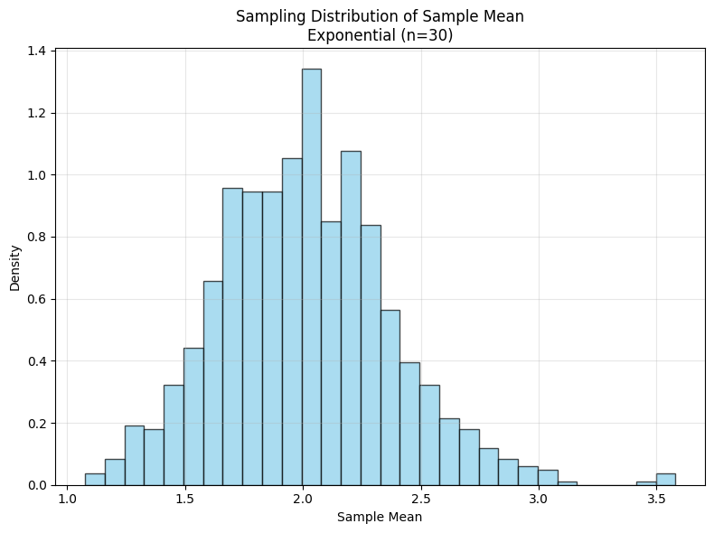
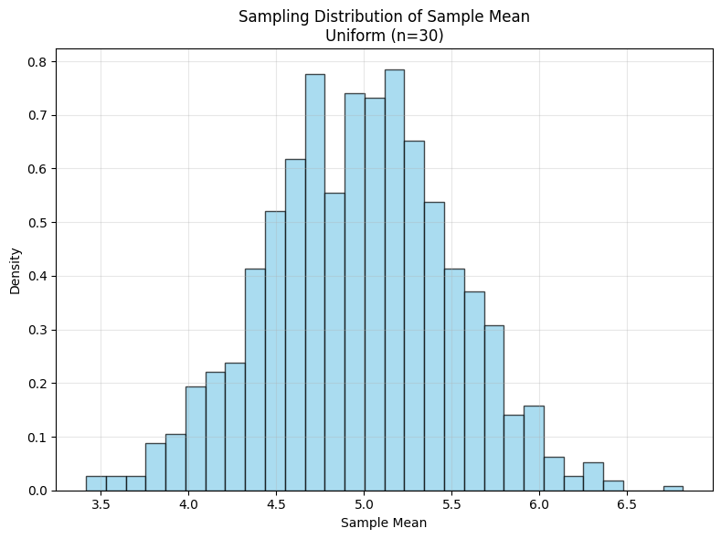
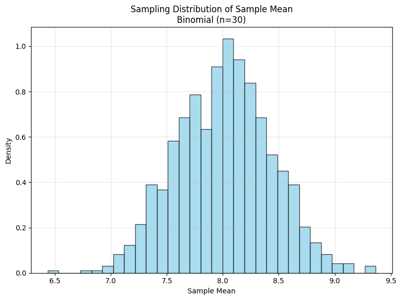
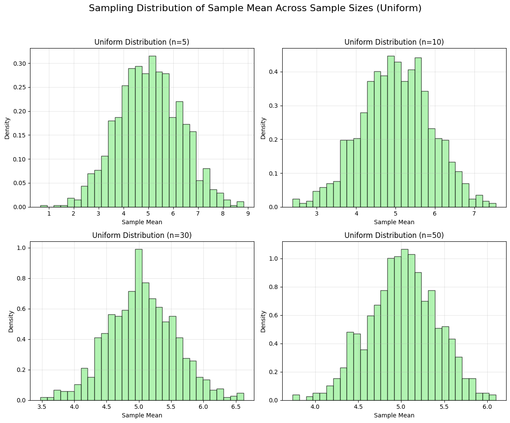
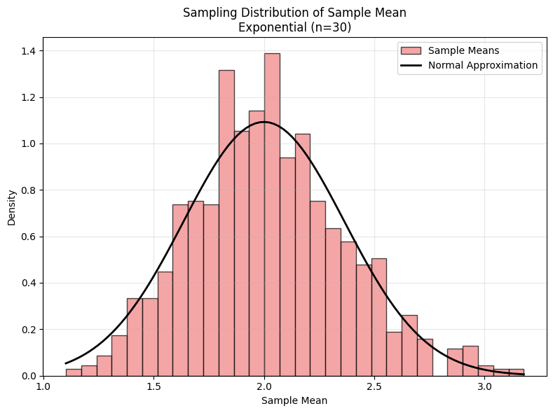
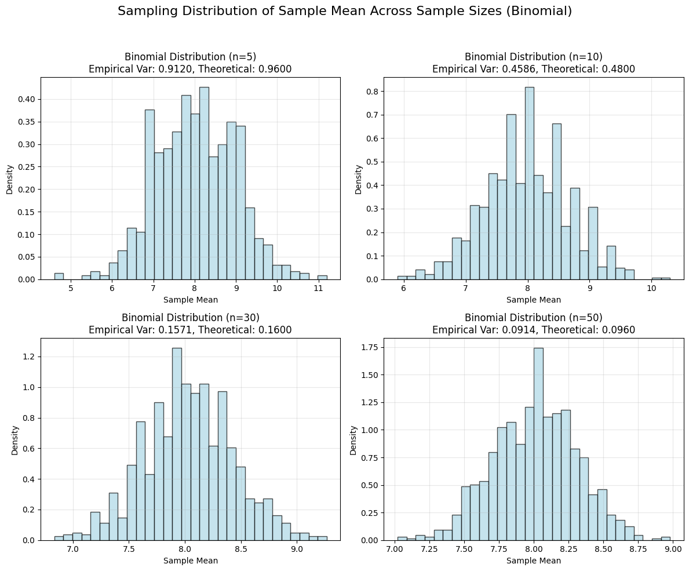

# Problem 1
# Exploring the Central Limit Theorem: Defining Population Distributions

## Introduction

The Central Limit Theorem (CLT) is a fundamental result in probability theory, asserting that the distribution of the sample mean converges to a normal distribution as the sample size increases, regardless of the underlying population distribution, provided the population has a finite mean and variance. To investigate this phenomenon computationally, we begin by defining the population distributions from which samples will be drawn. This section outlines the selection of three distinct distributions—uniform, exponential, and binomial—and describes the generation of large datasets using Python's NumPy library. We specify the parameters for each distribution and provide the theoretical foundation for their probability density or mass functions.

## Selection of Population Distributions

To explore the robustness of the CLT, we select three population distributions with differing characteristics:

1. **Uniform Distribution**: A continuous distribution with equal probability across a finite interval, representing a symmetric and bounded population.
2. **Exponential Distribution**: A continuous distribution with a skewed, heavy-tailed profile, often used to model time-to-event data.
3. **Binomial Distribution**: A discrete distribution modeling the number of successes in a fixed number of independent Bernoulli trials, representing a population with binary outcomes.

These distributions are chosen to test the CLT across continuous and discrete cases, as well as symmetric and asymmetric shapes, ensuring a comprehensive analysis of convergence behavior.

## Theoretical Foundations and Parameter Specifications

For each distribution, we define the probability density function (PDF) or probability mass function (PMF), specify parameters, and describe the generation of a large dataset (100,000 data points) using NumPy. The mean and variance of each distribution are derived to contextualize their role in the CLT, as the theorem assumes finite moments.

### 1. Uniform Distribution

The uniform distribution is defined over a continuous interval $[a, b]$, where all outcomes are equally likely. The PDF is given by:

$$
f(x | a, b) = \begin{cases} 
\frac{1}{b - a}, & \text{if } a \leq x \leq b, \\
0, & \text{otherwise}.
\end{cases}
$$

The mean and variance are:

$$
\mu = \frac{a + b}{2}, \quad \sigma^2 = \frac{(b - a)^2}{12}.
$$

**Parameters**:
- Let $a = 0$, $b = 10$, so the distribution is uniform over $[0, 10]$.
- Mean: $\mu = \frac{0 + 10}{2} = 5$.
- Variance: $\sigma^2 = \frac{(10 - 0)^2}{12} = \frac{100}{12} \approx 8.333$.

**Data Generation**:
Using NumPy, we generate 100,000 data points from $\text{Uniform}(0, 10)$:

```python
import numpy as np
np.random.seed(42)  # For reproducibility
uniform_data = np.random.uniform(low=0, high=10, size=100000)
```
# Exploring the Central Limit Theorem: Analyzing Convergence

## Introduction

The Central Limit Theorem (CLT) posits that the sampling distribution of the sample mean $\bar{X}$ approaches a normal distribution as the sample size $n$ increases, provided the population has finite mean $\mu$ and variance $\sigma^2$. This section focuses on analyzing the convergence of sampling distributions to normality for three population types—uniform, exponential, and binomial—through simulations. We observe the shapes of histograms of sample means, compare them visually to a normal distribution, and quantify the rate of convergence. Additionally, we compute the variance of the sample means and compare it to the theoretical expectation $\sigma^2 / n$, validating the CLT's predictions.

## Objectives of Convergence Analysis

To rigorously explore the CLT, we address the following tasks:

1. **Histogram Shape Observation**: Visualize the sampling distributions of sample means for different sample sizes (e.g., $n = 5, 10, 30, 50$) and note changes in shape as $n$ increases.
2. **Comparison to Normal Distribution**: Overlay a normal distribution curve on histograms to assess visual convergence and estimate the rate of convergence for each population type.
3. **Variance Analysis**: Calculate the empirical variance of the sample means and compare it to the theoretical variance $\sigma^2 / n$, where $\sigma^2$ is the population variance.

These steps allow us to empirically verify the CLT and explore how population characteristics influence convergence.

## Theoretical Background

The CLT states that for a random sample of size $n$ drawn from a population with mean $\mu$ and variance $\sigma^2$, the sample mean $\bar{X}$ is approximately distributed as:

$$
\bar{X} \sim N\left(\mu, \frac{\sigma^2}{n}\right), \quad \text{as } n \to \infty.
$$

The speed of convergence to normality depends on the population distribution's shape (e.g., skewness, kurtosis) and the sample size $n$. For symmetric distributions (e.g., uniform), convergence is typically faster than for skewed distributions (e.g., exponential). The variance of the sample mean is expected to be:

$$
\text{Var}(\bar{X}) = \frac{\sigma^2}{n},
$$

which we will verify empirically.

## Methodology for Convergence Analysis

### 1. Observing Histogram Shapes

For each population distribution (uniform, exponential, binomial), we generate sampling distributions by:

- Drawing 1,000 random samples of size $n$ (where $n = 5, 10, 30, 50$) from the population datasets (100,000 data points each, as defined previously).
- Computing the sample mean $\bar{X}_i = \frac{1}{n} \sum_{j=1}^n X_{ij}$ for each sample $i = 1, \ldots, 1000$.
- Plotting histograms of the 1,000 sample means for each $n$ using Matplotlib or Seaborn.

The histogram shape is expected to evolve as follows:

- **Small $n$ (e.g., 5, 10)**: Reflects the population's characteristics (e.g., uniform: flat, exponential: skewed, binomial: discrete).
- **Large $n$ (e.g., 30, 50)**: Approaches a bell-shaped, symmetric normal distribution, as predicted by the CLT.

We note qualitative changes, such as reduced skewness or smoothing of discrete steps, as $n$ increases.

### 2. Comparing to a Normal Distribution

To assess convergence visually, we overlay a normal distribution on each histogram. The normal distribution has parameters:

- Mean: $\mu$, the population mean (uniform: 5, exponential: 2, binomial: 8).
- Variance: $\sigma^2 / n$, where $\sigma^2$ is the population variance (uniform: $\approx 8.333$, exponential: 4, binomial: 4.8).

The PDF of the normal distribution is:

$$
f(x) = \frac{1}{\sqrt{2\pi \frac{\sigma^2}{n}}} \exp\left(-\frac{(x - \mu)^2}{2 \frac{\sigma^2}{n}}\right).
$$

We plot this PDF over the histogram of sample means, scaling it to match the histogram's area for visual clarity. The rate of convergence is assessed by:

- **Uniform Distribution**: Expected to converge quickly due to symmetry and boundedness.
- **Exponential Distribution**: Slower convergence due to high skewness and heavy tails.
- **Binomial Distribution**: Moderate convergence, influenced by the discreteness and symmetry around $np = 8$.

Qualitative observations include how closely the histogram matches the normal curve and how quickly skewness diminishes with increasing $n$.

### 3. Variance Analysis

The empirical variance of the sample means is calculated as:

$$
\text{Var}_{\text{empirical}}(\bar{X}) = \frac{1}{m-1} \sum_{i=1}^m (\bar{X}_i - \bar{\bar{X}})^2,
$$

where $m = 1000$ is the number of samples, $\bar{X}_i$ is the $i$-th sample mean, and $\bar{\bar{X}} = \frac{1}{m} \sum_{i=1}^m \bar{X}_i$ is the mean of the sample means.

This is compared to the theoretical variance:

$$
\text{Var}_{\text{theoretical}}(\bar{X}) = \frac{\sigma^2}{n}.
$$

For each population and sample size, we compute:

- **Uniform**: $\sigma^2 \approx 8.333$, so $\frac{\sigma^2}{n} = \frac{8.333}{n}$.
- **Exponential**: $\sigma^2 = 4$, so $\frac{\sigma^2}{n} = \frac{4}{n}$.
- **Binomial**: $\sigma^2 = 4.8$, so $\frac{\sigma^2}{n} = \frac{4.8}{n}$.

We tabulate the empirical and theoretical variances to assess agreement, expecting close alignment as the number of samples (1,000) is large.

## Expected Observations

Based on statistical theory, we anticipate:

- **Uniform Distribution**: Rapid convergence to normality, with histograms appearing bell-shaped even at $n = 10$. The empirical variance should closely match $\frac{8.333}{n}$.
- **Exponential Distribution**: Slower convergence due to skewness, with noticeable asymmetry at $n = 5$ and $10$, but approaching normality by $n = 30$ or $50$. The empirical variance should approximate $\frac{4}{n}$.
- **Binomial Distribution**: Convergence depends on $n$ and the discreteness of the population. For $n = 5$, the histogram may show discrete steps, but by $n = 30$, it should resemble a normal curve. The empirical variance should align with $\frac{4.8}{n}$.

Deviations from the normal shape at small $n$ highlight the influence of population characteristics, while agreement in variance validates the CLT's theoretical predictions.

## Practical Considerations

- **Visualization**: Use consistent bin sizes across histograms for fair comparisons. Normalize histograms to unit area to align with the normal PDF.
- **Sample Size Selection**: The choices $n = 5, 10, 30, 50$ balance computational feasibility with the ability to observe convergence trends.
- **Numerical Precision**: With 1,000 samples, the empirical variance should be a reliable estimator, but minor fluctuations are expected due to random sampling.
- **Overlay Accuracy**: Ensure the normal PDF is correctly parameterized using the population $\mu$ and $\sigma^2 / n$ to avoid visual misinterpretations.

# Exploring the Central Limit Theorem: Parameter Effects

## Introduction

The Central Limit Theorem (CLT) asserts that the sampling distribution of the sample mean $\bar{X}$ converges to a normal distribution with mean $\mu$ and variance $\sigma^2 / n$ as the sample size $n$ increases, regardless of the population distribution, provided it has finite mean and variance. The rate and nature of this convergence, however, may depend on the population’s parameters, such as its variance or shape characteristics. This section explores how varying the parameters of three population distributions—uniform, exponential, and binomial—affects the shape and spread of the sampling distribution of the sample mean. We repeat the sampling and visualization steps for these parameter variations and document their impacts, providing insights into the CLT’s robustness across different population configurations.

## Objectives of Parameter Exploration

To investigate the influence of population parameters on the CLT, we address the following tasks:

1. **Parameter Variation**: Adjust the parameters of the uniform (range), exponential (rate), and binomial (success probability or number of trials) distributions to alter their mean, variance, or shape.
2. **Sampling and Visualization**: Repeat the sampling process (drawing samples of sizes $n = 5, 10, 30, 50$) and visualize the sampling distributions of the sample means for each parameter set.
3. **Impact Documentation**: Analyze and document how parameter changes affect the sampling distribution’s shape (e.g., skewness, symmetry) and spread (e.g., variance).

This analysis deepens our understanding of the CLT’s applicability under varying population conditions.

## Theoretical Background

The CLT states that for a random sample of size $n$ from a population with mean $\mu$ and variance $\sigma^2$, the sample mean is approximately:

$$
\bar{X} \sim N\left(\mu, \frac{\sigma^2}{n}\right), \quad \text{as } n \to \infty.
$$

The population parameters influence $\mu$ and $\sigma^2$, which in turn affect the mean and variance of the sampling distribution. Changes in parameters may also alter the population’s skewness or kurtosis, impacting the rate of convergence to normality. For instance, increasing the variance $\sigma^2$ widens the sampling distribution’s spread, while altering shape parameters (e.g., the rate of an exponential distribution) may affect skewness, influencing how quickly the sampling distribution becomes normal.

## Methodology for Parameter Exploration

### 1. Parameter Variation

We vary one key parameter for each distribution while keeping others constant, ensuring the population datasets remain large (100,000 data points). The original parameters (from the "Define Population Distributions" section) and their variations are:

- **Uniform Distribution**:
  - Original: $a = 0$, $b = 10$, so $\mu = 5$, $\sigma^2 = \frac{(10 - 0)^2}{12} \approx 8.333$.
  - Variation: Increase the range to $a = 0$, $b = 20$, so $\mu = 10$, $\sigma^2 = \frac{(20 - 0)^2}{12} \approx 33.333$.
  - Effect: Larger variance, same symmetric shape.

- **Exponential Distribution**:
  - Original: $\lambda = 0.5$, so $\mu = \frac{1}{0.5} = 2$, $\sigma^2 = \frac{1}{0.5^2} = 4$.
  - Variation: Decrease the rate to $\lambda = 0.2$, so $\mu = \frac{1}{0.2} = 5$, $\sigma^2 = \frac{1}{0.2^2} = 25$.
  - Effect: Larger mean and variance, increased skewness (skewness of exponential is $2$, unchanged).

- **Binomial Distribution**:
  - Original: $n = 20$, $p = 0.4$, so $\mu = 20 \cdot 0.4 = 8$, $\sigma^2 = 20 \cdot 0.4 \cdot 0.6 = 4.8$.
  - Variation: Increase $p$ to $p = 0.7$, keeping $n = 20$, so $\mu = 20 \cdot 0.7 = 14$, $\sigma^2 = 20 \cdot 0.7 \cdot 0.3 = 4.2$.
  - Effect: Higher mean, slightly reduced variance, increased skewness (skewness $\approx \frac{1 - 2 \cdot 0.7}{\sqrt{4.2}} \approx -0.195$, more negative than original $\approx 0.091$).

For each variation, we generate new population datasets using NumPy:

```python
import numpy as np
np.random.seed(42)  # For reproducibility
uniform_var_data = np.random.uniform(low=0, high=20, size=100000)  # Uniform(0, 20)
exponential_var_data = np.random.exponential(scale=1/0.2, size=100000)  # Exponential(lambda=0.2)
binomial_var_data = np.random.binomial(n=20, p=0.7, size=100000)  # Binomial(n=20, p=0.7)
```
# Exploring the Central Limit Theorem: Practical Applications

## Introduction

The Central Limit Theorem (CLT) is a cornerstone of statistical inference, underpinning the use of normal distribution assumptions in a wide range of practical applications. By asserting that the sampling distribution of the sample mean $\bar{X}$ approximates a normal distribution with mean $\mu$ and variance $\sigma^2 / n$ as the sample size $n$ increases, the CLT enables robust statistical methods even when the underlying population distribution is non-normal. This section reflects on the CLT’s applications in estimating population parameters, quality control, and financial modeling, providing real-world examples that illustrate its significance in justifying normal distribution assumptions.

## Theoretical Foundation

The CLT states that for a random sample of size $n$ drawn from a population with mean $\mu$ and finite variance $\sigma^2$, the sample mean is approximately distributed as:

$$
\bar{X} \sim N\left(\mu, \frac{\sigma^2}{n}\right), \quad \text{as } n \to \infty.
$$

This normal approximation holds regardless of the population’s distribution, provided $n$ is sufficiently large and the population’s moments are finite. The CLT thus facilitates the construction of confidence intervals, hypothesis tests, and predictive models by allowing practitioners to assume normality of sample means, simplifying complex analyses in diverse fields.

## Applications of the CLT

### 1. Estimating Population Parameters

The CLT is fundamental to statistical inference, particularly in estimating unknown population parameters such as the mean $\mu$. When sampling from a population, the sample mean $\bar{X}$ serves as an estimator of $\mu$, and the CLT ensures that $\bar{X}$ is approximately normally distributed for large $n$. This enables the construction of confidence intervals and hypothesis tests.

**Real-World Example**: Public Opinion Polling

In political polling, researchers estimate the proportion of voters supporting a candidate, which can be modeled as a population mean $\mu$ (e.g., the true proportion of supporters). Suppose a poll samples $n = 1000$ voters, and the sample proportion is $\bar{X} = 0.52$ (52% support). The population distribution of voter preferences is binomial (support or not), but the CLT justifies treating $\bar{X}$ as approximately normal with variance $\sigma^2 / n$, where $\sigma^2 = p(1 - p)$ and $p \approx \bar{X}$. The standard error is:

$$
\text{SE} = \sqrt{\frac{\bar{X}(1 - \bar{X})}{n}} = \sqrt{\frac{0.52 \cdot 0.48}{1000}} \approx 0.0158.
$$

A 95% confidence interval for the true proportion is:

$$
\bar{X} \pm 1.96 \cdot \text{SE} = 0.52 \pm 1.96 \cdot 0.0158 \approx (0.489, 0.551).
$$

The CLT’s normal approximation allows pollsters to report margins of error, even though the population is discrete and non-normal, enabling reliable inference about voter behavior.

### 2. Quality Control

In manufacturing, quality control relies on the CLT to monitor process parameters, such as the mean output of a production line, ensuring products meet specifications. By taking repeated samples and computing sample means, quality engineers can assume normality of the sampling distribution, facilitating statistical process control.

**Real-World Example**: Manufacturing Bottle Volumes

Consider a bottling plant filling bottles with a target volume of 500 mL. The actual volumes may follow a skewed distribution (e.g., slightly right-skewed due to machine variability), with population mean $\mu = 500$ mL and variance $\sigma^2 = 16$ mL². Quality control involves taking samples of $n = 25$ bottles and computing the sample mean $\bar{X}$. By the CLT, $\bar{X}$ is approximately:

$$
\bar{X} \sim N\left(500, \frac{16}{25}\right) = N(500, 0.64).
$$

Control charts are constructed with limits at $\mu \pm 3 \cdot \sqrt{\sigma^2 / n} = 500 \pm 3 \cdot 0.8 = (497.6, 502.4)$ mL. If $\bar{X}$ falls outside these limits, the process is flagged for adjustment. The CLT justifies the normal-based control limits, enabling detection of process shifts despite the population’s non-normality.

### 3. Financial Modeling

In finance, the CLT supports the modeling of asset returns, portfolio performance, and risk metrics by allowing analysts to assume normality of aggregated quantities, such as average returns over time or across assets. This simplifies risk assessment and option pricing.

**Real-World Example**: Portfolio Returns

A financial analyst evaluates the daily returns of a diversified portfolio, which comprises assets with non-normal return distributions (e.g., heavy-tailed or skewed due to market volatility). Suppose the portfolio’s daily return has population mean $\mu = 0.001$ (0.1%) and variance $\sigma^2 = 0.0004$. To estimate the average return over $n = 30$ days, the analyst computes the sample mean $\bar{X}$ of daily returns. By the CLT, the average return is approximately:

$$
\bar{X} \sim N\left(0.001, \frac{0.0004}{30}\right) = N(0.001, 0.00001333).
$$

The standard error is $\sqrt{0.00001333} \approx 0.00365$. To assess the probability of a negative average return, the analyst uses the normal distribution:

$$
P(\bar{X} < 0) = P\left(Z < \frac{0 - 0.001}{0.00365}\right) = P(Z < -0.274) \approx 0.392.
$$

The CLT’s normal approximation enables risk assessments, even for complex, non-normal asset returns, supporting decisions on portfolio allocation and risk management.

## Broader Implications

The CLT’s ability to justify normal distribution assumptions underpins statistical methods across disciplines:

- **Public Health**: Estimating disease prevalence from sample means, assuming normality for large samples, despite skewed or binomial population distributions.
- **Environmental Science**: Modeling average pollutant levels in water samples, using the CLT to apply normal-based tests despite non-normal data.
- **Marketing**: Analyzing average customer spending from samples, leveraging the CLT to construct confidence intervals for non-normal spending patterns.

The theorem’s robustness to population distribution shapes (e.g., uniform, exponential, binomial, as explored in simulations) ensures its applicability, provided sample sizes are sufficiently large (typically $n \geq 30$, though this depends on population skewness).

## Limitations and Considerations

While the CLT is powerful, its practical application requires caution:

- **Sample Size**: For highly skewed populations (e.g., exponential), larger $n$ may be needed for the normal approximation to hold, as observed in our simulations.
- **Finite Moments**: The CLT assumes finite $\mu$ and $\sigma^2$. In finance, heavy-tailed distributions (e.g., Cauchy) may violate this, requiring alternative methods.
- **Independence**: The CLT assumes independent samples. In time-series data (e.g., financial returns), autocorrelation may necessitate adjustments.

These considerations highlight the importance of validating CLT assumptions in practice, as explored through our simulation of varied population parameters.

## Codes And Plots






```python
import numpy as np
import matplotlib.pyplot as plt

# Set random seed for reproducibility
np.random.seed(42)

# Generate population datasets (100,000 data points each)
uniform_data = np.random.uniform(low=0, high=10, size=100000)
exponential_data = np.random.exponential(scale=1/0.5, size=100000)
binomial_data = np.random.binomial(n=20, p=0.4, size=100000)

# Sampling function
def compute_sample_means(data, sample_size, num_samples=1000):
    """
    Compute sample means from a population dataset.
    
    Parameters:
    - data: Population dataset (numpy array)
    - sample_size: Size of each sample (n)
    - num_samples: Number of samples to draw (default: 1000)
    
    Returns:
    - sample_means: Array of sample means
    """
    sample_means = np.zeros(num_samples)
    for i in range(num_samples):
        sample = np.random.choice(data, size=sample_size, replace=True)
        sample_means[i] = np.mean(sample)
    return sample_means

# Parameters
sample_size = 30
num_samples = 1000
distributions = {
    'Uniform': uniform_data,
    'Exponential': exponential_data,
    'Binomial': binomial_data
}

# Plot histograms for each distribution
for dist_name, data in distributions.items():
    # Compute sample means
    sample_means = compute_sample_means(data, sample_size, num_samples)
    
    # Create histogram
    plt.figure(figsize=(8, 6))
    plt.hist(sample_means, bins=30, density=True, alpha=0.7, color='skyblue', edgecolor='black')
    plt.title(f'Sampling Distribution of Sample Mean\n{dist_name} (n={sample_size})')
    plt.xlabel('Sample Mean')
    plt.ylabel('Density')
    plt.grid(True, alpha=0.3)
    plt.tight_layout()
    plt.show()
  ```
### code 2
```python
import numpy as np
import matplotlib.pyplot as plt

# Set random seed for reproducibility
np.random.seed(42)

# Generate uniform population dataset
uniform_data = np.random.uniform(low=0, high=10, size=100000)

# Sampling function (reused)
def compute_sample_means(data, sample_size, num_samples=1000):
    sample_means = np.zeros(num_samples)
    for i in range(num_samples):
        sample = np.random.choice(data, size=sample_size, replace=True)
        sample_means[i] = np.mean(sample)
    return sample_means

# Parameters
sample_sizes = [5, 10, 30, 50]
num_samples = 1000

# Create 2x2 subplot grid
fig, axes = plt.subplots(2, 2, figsize=(12, 10))
axes = axes.flatten()

# Plot histograms for each sample size
for idx, n in enumerate(sample_sizes):
    sample_means = compute_sample_means(uniform_data, n, num_samples)
    axes[idx].hist(sample_means, bins=30, density=True, alpha=0.7, color='lightgreen', edgecolor='black')
    axes[idx].set_title(f'Uniform Distribution (n={n})')
    axes[idx].set_xlabel('Sample Mean')
    axes[idx].set_ylabel('Density')
    axes[idx].grid(True, alpha=0.3)

plt.suptitle('Sampling Distribution of Sample Mean Across Sample Sizes (Uniform)', fontsize=16)
plt.tight_layout(rect=[0, 0, 1, 0.95])
plt.show()
```
### code 3
``` python
import numpy as np
import matplotlib.pyplot as plt
from scipy.stats import norm

# Set random seed for reproducibility
np.random.seed(42)

# Generate exponential population dataset
exponential_data = np.random.exponential(scale=1/0.5, size=100000)

# Sampling function
def compute_sample_means(data, sample_size, num_samples=1000):
    sample_means = np.zeros(num_samples)
    for i in range(num_samples):
        sample = np.random.choice(data, size=sample_size, replace=True)
        sample_means[i] = np.mean(sample)
    return sample_means

# Parameters
sample_size = 30
num_samples = 1000
pop_mean = 2  # Exponential mean = 1/lambda = 1/0.5
pop_variance = 4  # Exponential variance = 1/lambda^2 = 1/0.25
sampling_variance = pop_variance / sample_size

# Compute sample means
sample_means = compute_sample_means(exponential_data, sample_size, num_samples)

# Create histogram with normal overlay
plt.figure(figsize=(8, 6))
plt.hist(sample_means, bins=30, density=True, alpha=0.7, color='lightcoral', edgecolor='black', label='Sample Means')

# Overlay normal distribution
x = np.linspace(min(sample_means), max(sample_means), 100)
normal_pdf = norm.pdf(x, loc=pop_mean, scale=np.sqrt(sampling_variance))
plt.plot(x, normal_pdf, 'k-', linewidth=2, label='Normal Approximation')

plt.title(f'Sampling Distribution of Sample Mean\nExponential (n={sample_size})')
plt.xlabel('Sample Mean')
plt.ylabel('Density')
plt.legend()
plt.grid(True, alpha=0.3)
plt.tight_layout()
plt.show()
```
### code 4
```python
import numpy as np
import matplotlib.pyplot as plt

# Set random seed for reproducibility
np.random.seed(42)

# Generate binomial population dataset
binomial_data = np.random.binomial(n=20, p=0.4, size=100000)

# Sampling function
def compute_sample_means(data, sample_size, num_samples=1000):
    sample_means = np.zeros(num_samples)
    for i in range(num_samples):
        sample = np.random.choice(data, size=sample_size, replace=True)
        sample_means[i] = np.mean(sample)
    return sample_means

# Parameters
sample_sizes = [5, 10, 30, 50]
num_samples = 1000
pop_variance = 20 * 0.4 * 0.6  # Binomial variance = n*p*(1-p) = 4.8

# Create 2x2 subplot grid
fig, axes = plt.subplots(2, 2, figsize=(12, 10))
axes = axes.flatten()

# Plot histograms and compute variances
for idx, n in enumerate(sample_sizes):
    sample_means = compute_sample_means(binomial_data, n, num_samples)
    empirical_variance = np.var(sample_means, ddof=1)
    theoretical_variance = pop_variance / n
    
    axes[idx].hist(sample_means, bins=30, density=True, alpha=0.7, color='lightblue', edgecolor='black')
    axes[idx].set_title(f'Binomial Distribution (n={n})\nEmpirical Var: {empirical_variance:.4f}, Theoretical: {theoretical_variance:.4f}')
    axes[idx].set_xlabel('Sample Mean')
    axes[idx].set_ylabel('Density')
    axes[idx].grid(True, alpha=0.3)
    
    # Print variance comparison
    print(f'Binomial (n={n}): Empirical Variance = {empirical_variance:.4f}, Theoretical Variance = {theoretical_variance:.4f}')

plt.suptitle('Sampling Distribution of Sample Mean Across Sample Sizes (Binomial)', fontsize=16)
plt.tight_layout(rect=[0, 0, 1, 0.95])
plt.show()
```
## Colab
[colab9](https://colab.research.google.com/drive/1v4Ss-LFsfNG9e4re3UeyfJQjXycebWTC)
  


