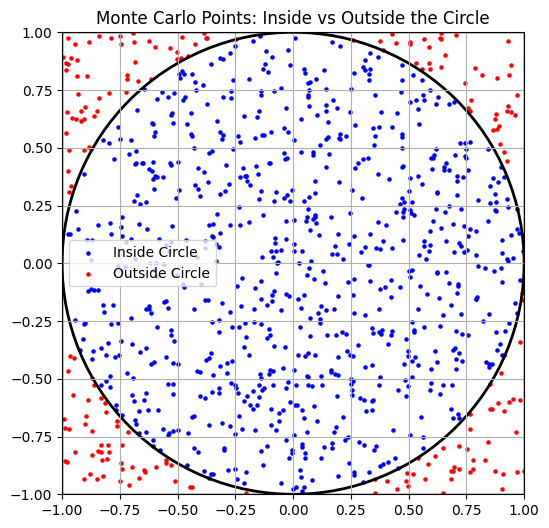
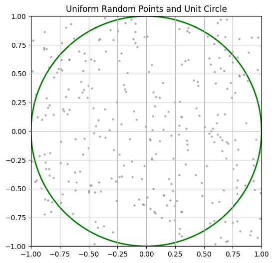
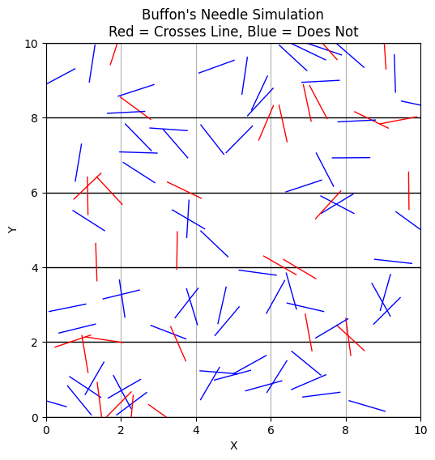

# Problem 2
# Monte Carlo Estimation of π — Theoretical Foundations

## 1. Introduction to Geometric Probability and Monte Carlo Estimation

Monte Carlo methods are a class of computational algorithms that rely on repeated random sampling to obtain numerical results. One of the most elegant applications of Monte Carlo simulation is the estimation of the mathematical constant π through **geometric probability**.

Geometric probability involves calculating the likelihood of a point landing in a particular region of space, typically relative to some well-defined geometric shapes. In the context of π estimation, we exploit the relationship between the area of a circle and that of the square that bounds it.

---

## 2. Geometric Setup

Consider a **unit circle** centered at the origin $(0, 0)$, with a radius $r = 1$. This circle is inscribed within a square of side length $2$, spanning from $(-1, -1)$ to $(1, 1)$.

Let’s denote:
- $A_{\text{circle}}$ as the area of the unit circle,
- $A_{\text{square}}$ as the area of the bounding square.

$$
A_{\text{circle}} = \pi r^2 = \pi \cdot 1^2 = \pi
$$

$$
A_{\text{square}} = (2r)^2 = (2 \cdot 1)^2 = 4
$$

Thus, the ratio of the circle’s area to the square’s area is:

$$
\frac{A_{\text{circle}}}{A_{\text{square}}} = \frac{\pi}{4}
$$

---

## 3. Probabilistic Interpretation

Assume we generate random points $(x, y)$ uniformly in the square $[-1, 1] \times [-1, 1]$. The **probability** that a point lies inside the circle is equal to the ratio of the areas:

$$
P(\text{point inside circle}) = \frac{A_{\text{circle}}}{A_{\text{square}}} = \frac{\pi}{4}
$$

Let:
- $N$ be the total number of randomly generated points,
- $N_{\text{circle}}$ be the number of points that fall inside the unit circle.

Then, the empirical probability (based on simulation) that a point falls within the circle is approximately:

$$
P_{\text{empirical}} = \frac{N_{\text{circle}}}{N}
$$

By equating the empirical probability to the theoretical one:

$$
\frac{N_{\text{circle}}}{N} \approx \frac{\pi}{4}
$$

Multiplying both sides by 4 gives the Monte Carlo estimate of π:

$$
\pi \approx 4 \times \frac{N_{\text{circle}}}{N}
$$

This is the fundamental formula for estimating π using random sampling in a unit square.

---

## 4. Determining Point Inclusion in the Circle

To decide whether a randomly generated point $(x, y)$ lies within the unit circle, we check:

$$
x^2 + y^2 \leq 1
$$

This is derived from the standard equation of a circle centered at the origin:

$$
x^2 + y^2 = r^2
$$

where $r = 1$. If the inequality holds, the point lies within or on the boundary of the circle.

---

## 5. Assumptions and Accuracy Considerations

- **Uniform Distribution**: The method assumes the random number generator produces points uniformly over the square domain.
- **Law of Large Numbers**: As $N \rightarrow \infty$, the estimate $4 \cdot \frac{N_{\text{circle}}}{N}$ converges to the true value of π.
- **Independence**: Each sample point is drawn independently.

---
## Part 2: Theoretical Foundation — Buffon’s Needle

### Introduction to Buffon’s Needle Problem

**Buffon’s Needle** is one of the earliest problems in geometric probability, first posed by Georges-Louis Leclerc, Comte de Buffon, in the 18th century. It provides a surprising and elegant way to estimate the value of π using physical randomness.

The problem involves dropping a needle of a given length onto a plane ruled with equally spaced parallel lines and calculating the probability that the needle will cross one of the lines.

---

### Problem Setup

Consider the following configuration:

- The plane has horizontal lines spaced a constant distance $H$ apart.
- A needle of length $L$ is dropped randomly onto the plane.
- The position of the needle is completely random: both the distance of the center of the needle from the nearest line and the angle the needle makes with the horizontal are uniformly distributed.

We assume that:

$$
0 < L \leq H
$$

This condition simplifies the mathematics and ensures the needle cannot cross more than one line at a time.

---

### Geometric Probability

Let:
- $N$ = total number of needle drops
- $t$ = number of times the needle crosses a line
- $L$ = length of the needle
- $H$ = distance between the parallel lines

The theoretical probability $P$ that the needle **crosses a line** is given by:

$$
P = \frac{2L}{\pi H}
$$

This result is obtained through integrating over all possible positions and orientations of the needle, which involves calculus and trigonometry.

---

### Derivation of the Formula to Estimate π

From the theoretical probability:

$$
P = \frac{2L}{\pi H}
$$

We can rearrange to solve for $\pi$:

$$
\pi = \frac{2L}{P H}
$$

In practice, we do not know $P$ exactly but can estimate it from a simulation by computing the proportion of drops that result in a crossing:

$$
P_{\text{empirical}} = \frac{t}{N}
$$

Substituting into the formula gives the Monte Carlo estimate of $\pi$:

$$
\pi \approx \frac{2L \cdot N}{t \cdot H}
$$

---

### Final Formula

We summarize the result with the following boxed expression:

$$
\boxed{
\pi \approx \frac{2L \cdot N}{t \cdot H}
}
$$

Where:
- $L$ = needle length,
- $H$ = distance between parallel lines,
- $N$ = number of needle drops,
- $t$ = number of crossings observed.

---

### Assumptions

- The needle is **uniformly dropped** (random angle and position).
- The length of the needle $L$ does not exceed the distance between lines $H$.
- Each drop is independent of the others.
- The number of trials $N$ is sufficiently large for the Law of Large Numbers to ensure convergence.

---

## 2. Simulation

The Monte Carlo estimation of π relies on random sampling and simple geometric tests. In this section, we simulate the process of generating random points within a square and determining how many fall within a unit circle inscribed in the square.

### Step-by-Step Process

We consider a square of side length $2$ centered at the origin. This square spans the region $[-1, 1] \times [-1, 1]$. Within this square lies a **unit circle** centered at the origin with radius $r = 1$.

To estimate π, we proceed with the following steps:

---

### 1. Random Point Generation

We generate a large number of random points $(x, y)$ such that:

$$
x, y \sim \mathcal{U}(-1, 1)
$$

That is, both $x$ and $y$ are sampled independently from a **uniform distribution** over the interval $[-1, 1]$. This ensures that the points are uniformly scattered across the square.

---

### 2. Circle Inclusion Test

For each point $(x, y)$, we check whether it lies within the unit circle centered at the origin. This is done using the condition:

$$
x^2 + y^2 \leq 1
$$

If the inequality holds, the point lies **inside or on the boundary** of the circle. Otherwise, it lies outside.

Let:
- $N$ be the total number of points generated,
- $N_{\text{circle}}$ be the number of points that satisfy $x^2 + y^2 \leq 1$.

---

### 3. Estimating π

Using the geometric probability derived earlier, the fraction of points that fall inside the circle approximates the ratio of the circle’s area to the square’s area:

$$
\frac{N_{\text{circle}}}{N} \approx \frac{\pi}{4}
$$

Multiplying both sides by 4 gives the estimate of π:

$$
\pi \approx 4 \cdot \frac{N_{\text{circle}}}{N}
$$

This formula becomes increasingly accurate as $N$ grows larger, due to the Law of Large Numbers.

---

### 4. Summary of Simulation Algorithm

The procedure can be described algorithmically as follows:

1. Initialize counters:
   - $N = 0$
   - $N_{\text{circle}} = 0$
2. For a specified number of iterations:
   - Generate a random point $(x, y)$ where $x, y \in [-1, 1]$
   - Increment $N$ by 1
   - If $x^2 + y^2 \leq 1$, increment $N_{\text{circle}}$ by 1
3. Compute:
   $$
   \pi \approx 4 \cdot \frac{N_{\text{circle}}}{N}
   $$

---

### Notes on Implementation

- The number of samples $N$ strongly influences the accuracy of the estimate.
- For a robust result, typical values of $N$ might range from $10^3$ to $10^7$.
- The algorithm is trivially parallelizable and benefits from vectorized computation in languages such as Python (using NumPy).

---

> **Tip**: Plotting the points inside and outside the circle (e.g., with different colors) helps visualize the effectiveness of the method.

---
## 2. Simulation — Buffon’s Needle

In this section, we implement a Monte Carlo simulation to estimate $\pi$ using the geometric probability technique introduced in **Buffon’s Needle** problem.

---

### Objective

To simulate the experiment, we:

1. Randomly generate the position and orientation of a needle.
2. Determine whether it intersects any of the parallel lines.
3. Use the total number of needle drops and intersections to estimate $\pi$.

---

### Step-by-Step Simulation Procedure

#### 1. Random Needle Drop Setup

Each needle drop is defined by two random variables:

- The **distance** $d$ from the center of the needle to the nearest horizontal line:
  
  $$
  d \sim \mathcal{U}(0, \frac{H}{2})
  $$

  Since the geometry is symmetric, we only need to consider distances from the center of the needle to the nearest line within half the spacing ($H/2$).

- The **angle** $\theta$ that the needle makes with the horizontal (in radians):

  $$
  \theta \sim \mathcal{U}(0, \frac{\pi}{2})
  $$

  Again, symmetry allows us to limit the angular range to $[0, \frac{\pi}{2}]$.

---

#### 2. Crossing Condition

The needle crosses a line **if the vertical component of half its length exceeds $d$**, the distance from the needle's center to the nearest line.

This condition can be mathematically expressed as:

$$
\frac{L}{2} \cdot \sin(\theta) \geq d
$$

If the above inequality holds, the needle intersects one of the horizontal lines.

---

#### 3. Simulation Loop

To estimate $\pi$, the simulation proceeds as follows:

- Initialize counters:
  - $N = 0$ (total number of needle drops)
  - $t = 0$ (total number of crossings)
- For each trial:
  - Generate $d \sim \mathcal{U}(0, \frac{H}{2})$
  - Generate $\theta \sim \mathcal{U}(0, \frac{\pi}{2})$
  - Check if $\frac{L}{2} \cdot \sin(\theta) \geq d$
  - If true, increment $t$
  - Increment $N$
- Estimate π using the formula:

  $$
  \pi \approx \frac{2L \cdot N}{t \cdot H}
  $$

---

### Notes on Implementation

- The simulation requires generating **two independent random variables** per needle drop.
- For high accuracy, a large number of drops $N$ is recommended (e.g., $10^5$ or more).
- The crossing condition is purely geometric and does not require explicit line drawing.
- Ensure that the condition $L \leq H$ holds to validate the single-line crossing assumption.

---
## 4. Analysis

### Convergence Behavior of the Monte Carlo Estimator

To assess the reliability of the Monte Carlo method for estimating π, we perform simulations with progressively increasing numbers of random points:

- $N = 10^2$
- $N = 10^3$
- $N = 10^4$
- $N = 10^5$
- $N = 10^6$
- $N = 10^7$ (optional, depending on computational resources)

For each value of $N$, we compute an estimate of π using the standard formula:

$$
\pi \approx 4 \cdot \frac{N_{\text{circle}}}{N}
$$

We then compare the estimated values to the actual value of π, denoted:

$$
\pi_{\text{true}} \approx 3.141592653589793
$$

---

### Visualization: Convergence Plot

To visually analyze convergence, we construct a plot of:

- **x-axis**: Number of points $N$ (on a logarithmic scale)
- **y-axis**: Estimated value of π

This allows us to observe how the Monte Carlo estimate approaches the true value of π as $N$ increases. Ideally, the estimate will oscillate around π with decreasing amplitude.

> **Optional Addition**: Add a horizontal reference line at $y = \pi_{\text{true}}$ to visualize convergence clearly.

---

### Error Analysis

To quantify accuracy, we define the **absolute error** of each estimate as:

$$
\text{Error}(N) = \left| \pi_{\text{estimate}} - \pi_{\text{true}} \right|
$$

Alternatively, the **relative error** can be computed as:

$$
\text{Relative Error}(N) = \left| \frac{\pi_{\text{estimate}} - \pi_{\text{true}}}{\pi_{\text{true}}} \right|
$$

Plotting the error versus $N$ can illustrate how error diminishes with more samples.

---

### Computational Efficiency

Monte Carlo methods are inherently **probabilistic** and **stochastic**. They converge slowly compared to deterministic numerical integration methods. The standard error of a Monte Carlo estimate is proportional to:

$$
\text{Standard Error} \propto \frac{1}{\sqrt{N}}
$$

This implies a convergence rate of $\mathcal{O}(N^{-1/2})$. Therefore, **to reduce the error by a factor of 10, we must increase the number of samples by a factor of 100**.

---

### Practical Considerations

- **Efficiency**: Vectorized implementations (e.g., using NumPy) are essential for handling large $N$ efficiently.
- **Variance**: Due to random sampling, each run produces slightly different results. Averaging results over multiple independent runs may yield smoother convergence curves.
- **Trade-off**: There is a computational trade-off between accuracy and runtime. Larger values of $N$ improve accuracy but increase computation time.

---
## 4. Analysis — Buffon’s Needle

In this section, we analyze the convergence behavior of Buffon’s Needle simulation for estimating $\pi$, and compare it with the classical Monte Carlo method using a circle.

---

### 1. Experimental Design

To study convergence, we run simulations with increasing numbers of needle drops:

- $N = 10^2$
- $N = 10^3$
- $N = 10^4$
- $N = 10^5$
- $N = 10^6$

For each $N$, we estimate $\pi$ using the formula:

$$
\pi \approx \frac{2L \cdot N}{t \cdot H}
$$

Where:
- $L$ is the needle length,
- $H$ is the distance between the parallel lines,
- $t$ is the number of successful crossings.

---

### 2. Visualization: Estimated $\pi$ vs Number of Drops

We plot:

- **x-axis**: Number of needle drops $N$ (logarithmic scale).
- **y-axis**: Estimated value of $\pi$.

We overlay a horizontal reference line at the true value of $\pi$:

$$
\pi_{\text{true}} \approx 3.141592653589793
$$

This allows us to visually assess how closely and consistently the estimate converges to $\pi$.

---

### 3. Error Analysis

We define the **absolute error** of the estimate as:

$$
\text{Error}(N) = \left| \pi_{\text{estimate}} - \pi_{\text{true}} \right|
$$

Alternatively, we may use the **relative error**:

$$
\text{Relative Error}(N) = \left| \frac{\pi_{\text{estimate}} - \pi_{\text{true}}}{\pi_{\text{true}}} \right|
$$

We expect the error to decrease as $N$ increases, but at a slow rate due to the stochastic nature of the method.

---

### 4. Comparison with Circle-Based Method

| Criterion                    | Circle-Based Method       | Buffon's Needle              |
|-----------------------------|---------------------------|------------------------------|
| **Conceptual Complexity**   | Low (simple geometry)     | Moderate (trigonometry)      |
| **Convergence Speed**       | Faster                    | Slower                       |
| **Random Variables Needed** | 2D point ($x$, $y$)       | Distance $d$, angle $\the

### Codes And  Plots

```python
import numpy as np
import matplotlib.pyplot as plt

# Generate random points
n_points = 1000
x = np.random.uniform(-1, 1, n_points)
y = np.random.uniform(-1, 1, n_points)

# Check if inside circle
inside = x**2 + y**2 <= 1

# Plot
plt.figure(figsize=(6, 6))
plt.scatter(x[inside], y[inside], color='blue', s=5, label='Inside Circle')
plt.scatter(x[~inside], y[~inside], color='red', s=5, label='Outside Circle')

# Draw unit circle
circle = plt.Circle((0, 0), 1, edgecolor='black', facecolor='none', linewidth=2)
plt.gca().add_patch(circle)

# Draw square boundary
plt.xlim(-1, 1)
plt.ylim(-1, 1)
plt.axhline(y=1, color='black', linewidth=1)
plt.axhline(y=-1, color='black', linewidth=1)
plt.axvline(x=1, color='black', linewidth=1)
plt.axvline(x=-1, color='black', linewidth=1)

plt.gca().set_aspect('equal')
plt.title('Monte Carlo Points: Inside vs Outside the Circle')
plt.legend()
plt.grid(True)
plt.show()
```

```python
import numpy as np
import matplotlib.pyplot as plt

# Generate uniform points
x = np.random.uniform(-1, 1, 300)
y = np.random.uniform(-1, 1, 300)

# Plot
plt.figure(figsize=(6, 6))
plt.scatter(x, y, color='gray', s=5, alpha=0.5)

# Draw unit circle and square
circle = plt.Circle((0, 0), 1, edgecolor='green', facecolor='none', linewidth=2)
plt.gca().add_patch(circle)

# Square boundary
plt.axhline(y=1, color='black', linewidth=1)
plt.axhline(y=-1, color='black', linewidth=1)
plt.axvline(x=1, color='black', linewidth=1)
plt.axvline(x=-1, color='black', linewidth=1)

plt.xlim(-1, 1)
plt.ylim(-1, 1)
plt.gca().set_aspect('equal')
plt.title('Uniform Random Points and Unit Circle')
plt.grid(True)
plt.show()
```

```python
import numpy as np
import matplotlib.pyplot as plt

# Parameters
N = 100  # number of needles
L = 1.0  # length of needle
H = 2.0  # distance between parallel lines
num_lines = 5  # number of horizontal lines

# Generate random needle centers (y only needs to stay within line region)
x_centers = np.random.uniform(0, 10, N)
y_centers = np.random.uniform(0, num_lines * H, N)

# Generate random angles (0 to pi)
angles = np.random.uniform(0, np.pi, N)

# Compute endpoints of each needle
x1 = x_centers - (L / 2) * np.cos(angles)
x2 = x_centers + (L / 2) * np.cos(angles)
y1 = y_centers - (L / 2) * np.sin(angles)
y2 = y_centers + (L / 2) * np.sin(angles)

# Determine if a needle crosses a line
crosses = np.floor(y1 / H) != np.floor(y2 / H)

# Plot setup
plt.figure(figsize=(10, 6))

# Draw parallel lines
for i in range(num_lines + 1):
    y_line = i * H
    plt.axhline(y=y_line, color='black', linewidth=1)

# Plot needles: red = crossing, blue = non-crossing
for i in range(N):
    color = 'red' if crosses[i] else 'blue'
    plt.plot([x1[i], x2[i]], [y1[i], y2[i]], color=color, linewidth=1)

# Labels and formatting
plt.title('Buffon\'s Needle Simulation\nRed = Crosses Line, Blue = Does Not')
plt.xlim(0, 10)
plt.ylim(0, num_lines * H)
plt.gca().set_aspect('equal')
plt.xlabel('X')
plt.ylabel('Y')
plt.grid(True)
plt.show()
```
## Colab 
[colab10](https://colab.research.google.com/drive/1Pk5LFyZwBzSTsAeUJyRkwx5aOuyY-RP9)


