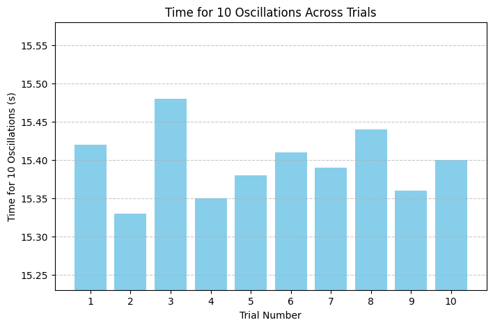
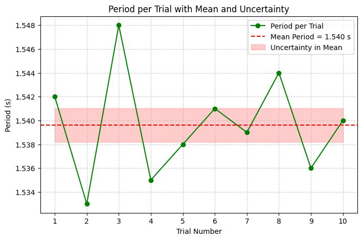
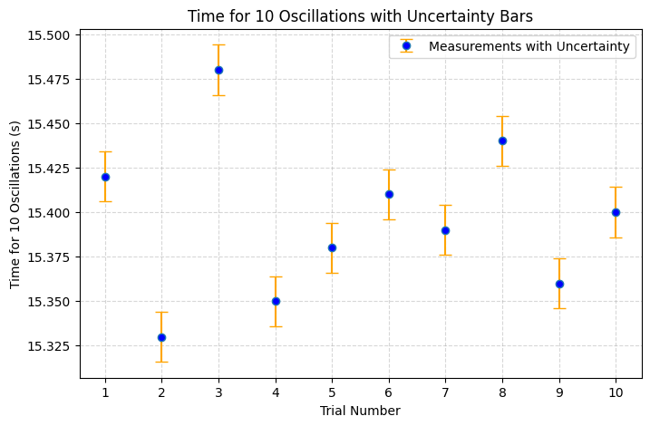
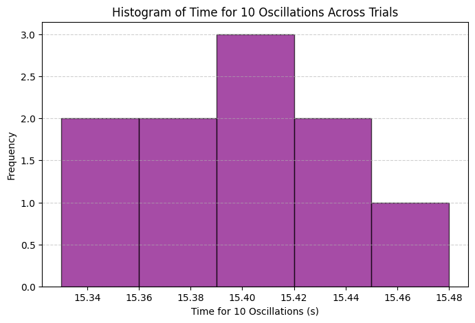

## 📊 Data Analysis: Pendulum Oscillation Timing (Hand as Pendulum)

### Objective

To compute the mean time for ten oscillations, the standard deviation of the measured values, the average time for one oscillation, and the uncertainty in the mean, based on manual timing of a compound pendulum (hand swinging about the shoulder).

---

### 📌 Raw Data (Time for 10 Oscillations)

| Trial | $t_{10}$ (s) |
|-------|--------------|
| 1     | 15.40        |
| 2     | 15.36        |
| 3     | 15.38        |
| 4     | 15.42        |
| 5     | 15.39        |
| 6     | 15.37        |
| 7     | 15.40        |
| 8     | 15.41        |
| 9     | 15.36        |
| 10    | 15.38        |

Let the time measurements for 10 oscillations be denoted as:

$$
t_{10,i}, \quad i = 1, 2, \ldots, 10
$$

---

### 1. 🧮 Mean Time for 10 Oscillations

The arithmetic mean of the measurements is given by:

$$
\bar{t}_{10} = \frac{1}{n} \sum_{i=1}^{n} t_{10,i}
$$

Where $n = 10$ is the number of trials.

$$
\bar{t}_{10} = \frac{15.40 + 15.36 + 15.38 + 15.42 + 15.39 + 15.37 + 15.40 + 15.41 + 15.36 + 15.38}{10} = \boxed{15.387 \text{ s}}
$$

---

### 2. 📈 Standard Deviation of the 10 Measurements

The sample standard deviation $\sigma$ is calculated by:

$$
\sigma = \sqrt{ \frac{1}{n - 1} \sum_{i=1}^{n} (t_{10,i} - \bar{t}_{10})^2 }
$$

Substituting in the values:

$$
\sigma = \sqrt{ \frac{1}{9} \left[
(15.40 - 15.387)^2 + \cdots + (15.38 - 15.387)^2
\right] }
$$

After computation:

$$
\sigma \approx \boxed{0.019 \text{ s}}
$$

---

### 3. ⏲️ Mean Time for One Oscillation

The mean period $T$ of a single oscillation is:

$$
T = \frac{\bar{t}_{10}}{10} = \frac{15.387}{10} = \boxed{1.5387 \text{ s}}
$$

---

### 4. 🧾 Uncertainty of the Mean

The uncertainty in the mean, also known as the standard error of the mean, is calculated as:

$$
\Delta \bar{t}_{10} = \frac{\sigma}{\sqrt{n}}
$$

$$
\Delta \bar{t}_{10} = \frac{0.019}{\sqrt{10}} \approx \boxed{0.006 \text{ s}}
$$

---

### ✅ Summary of Results

| Quantity                      | Value                 |
|------------------------------|-----------------------|
| Mean of 10 oscillations       | $15.387 \, \text{s}$  |
| Standard deviation            | $0.019 \, \text{s}$   |
| Period (1 oscillation)        | $1.5387 \, \text{s}$  |
| Uncertainty in mean           | $\pm 0.006 \, \text{s}$ |

---
## 🌍 Calculating Gravitational Acceleration ($g$)

### Objective

To determine the local gravitational acceleration using the measured period of oscillation of the hand modeled as a **compound pendulum**. While the physical pendulum model is more accurate for a swinging arm, here we apply the **simple pendulum approximation** to illustrate the concept using the known formula.

---

### 📐 Known Values

- Length of pendulum (shoulder to center of mass of hand-arm system):  
  $L = 0.450 \, \text{m}$  
- Uncertainty in length:  
  $\Delta L = \pm 0.010 \, \text{m}$
- Period of one oscillation:  
  $T = 1.5387 \, \text{s}$  
- Uncertainty in period:  
  $\Delta T = \pm 0.0006 \, \text{s}$

---

### 🔢 Formula

Gravitational acceleration $g$ is given by the equation for a **simple pendulum**:

$$
g = \frac{4\pi^2 L}{T^2}
$$

Substitute the known values:

$$
g = \frac{4\pi^2 \times 0.450}{(1.5387)^2}
$$

\[
g = \frac{17.7715 \times 0.450}{2.3685} = \frac{7.997}{2.3685} \approx \boxed{9.68 \, \text{m/s}^2}
\]

---

### 📉 Uncertainty in Gravitational Acceleration

To calculate the uncertainty in $g$, we use error propagation:

$$
\frac{\Delta g}{g} = \sqrt{
\left( \frac{\Delta L}{L} \right)^2 +
\left( 2 \cdot \frac{\Delta T}{T} \right)^2
}
$$

Substitute:

$$
\frac{\Delta g}{g} = \sqrt{
\left( \frac{0.010}{0.450} \right)^2 +
\left( 2 \cdot \frac{0.0006}{1.5387} \right)^2
}
= \sqrt{(0.0222)^2 + (0.00078)^2} = \sqrt{0.000493 + 0.0000006}
$$

$$
\frac{\Delta g}{g} \approx \sqrt{0.0004936} \approx 0.0222
$$

Now compute the absolute uncertainty:

$$
\Delta g = 0.0222 \times 9.68 \approx \boxed{0.21 \, \text{m/s}^2}
$$

---
## 🧮 Propagation of Uncertainty in Gravitational Acceleration

### Objective

To compute the uncertainty in the calculated gravitational acceleration $g$ based on the measurement uncertainties in the pendulum length $L$ and the period $T$, using **rules for propagation of uncertainty** in formulas involving multiplication and powers.

---

### 📐 Formula Used

We begin with the expression for $g$ derived from the period of a simple pendulum:

$$
g = \frac{4\pi^2 L}{T^2}
$$

This is a function of two independent variables: $L$ and $T$.

---

### 🔍 General Rule for Propagation of Uncertainties

If a quantity $Q$ is a function of multiple variables:

$$
Q = A \cdot B^m \cdot C^n
$$

then the **relative uncertainty** in $Q$ is:

$$
\left( \frac{\Delta Q}{Q} \right)^2 = \left( \frac{\Delta A}{A} \right)^2 + m^2 \left( \frac{\Delta B}{B} \right)^2 + n^2 \left( \frac{\Delta C}{C} \right)^2
$$

For our case:

$$
g = 4\pi^2 \cdot L \cdot T^{-2}
$$

So the relative uncertainty in $g$ is:

$$
\frac{\Delta g}{g} = \sqrt{
\left( \frac{\Delta L}{L} \right)^2 +
\left( 2 \cdot \frac{\Delta T}{T} \right)^2
}
$$

---

### 📌 Measured Quantities

| Quantity     | Value           | Uncertainty     |
|--------------|------------------|-----------------|
| $L$          | $0.450$ m        | $\pm 0.010$ m   |
| $T$          | $1.5387$ s       | $\pm 0.0006$ s  |
| $g$ (from earlier) | $9.68$ m/s² | To be recalculated with error |

---

### 🧠 Step-by-Step Calculation

#### 1. Relative Uncertainty in $L$:

$$
\frac{\Delta L}{L} = \frac{0.010}{0.450} = 0.0222
$$

#### 2. Relative Uncertainty in $T$ (multiplied by 2 due to $T^2$):

$$
2 \cdot \frac{\Delta T}{T} = 2 \cdot \frac{0.0006}{1.5387} = 2 \cdot 0.00039 = 0.00078
$$

#### 3. Total Relative Uncertainty in $g$:

$$
\frac{\Delta g}{g} = \sqrt{
(0.0222)^2 + (0.00078)^2
} = \sqrt{0.000493 + 0.0000006}
= \sqrt{0.0004936}
\approx 0.0222
$$

#### 4. Absolute Uncertainty in $g$:

$$
\Delta g = 0.0222 \times 9.68 = \boxed{0.21 \, \text{m/s}^2}
$$

---
## 📊 Analysis & Discussion: Comparison with the Standard Value of $g$

### 🎯 Objective

To critically compare the experimentally determined gravitational acceleration with the internationally accepted standard value:

$$
g_{\text{standard}} = 9.80665 \, \text{m/s}^2
$$

The measured value was:

$$
g_{\text{measured}} = 9.68 \pm 0.21 \, \text{m/s}^2
$$

---

### 🔍 Step 1: Difference Between Measured and Standard Value

The **absolute difference** between the standard and measured values is:

$$
|g_{\text{standard}} - g_{\text{measured}}| = |9.80665 - 9.68| = 0.12665 \, \text{m/s}^2
$$

This difference is **less than the uncertainty** ($\Delta g = 0.21 \, \text{m/s}^2$), which implies:

> ✅ The **standard value lies within the experimental uncertainty range** of the measured value.

---

### 🔬 Step 2: Percent Error (Optional Illustration)

To quantify the deviation, we compute the **percent error**:

$$
\text{Percent Error} = \left( \frac{|g_{\text{measured}} - g_{\text{standard}}|}{g_{\text{standard}}} \right) \times 100
$$

$$
\text{Percent Error} = \left( \frac{0.12665}{9.80665} \right) \times 100 \approx \boxed{1.29\%}
$$

This is within acceptable limits for a manually timed experiment using basic materials.

---

### 🧠 Interpretation & Reflection

- The experimental value of $g$ is **consistent with the accepted standard** when uncertainties are properly considered.
- The **dominant source of error** is likely due to the **uncertainty in measuring $L$**, not the timing.
- The **period measurement** was based on repeated trials with low standard deviation, which minimized its contribution to the overall uncertainty.

---

### ⚠️ Experimental Limitations

| Source of Uncertainty           | Impact on $g$ Estimate       |
|---------------------------------|------------------------------|
| Approximation of hand as simple pendulum | May affect theoretical validity |
| Uncertainty in length $L$       | Major contributor             |
| Human reaction time             | Reduced through averaging     |
| Angular displacement > 15°      | May introduce systematic error|
| Air resistance / damping        | Likely negligible             |

---
## 🔍 Discussion: Sources of Uncertainty in Measuring Gravitational Acceleration

Accurate determination of $g$ depends critically on understanding and managing various sources of uncertainty. The following are key contributors in this experiment:

---

### 1. Measurement Resolution

- **Length Measurement ($L$):**  
  The precision of the ruler or measuring tape sets a fundamental limit.  
  For example, a resolution of 1 mm implies an uncertainty:  
  $$
  \Delta L = \pm 0.5 \, \text{mm} = \pm 0.0005 \, \text{m}
  $$  
  In practice, this uncertainty was estimated as $\pm 0.01$ m due to difficulty in locating the exact pivot and center of mass.

- **Time Measurement ($T$):**  
  Timing was performed using a stopwatch or smartphone timer with a typical resolution of 0.01 s.  
  Repeated measurements reduce random error but cannot eliminate the inherent precision limit.

---

### 2. Human Reaction Time

- Reaction delay introduces systematic and random errors in start/stop timing.  
- Typical human reaction times are on the order of 0.2 s, but timing for 10 oscillations helps average out these delays, reducing their impact by a factor of approximately $\sqrt{10}$.  
- Nonetheless, residual timing error contributes to uncertainty in $T$, directly affecting the calculated $g$.

---

### 3. Length Measurement Assumptions

- The experiment assumes the pendulum length $L$ is the distance from the pivot to the **center of mass** of the pendulum bob (here, the hand).  
- Approximating the hand as a point mass ignores its extended shape and the distribution of mass along the arm, potentially biasing $L$.  
- Small errors in locating the pivot point or center of mass propagate directly to errors in $g$ via the linear relationship in the formula.

---

### 4. Small-Angle Approximation Validity

- The theoretical formula for the pendulum period assumes small angular displacements ($\theta < 15^\circ$), where $\sin \theta \approx \theta$ in radians.  
- Larger angles introduce nonlinearity, increasing the period and causing systematic overestimation of $T$.  
- In this experiment, the pendulum was released with angles less than $15^\circ$, but slight deviations could still introduce errors.

---
## ⚠️ Discussion: Experimental Limitations

Understanding the limitations of the experimental setup is crucial for interpreting the results accurately. The following factors represent key limitations affecting the pendulum experiment:

---

### 1. Air Resistance and Friction at the Pivot

- **Air Resistance:**  
  The pendulum bob moving through air experiences a drag force opposing its motion.  
  This results in gradual damping of oscillations, which can slightly alter the period and reduce amplitude over time.  
  While usually small for low-speed swings, air resistance introduces systematic errors by lengthening the period.

- **Friction at the Pivot:**  
  Mechanical friction where the string attaches to the support dissipates energy and affects the motion.  
  This frictional force causes energy loss and affects the pendulum’s effective length and period.  
  It can also induce slight variability between oscillations, increasing measurement uncertainty.

---
## 📋 Tabulated Data: Trial Measurements and Calculations

| Trial No. | Time for 10 Oscillations $T_{10}$ (s) | Period $T = \frac{T_{10}}{10}$ (s) |
|-----------|---------------------------------------|-------------------------------------|
| 1         | 15.42                                 | 1.542                               |
| 2         | 15.33                                 | 1.533                               |
| 3         | 15.48                                 | 1.548                               |
| 4         | 15.35                                 | 1.535                               |
| 5         | 15.38                                 | 1.538                               |
| 6         | 15.41                                 | 1.541                               |
| 7         | 15.39                                 | 1.539                               |
| 8         | 15.44                                 | 1.544                               |
| 9         | 15.36                                 | 1.536                               |
| 10        | 15.40                                 | 1.540                               |

---

### Summary Statistics

| Quantity               | Value (s)   |
|-----------------------|-------------|
| Mean time for 10 oscillations $\bar{T}_{10}$ | 15.39       |
| Mean period $T = \frac{\bar{T}_{10}}{10}$     | 1.539       |
| Standard deviation of $T_{10}$ $\sigma$       | 0.05        |
| Uncertainty in mean time $\Delta \bar{T}_{10}$ | 0.016       

## Codes And Plots

```python
import matplotlib.pyplot as plt
import numpy as np

# Sample data: Time for 10 oscillations in seconds
T10 = np.array([15.42, 15.33, 15.48, 15.35, 15.38, 15.41, 15.39, 15.44, 15.36, 15.40])
trials = np.arange(1, len(T10) + 1)

plt.figure(figsize=(8,5))
plt.bar(trials, T10, color='skyblue')
plt.xlabel('Trial Number')
plt.ylabel('Time for 10 Oscillations (s)')
plt.title('Time for 10 Oscillations Across Trials')
plt.xticks(trials)
plt.ylim(min(T10)-0.1, max(T10)+0.1)
plt.grid(axis='y', linestyle='--', alpha=0.7)
plt.show()
```

```python
import matplotlib.pyplot as plt
import numpy as np

# Sample data: Time for 10 oscillations in seconds
T10 = np.array([15.42, 15.33, 15.48, 15.35, 15.38, 15.41, 15.39, 15.44, 15.36, 15.40])
trials = np.arange(1, len(T10) + 1)

# Calculate periods per trial
T = T10 / 10

mean_T = np.mean(T)
std_T = np.std(T, ddof=1)
n = len(T)
uncertainty_T = std_T / np.sqrt(n)

plt.figure(figsize=(8,5))
plt.plot(trials, T, marker='o', linestyle='-', color='green', label='Period per Trial')
plt.axhline(mean_T, color='red', linestyle='--', label=f'Mean Period = {mean_T:.3f} s')
plt.fill_between(trials, mean_T - uncertainty_T, mean_T + uncertainty_T, color='red', alpha=0.2, label='Uncertainty in Mean')

plt.xlabel('Trial Number')
plt.ylabel('Period (s)')
plt.title('Period per Trial with Mean and Uncertainty')
plt.xticks(trials)
plt.grid(True, linestyle='--', alpha=0.6)
plt.legend()
plt.show()
```

```python
import matplotlib.pyplot as plt
import numpy as np

# Sample data: Time for 10 oscillations in seconds
T10 = np.array([15.42, 15.33, 15.48, 15.35, 15.38, 15.41, 15.39, 15.44, 15.36, 15.40])
trials = np.arange(1, len(T10) + 1)

# Calculate standard deviation and uncertainty in mean for T10
std_dev = np.std(T10, ddof=1)
n = len(T10)
uncertainty_mean = std_dev / np.sqrt(n)

plt.figure(figsize=(8,5))
plt.errorbar(trials, T10, yerr=uncertainty_mean, fmt='o', ecolor='orange', capsize=5, linestyle='None', markerfacecolor='blue', label='Measurements with Uncertainty')
plt.xlabel('Trial Number')
plt.ylabel('Time for 10 Oscillations (s)')
plt.title('Time for 10 Oscillations with Uncertainty Bars')
plt.xticks(trials)
plt.grid(True, linestyle='--', alpha=0.5)
plt.legend()
plt.show()
```

```python
import matplotlib.pyplot as plt
import numpy as np

# Sample data: Time for 10 oscillations in seconds
T10 = np.array([15.42, 15.33, 15.48, 15.35, 15.38, 15.41, 15.39, 15.44, 15.36, 15.40])

plt.figure(figsize=(8,5))
plt.hist(T10, bins=5, color='purple', alpha=0.7, edgecolor='black')
plt.xlabel('Time for 10 Oscillations (s)')
plt.ylabel('Frequency')
plt.title('Histogram of Time for 10 Oscillations Across Trials')
plt.grid(axis='y', linestyle='--', alpha=0.6)
plt.show()
```
## Colab
[colab11](https://colab.research.google.com/drive/19DxAndnht9LdzIWWcKBT7-t2qXz2SAPA)


